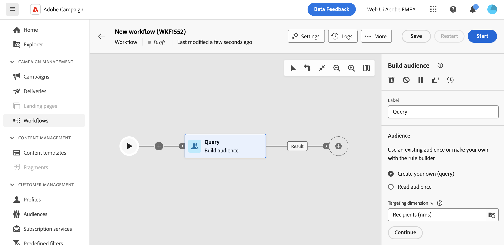
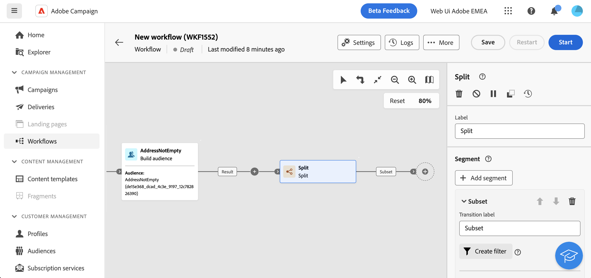

# Work with the query modeler {#segment-builder}

>[!CONTEXTUALHELP]
>id="acw_homepage_learning_card5"
>title="New Query modeler"
>abstract="Adobe Campaign Web features a query modeler that simplifies the process of filtering databases to select specific targets based on various criteria. This includes the use of advanced expressions and operators. The query modeler is available in every context where you need to define rules to filter data."

<!--TO REMOVE BELOW-->
>[!CONTEXTUALHELP]
>id="acw_homepage_card5"
>title="New Query modeler"
>abstract="Adobe Campaign Web features a query modeler that simplifies the process of filtering databases to select specific targets based on various criteria. This includes the use of advanced expressions and operators. The query modeler is available in every context where you need to define rules to filter data."
<!--TO REMOVE ABOVE-->

>[!CONTEXTUALHELP]
>id="acw_orchestration_querymodeler_querymessage"
>title="Query modeler"
>abstract="Define filtering criteria for recipients or any other targeting dimension from the database. Take advantage of your Adobe Experience Platform audience to further refine your target audience and maximize the impact of your campaign."

Adobe Campaign Web features a query modeler that simplifies the process of filtering databases to select specific targets based on various criteria. This includes the use of advanced expressions and operators. 

## Access the query modeler

The query modeler is available in every context where you need to define rules to filter data.

|Usage|Example|
|  ---  |  ---  |
|**Define audiences**: Specify the population you want to target in your messages or workflows, and effortlessly create new audiences tailored to your needs.|{zoomable="yes"}{width="200" align="center" zoomable="yes"}|
|**Customize workflow activities**: apply rules within workflow activities, such as Split and Reconciliation, to align with your specific requirements.|{zoomable="yes"}{width="200" align="center" zoomable="yes"}|
|**Predefined filters**: Create predefined filters that serve as shortcuts during various filtering operations, whether you're working with data lists or forming the audience for a delivery.|{zoomable="yes"}{width="200" align="center" zoomable="yes"}|
|**Filter reports data**: Add rule to filter the data displayed in reports.|{zoomable="yes"}{width="200" align="center" zoomable="yes"}|
|**Customize lists**: Create custom rules to filter the data displayed in lists such as recipients, deliveries lists etc.|{zoomable="yes"}{width="200" align="center" zoomable="yes"}|

<!--**Dynamize content**: make your content dynamic by creating conditions that define which content should be displayed to different recipients, ensuring personalized and relevant messaging.

+++Example

{zoomable="yes"}

 +++
-->

## Query modeler interface {#interface}

The query modeler provides a central canvas where you build your query, and a right pane providing information on your query.

{zoomable="yes"}

### The central canvas {#canvas}

The query modeler central canvas is where you add and combine the different components building your query. [Learn how to build a query](build-query.md)

The toolbar located in the upper-right corner of the canvas provides options to easily manipulate the query components and navigate in the canvas:

* **Multiple selection mode**: Select multiple filtering components to copy and paste them at the location of your choice.
* **Rotate**: Switch the canvas vertically.
* **Fit to screen**: Adapt the canvas zoom level to your screen.
* **Zoom out** / **Zoom in**: Zoom out or in the canvas.
* **Display map**: Opens a snapshot of the canvas showing you are located.

### The Rule properties pane {#rule-properties}

On the right hand side, the **[!UICONTROL Rule properties]** pane provides information on your query. It allows you to perform various operations to check the query and ensure it suits your needs. [Learn how to check and validate your query](build-query.md#check-and-validate-your-query)
