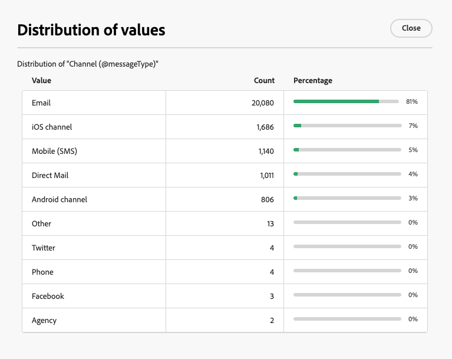

# Distribution of values {#distribution-values}

The distribution of values helps to know the percentage of a value in a column within a table. It is available for columns composed of sequels or expressions.

## Distribution of values in a folder {#distribution-values-folder}

For example, among the deliveries, we want to know the distribution of values of the **Channel** column.

To get this information, go to the deliveries folder and click on **[!UICONTROL Configure columns]** button.

In the **[!UICONTROL Configure columns]** window, click on the **[!UICONTROL Information]** icon of the column you want to know. Then, click on the **[!UICONTROL Distribution of values]** button.

{zoomable="yes"}

You will get the percentage of the values in the **[!UICONTROL Channel]** column.

{zoomable="yes"}

>[!NOTE]
>
> For columns with many values, only the first twenty values will be displayed. A notification **[!UICONTROL Partial load]** will warn you.

It is also possible to have the distribution of values though a link. To do this, click on the **+** button of the link, then select the field you want to analyze.

{zoomable="yes"}

## Distribution of values in a query {#distribution-values-query}

If you are in a workflow, knowing the distribution of values within a query can assist you in refining your segmentation. 

To access the feature, in your query, click the attribute selection button as shown below. Then, click on the **[!UICONTROL Information]** icon next to the selected attribute. You can have access there to the **[!UICONTROL Distribution of values]** button.

{zoomable="yes"}

>[!NOTE]
>
> The **[!UICONTROL Distribution of values]** feature is accessible in every attribute picker.
