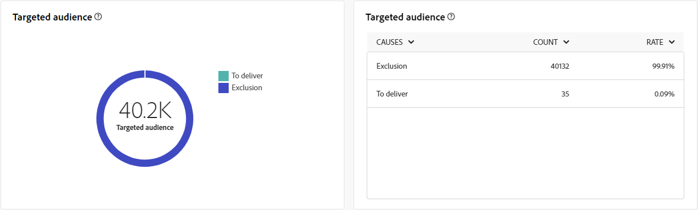

# Campaign reports for the Direct mail channel {#campaign-reports-direct-mail}

Each campaign report is divided into different widgets detailing your campaign's success and errors. For the Direct mail channel, reports and metrics are detailed below. Learn how to access your campaign reports in [this page](campaign-reports.md).

## Delivery summary {#delivery-summary-direct}

### Delivery overview {#delivery-overview-direct}

>[!CONTEXTUALHELP]
>id="acw_campaign_reporting_delivery_overview_direct_mail"
>title="Delivery overview"
>abstract="The **Delivery Overview** presents key performance metrics (KPIs) offering in-depth insights into the interaction of your visitors with each direct mail delivery. The metrics are outlined below."

The **[!UICONTROL Delivery Overview]** presents key performance metrics (KPIs) offering in-depth insights into the interaction of your visitors with each Direct mail delivery. The metrics are outlined below.

{zoomable="yes"}{align="center"}

+++Learn more on Delivery overview metrics.

* **[!UICONTROL Messages to deliver]**: Total number of messages processed during the delivery preparation.

* **[!UICONTROL Targeted]**: Number of messages successfully sent, in relation to the total number of sent messages.

* **[!UICONTROL To exclude]**: Number of recipients who clicked unsubscriptions.
+++

### Targeted audience {#delivery-summary-direct-initial-target}

>[!CONTEXTUALHELP]
>id="acw_campaign_reporting_target_audience_direct_mail_graph"
>title="Targeted audience"
>abstract="The recipient data and message information are displayed in the **Targeted audience** graph, reflecting the delivery preparation analysis."

>[!CONTEXTUALHELP]
>id="acw_campaign_reporting_target_audience_direct_mail_table"
>title="Targeted audience"
>abstract="The **Targeted audience** table provides a detailed breakdown of your recipients and the corresponding messages, based on the results of the delivery preparation process."

The table and graph for **[!UICONTROL Targeted Audience]** showcase data related to your recipients, with detailed metrics provided below.

{zoomable="yes"}{align="center"}

+++Learn more on Delivery overview metrics.

* **[!UICONTROL Messages to deliver]**: Total number of messages processed during the delivery preparation.

* **[!UICONTROL Targeted]**: Number of user profiles who qualify as target profiles for your direct mail messages.

* **[!UICONTROL Exclusion]**: Number of user profiles, excluded from the targeted profiles, who will not receive your direct mail messages.
+++

### Delivery statistics {#delivery-summary-direct-exec-stats}

>[!CONTEXTUALHELP]
>id="acw_campaign_reporting_delivery_statistics_summary_direct_mail"
>title="Delivery statistics"
>abstract="The **Delivery statistics** graph details the success of your Direct mail delivery, and errors that occurred."

The **[!UICONTROL Delivery statistics]** table provides a breakdown of the success of every direct mail delivery, with detailed metrics outlined below.

+++Learn more on Delivery statistics metrics.

* **[!UICONTROL Message to deliver]**: Total number of messages to be delivered after delivery preparation.

* **[!UICONTROL Success]**: Number of messages processed successfully in relation to the number of messages to be delivered.

* **[!UICONTROL Errors / Bounces]**: Total number of errors cumulated during deliveries and automatic rebound processing in relation to the number of messages to be delivered.

* **[!UICONTROL New quarantines]**: Total number of addresses quarantined following a failed delivery (user unknown, invalid domain) in relation to the number of messages to be delivered.

+++

### Causes of exclusion {#causes-exclusion}

>[!CONTEXTUALHELP]
>id="acw_campaign_reporting_exclusions_direct_mail_table"
>title="Exclusions"
>abstract="The **Causes of exclusion** table displays a detailed breakdown, by rule, of messages that were rejected during the delivery preparation process."

>[!CONTEXTUALHELP]
>id="acw_campaign_reporting_causes_exclusion_direct_mail_graph"
>title="Delivery Causes of exclusion"
>abstract="The **Causes of exclusion** graph illustrates the distribution of rejected messages during the preparation for delivery, categorized by each rule."

{zoomable="yes"}{align="center"}

The **Causes of exclusion** graph and table illustrate the reasons that prevented user profiles, excluded from the targeted profiles, from receiving the message.

+++Learn more on Causes of exclusion metrics.

* **[!UICONTROL Address in quarantine]**: Error type generated when address is placed in quarantine.

* **[!UICONTROL Address not specified]**: Error type generated when sending a delivery to indicate that the address does not exist.

* **[!UICONTROL Bad quality address]**: Error type generated when postal address quality rating is too low.

* **[!UICONTROL Denylisted address]**: Error type generated when the recipient was denylisted when the delivery was performed.

* **[!UICONTROL Double]**: Error type generated when the recipient was excluded because its keys values were not unique.

* **[!UICONTROL Control group]**: 

* **[!UICONTROL Target limited in size]**: 

+++
