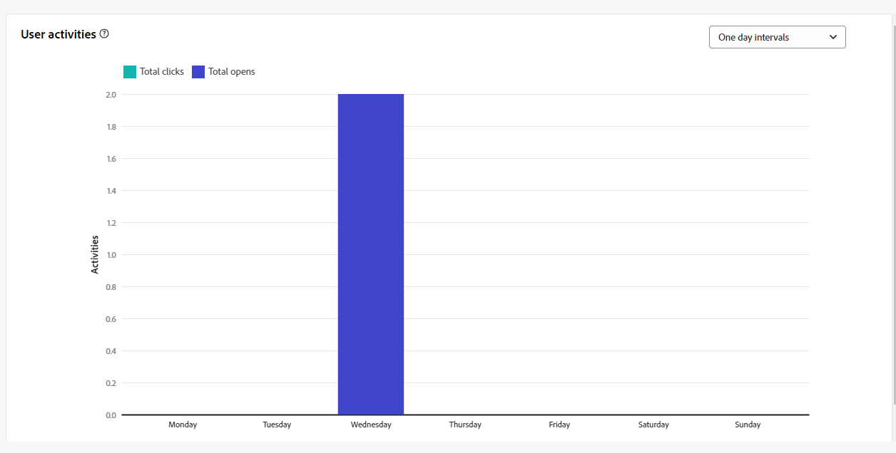

# Campaign reports for the email channel {#campaign-reports-email-channel}

Each campaign report is divided into different widgets detailing your campaign's success and errors. For the email channel, reports and metrics are detailed below. Learn how to access your campaign reports in [this page](campaign-reports.md).

## Delivery summary {#delivery-summary-email}

>[!CONTEXTUALHELP]
>id="acw_campaign_reporting_deliveries_overview"
>title="Delivery overview"
>abstract="The **Delivery Overview** provides key performance indicators (KPIs) that give detailed information about how your visitors engage with your email delivery."

### Delivery overview {#delivery-summary-email-ovv}

The **[!UICONTROL Delivery Overview]** report provides key performance indicators (KPIs) that give detailed information about how your visitors engage with your email delivery. Metrics are detailed below.

 

+++Learn more on Email campaign report metrics.

* **[!UICONTROL Messages to deliver]**: Total number of messages processed during the delivery preparation.

* **[!UICONTROL Delivered]**: Number of messages successfully sent, in relation to the total number of sent messages.

* **[!UICONTROL Bounces]**: Total of errors cumulated during delivery and automatic return processing in relation to the total number of sent messages.

* **[!UICONTROL Total opens]**: Total number of targeted recipients who opened a message at least once.

* **[!UICONTROL Total clicks]**: Total number of distinct recipients who clicked in a delivery at least once.

+++

### Initial target audience statistics {#delivery-summary-email-initial-target}

>[!CONTEXTUALHELP]
>id="acw_campaign_reporting_deliveries_target"
>title="Initial target audience statistics"
>abstract="The Initial target audience statistics table displays data relative to your recipients"

The **[!UICONTROL Initial target audience statistics]** table displays data relative to your recipients. Metrics are detailed below.

+++Learn more on Email campaign report metrics.

* **[!UICONTROL Initial audience]**: Total number of targeted recipients.

* **[!UICONTROL Message to deliver]**: Total number of messages to be delivered after delivery preparation.

* **[!UICONTROL Rejected by rules]**: Total number of addresses ignored during the analysis when applying rules: address missing, quarantined, on denylist, etc.

+++

### Execution statistics {#delivery-summary-email-exec-stats}

>[!CONTEXTUALHELP]
>id="acw_campaign_reporting_email_exec_stats"
>title="Execution statistics"
>abstract="The **Execution statistics** table details the success of your delivery: messages to deliver, success, errors, and new quarantines."

The **[!UICONTROL Execution statistics]** table details the success of your delivery. Metrics are detailed below.

+++Learn more on Email campaign report metrics.

* **[!UICONTROL Message to deliver]**: Total number of messages to be delivered after delivery preparation.

* **[!UICONTROL Success]**: Number of messages processed successfully in relation to the number of messages to be delivered.

* **[!UICONTROL Errors]**: Total number of errors cumulated during deliveries and automatic rebound processing in relation to the number of messages to be delivered.

* **[!UICONTROL New quarantines]**: Total number of addresses quarantined following a failed delivery (user unknown, invalid domain) in relation to the number of messages to be delivered.

    Email error types are listed in the [Adobe Campaign v8 (client console) documentation](https://experienceleague.adobe.com/docs/campaign/campaign-v8/send/failures/delivery-failures.html#email-error-types){target="_blank"}.

+++

### Reaction statistics {#delivery-summary-email-reaction-stats}

>[!CONTEXTUALHELP]
>id="acw_campaign_reporting_email_reaction_stats"
>title="Reaction statistics"
>abstract="The **Reaction statistics** table shows the available data for recipient activity for your delivery: number of opens, subscriptions, unsubscriptions, click to mirror page link."

The **[!UICONTROL Reaction statistics]** table contains the available data for recipient activity for your delivery. Metrics are detailed below.

+++Learn more on Email campaign report metrics.

* **[!UICONTROL Unique opens]**: Total number of targeted recipients who opened a message at least once.

* **[!UICONTROL Total Opens]**: Number of distinct targeted recipients for this domain who have opened a message at least once.

* **[!UICONTROL Unsubscriptions]**: Number of recipients who clicked unsubscriptions for the concerned period.

* **[!UICONTROL Mirror page]**: Number of recipients who clicked on the mirror page link.

* **[!UICONTROL Forwards]**:  Number of recipients who clicked who forwarded the email. 
+++

### Generated click streams {#delivery-summary-email-click-streams}

>[!CONTEXTUALHELP]
>id="acw_campaign_reporting_email_click_streams"
>title="Generated click streams"
>abstract="The **Generated click streams** table shows the available data relative to how your recipients interacted with your delivery."

The **[!UICONTROL Generated click streams]** table displays data relative to how your recipients interacted with your delivery. Metrics are detailed below.

 

+++Learn more on Email campaign report metrics.

* **[!UICONTROL Unique clicks]**: Total number of unique recipients who clicked in a delivery at least once.

* **[!UICONTROL Total Clicks]**: Total number of clicks on links in deliveries.

* **[!UICONTROL Reactivity]**: Ratio of the number of targeted recipients having clicked in a delivery, in relation to the estimated number of targeted recipients having opened a delivery.

+++

## Non-deliverables {#non-deliverables-email}

### Breakdown of errors per type {#delivery-summary-email-breakdown-per-type}

>[!CONTEXTUALHELP]
>id="acw_campaign_reporting_error_type"
>title="Breakdown of errors per type"
>abstract="The **Breakdown of errors per type** table and graph contain the available data for each error type encountered: user unknown, mailbox full, invalid domain, and more."

The **[!UICONTROL Breakdown of errors per type]** table and graph contain the available data for possible errors encountered for each type of domain. Metrics are detailed below.
    
The errors shown in this report trigger the quarantine process. For more on quarantine management, refer to [Campaign v8 (client console) documentation](https://experienceleague.adobe.com/docs/campaign/campaign-v8/campaigns/send/failures/delivery-failures.html){target="_blank"}.

+++Learn more on Email campaign report metrics.

* **[!UICONTROL User unknown]**: Error type generated during delivery to indicate that the email address is invalid.

* **[!UICONTROL Invalid domain]**: Error type generated when sending a delivery to indicate that the domain of the email address is wrong or does not exist.

* **[!UICONTROL Mailbox full]**: Error type generated after five delivery attempts to indicate that the recipients' inbox contains too many messages.

* **[!UICONTROL Account disabled]**: Error type generated when sending a delivery to indicate that the address no longer exists.

* **[!UICONTROL Refused]**: Error type generated when an address is rejected by the IAP (Internet Access Provider), for instance following the application of a security rule (anti-spam software).

* **[!UICONTROL Unreachable]**: Error type which occurs in the message distribution string: incident on the SMTP relay, domain temporarily unreachable, etc

* **[!UICONTROL Not connected]**: Error type to indicate that the recipients' mobile phone is switched off or disconnected from the network at the time of sending.

+++

### Breakdown of errors per domain {#delivery-summary-email-breakdown-per-domain}

>[!CONTEXTUALHELP]
>id="acw_campaign_reporting_error_domain"
>title="Breakdown of errors per domain"
>abstract="The **Breakdown of errors per domain** table and graph display the available data for each error type encountered depending on each domain."

The **[!UICONTROL Breakdown of errors per domain]** table and graph contain the available data for possible errors encountered with each domain. Metrics are common with the **[!UICONTROL Breakdown of errors per type]** table and graph detailed above.

## Tracking indicators {#tracking-indicators-email}

### Delivery statistics {#delivery-summary-email-statistics}

>[!CONTEXTUALHELP]
>id="acw_delivery_campaign_delivery_statistics_summary"
>title="Delivery statistics"
>abstract="The **Delivery statistics** graph details the success of your delivery, and errors that occurred."

The **[!UICONTROL Delivery statistics]** metrics provides key performance indicators (KPIs) that give detailed information about data available for sent emails. Metrics are detailed below.
 

+++Learn more on Email campaign report metrics.

* **[!UICONTROL Message(s) to deliver]**: Number of messages processed successfully in relation to the number of messages to be delivered.

* **[!UICONTROL Unique opens]**: Total number of targeted recipients who opened a message at least once.

* **[!UICONTROL Total Opens]**: Number of distinct targeted recipients for this domain who have opened a message at least once.

* **[!UICONTROL Clicks on the opt-out link]**:  Number of clicks on the unsubscription link.

* **[!UICONTROL Clicks on the mirror link]**: Number of clicks on the link to the mirror page.

* **[!UICONTROL Estimation of forwards]**: Estimation of the number of emails forwarded by the targeted recipients. 
+++

### Open and click-trough rate {#delivery-summary-open-rate}

>[!CONTEXTUALHELP]
>id="acw_campaign_reporting_open_clickthrough"
>title="Open and click-through rate"
>abstract="The **Open and click-through rate** table displays data relative to your recipients engagement with your delivery."

The **[!UICONTROL Open and click-trough rate]** table displays data relative to your recipients. Metrics are detailed below.

 

+++ Learn more on Email campaign report metrics.

* **[!UICONTROL Sent]**: Total number of messages sent.

* **[!UICONTROL Complaints]**: Number and percentage of messages for this domain that have been reported as undesirable by the recipient.

* **[!UICONTROL Unique Opens]**: Number and percentage of distinct targeted recipients for this domain who have opened a message at least once.

* **[!UICONTROL Unique Clicks]**: Number and percentage of distinct targeted recipients who clicked in the same delivery at least once. 

* **[!UICONTROL Raw reactivity]**: Percentage of the number of recipient who clicked in a delivery at least once compared to the number of recipients who opened a delivery at least once.

+++

## URLs and click streams {#url-email}

>[!CONTEXTUALHELP]
>id="acw_campaign_reporting_urls_clickstreams"
>title="URLs and click streams"
>abstract="The **URLs and click streams** report provides key performance indicators (KPIs) that give detailed information about the URLs that were clicked the most during a delivery."

The **[!UICONTROL URLs and click streams]** report provides key performance indicators (KPIs) that give detailed information about the URLs that were clicked the most during a delivery. Metrics are detailed below.

+++ Learn more on Email campaign report metrics.

* **[!UICONTROL Reactivity]**: Ratio of the number of targeted recipients having clicked in a delivery, in relation to the estimated number of targeted recipients having opened a delivery.

* **[!UICONTROL Unique clicks]**: Total number of distinct recipients who clicked in a delivery at least once.

* **[!UICONTROL Total Clicks]**: Total number of clicks on links in deliveries.

* **[!UICONTROL Platform average]** : This average rate, displayed under each rate (reactivity, distinct clicks, and cumulated clicks), is calculated for deliveries sent over the previous six months. Only deliveries with the same typology and on the same channel are taken into account. Proofs are excluded.

+++

### Top 10 most visited links {#top10-campaign-report-email}

>[!CONTEXTUALHELP]
>id="acw_campaign_reporting_urls_clickstreams_top10"
>title="Top 10 most visited links"
>abstract="The **Top 10 most visited links** rgraph and table contain the available data for recipient behavior per link."

The **[!UICONTROL Top 10 most visited links]** graph and table contain the available data for recipient behavior per link. Metrics are detailed below.

+++Learn more on Email campaign report metrics.

* **[!UICONTROL Clicks]**: Total number of clicks on links in deliveries.

* **[!UICONTROL Percentage]**: Percentage of users who interacted with the delivery.

+++

### Breakdown of clicks over time {#campaign-report-email-breakdown-clicks}

>[!CONTEXTUALHELP]
>id="acw_delivery_campaign_urls_click_breakdown"
>title="Breakdown of clicks over time"
>abstract="The **Breakdown of clicks over time** graph shows the available data for recipient behavior per link."

The **[!UICONTROL Breakdown of clicks over time]** graph contains the available data for recipient behavior per link. 

## User Activities {#user-activities-email}

>[!CONTEXTUALHELP]
>id="acw_campaign_reporting_user_activities"
>title="User activities"
>abstract="The **User activities** graph shows the breakdown of opens and clicks in the form of a chart."

The **[!UICONTROL User activities]** report shows the breakdown of opens and clicks in the form of a chart. Metrics for this report are detailed below.

{align="center"}

+++Learn more on Email delivery report metrics.

* **[!UICONTROL Clicks]**: Total number of clicks on links in deliveries.

* **[!UICONTROL Opens]**: Number of distinct targeted recipients for this domain who have opened a message at least once.

+++
