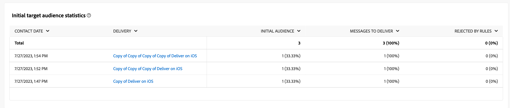

# Campaign reports for the Push channel {#campaign-reports-push-channel}

Each campaign report is divided into different widgets detailing your campaign's success and errors. For the push channel, reports and metrics are detailed below. Learn how to access your campaign reports in [this page](campaign-reports.md).

## Delivery summary {#delivery-summary-push}

>[!CONTEXTUALHELP]
>id="acw_campaign_reporting_push_deliveries_overview"
>title="Delivery overview"
>abstract="The **Delivery Overview** report provides key performance indicators (KPIs) that give detailed information about how your visitors engage with your push notification delivery."

The **[!UICONTROL Delivery Overview]** report provides key performance indicators (KPIs) that give detailed information about how your visitors engage with your push notification delivery. Metrics are detailed below.
    

+++Learn more on Push campaign report metrics.

* **[!UICONTROL Total sent]**: Total number of messages processed during the delivery preparation.

* **[!UICONTROL Delivered]**: Number of messages successfully sent, in relation to the total number of sent messages.

* **[!UICONTROL Errors]**: Total of errors cumulated during delivery and automatic return processing in relation to the total number of sent messages.

* **[!UICONTROL Total clicks]**: Total number of distinct recipients who clicked in a delivery at least once.

+++

### Initial target audience statistics {#delivery-summary-push-initial-target}

>[!CONTEXTUALHELP]
>id="acw_campaign_reporting_push_target"
>title="Initial target audience statistics"
>abstract="The **Initial target audience statistics** table displays data relative to your recipients"

The **[!UICONTROL Initial target audience statistics]** table displays data relative to your recipients. Metrics are detailed below.

+++Learn more on Push campaign report metrics.

* **[!UICONTROL Initial audience]**: Total number of targeted recipients.

* **[!UICONTROL Message to deliver]**: Total number of messages to be delivered after delivery preparation.

* **[!UICONTROL Rejected by rules]**: Total number of addresses ignored during the analysis when applying rules: address missing, quarantined, on denylist, etc.

+++

### Execution statistics {#delivery-summary-push-exec-stats}

>[!CONTEXTUALHELP]
>id="acw_campaign_reporting_push_exec_stats"
>title="Execution statistics"
>abstract="The **Execution statistics** table details the success of your delivery: messages to deliver, success, errors, and new quarantines."

The **[!UICONTROL Execution statistics]** table details the success of your delivery. Metrics are detailed below.

+++Learn more on Push campaign report metrics.

* **[!UICONTROL Message to deliver]**: Total number of messages to be delivered after delivery preparation.

* **[!UICONTROL Success]**: Number of messages processed successfully in relation to the number of messages to be delivered.

* **[!UICONTROL Errors]**: Total number of errors cumulated during deliveries and automatic rebound processing in relation to the number of messages to be delivered.

* **[!UICONTROL New quarantines]**: Total number of addresses quarantined following a failed delivery (invalid registration, message rejection, payload error, for ex.) in relation to the number of messages to be delivered.

    Learn more about delivery failures and quarantines in [this technote](../technotes/failures-and-quarantines.md).

    Push notifications error types are listed in the [Adobe Campaign v8 (client console) documentation](https://experienceleague.adobe.com/docs/campaign/campaign-v8/send/failures/delivery-failures.html#push-error-types){target="_blank"}.

+++

### Generated click streams {#delivery-summary-push-click-streams}

>[!CONTEXTUALHELP]
>id="acw_campaign_reporting_push_click_streams"
>title="Generated click streams"
>abstract="The **Generated click streams** table shows the available data relative to how your recipients interacted with your delivery."

The **[!UICONTROL Generated click streams]** table displays data relative to how your recipients interacted with your delivery. Metrics are detailed below.

+++Learn more on Push campaign report metrics.

* **[!UICONTROL Unique clicks]**: Total number of distinct recipients who clicked in a delivery at least once.

* **[!UICONTROL Total clicks]**: Total number of clicks on links in deliveries.

* **[!UICONTROL Reactivity]**: Ratio of the number of targeted recipients having clicked in a delivery, in relation to the estimated number of targeted recipients having opened a delivery.

+++
