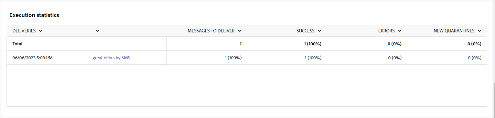

# Campaign reports for the SMS channel {#campaign-reports-sms-channel}

>[!CONTEXTUALHELP]
>id="acw_campaign_reporting_sms_deliveries_overview"
>title="Delivery overview"
>abstract="The **Delivery Overview** report provides key performance indicators (KPIs) that give detailed information about how your visitors engage with your SMS delivery."

## Delivery summary {#delivery-summary-sms}

The **[!UICONTROL Delivery Overview]** report provides key performance indicators (KPIs) that give detailed information about how your visitors engage with your SMS delivery. Metrics are detailed below.
    

+++Learn more on SMS campaign report metrics.

* **[!UICONTROL Total sent]**: Total number of messages processed during the delivery preparation.

* **[!UICONTROL Delivered]**: Number of messages successfully sent, in relation to the total number of sent messages.

* **[!UICONTROL Errors]**: Total of errors cumulated during delivery and automatic return processing in relation to the total number of sent messages.

* **[!UICONTROL Distinct clicks]**: Total number of distinct recipients who clicked in a delivery at least once.

 +++

### Initial target audience statistics {#delivery-summary-sms-initial-target}

>[!CONTEXTUALHELP]
>id="acw_campaign_reporting_sms_target"
>title="Initial target audience statistics"
>abstract="The **Initial target audience statistics** table displays data relative to your recipients"

The **[!UICONTROL Initial target audience statistics]** table displays data relative to your recipients. Metrics are detailed below.

+++Learn more on SMS campaign report metrics.

* **[!UICONTROL Initial audience]**: Total number of targeted recipients.

* **[!UICONTROL Message to deliver]**: Total number of messages to be delivered after delivery preparation.

* **[!UICONTROL Rejected by rules]**: Total number of addresses ignored during the analysis when applying rules: address missing, quarantined, on denylist, etc.

+++

### Execution statistics {#delivery-summary-sms-exec-stats}

>[!CONTEXTUALHELP]
>id="acw_campaign_reporting_sms_exec_stats"
>title="Execution statistics"
>abstract="The **Execution statistics** table details the success of your delivery: messages to deliver, success, errors, and new quarantines."

The **[!UICONTROL Execution statistics]** table details the success of your delivery. Metrics are detailed below.

+++Learn more on SMS campaign report metrics.

* **[!UICONTROL Message to deliver]**: Total number of messages to be delivered after delivery preparation.

* **[!UICONTROL Success]**: Number of messages processed successfully in relation to the number of messages to be delivered.

* **[!UICONTROL Errors]**: Total number of errors cumulated during deliveries and automatic rebound processing in relation to the number of messages to be delivered.

* **[!UICONTROL New quarantines]**: Total number of addresses quarantined following a failed delivery (user unknown, invalid domain) in relation to the number of messages to be delivered.

+++

### Generated click streams {#delivery-summary-sms-click-streams}

>[!CONTEXTUALHELP]
>id="acw_campaign_reporting_sms_click_streams"
>title="Generated click streams"
>abstract="The **Generated click streams** table shows the available data relative to how your recipients interacted with your delivery."

The **[!UICONTROL Generated click streams]** table displays data relative to how your recipients interacted with your delivery. Metrics are detailed below.

+++Learn more on SMS campaign report metrics.

* **[!UICONTROL Distinct clicks]**: Total number of distinct recipients who clicked in a delivery at least once.

* **[!UICONTROL Clicks]**: Total number of clicks on links in deliveries.

* **[!UICONTROL Reactivity]**: Ratio of the number of targeted recipients having clicked in a delivery, in relation to the estimated number of targeted recipients having opened a delivery.

+++

## Push channel {#push-channel}

### Delivery summary {#delivery-summary-push}

* **[!UICONTROL Delivery Overview]** provides key performance indicators (KPIs) that give detailed information about how your visitors engage with your push notification delivery.
    
    +++Learn more on Push campaign report metrics.

    * **[!UICONTROL Total sent]**: Total number of messages processed during the delivery preparation.

    * **[!UICONTROL Delivered]**: Number of messages successfully sent, in relation to the total number of sent messages.

    * **[!UICONTROL Errors]**: Total of errors cumulated during delivery and automatic return processing in relation to the total number of sent messages.

    * **[!UICONTROL Distinct clicks]**: Total number of distinct recipients who clicked in a delivery at least once.

    +++

* **[!UICONTROL Initial target audience statistics]** table displays data relative to your recipients:

    +++Learn more on Push campaign report metrics.

    * **[!UICONTROL Initial audience]**: Total number of targeted recipients.

    * **[!UICONTROL Message to deliver]**: Total number of messages to be delivered after delivery preparation.

    * **[!UICONTROL Rejected by rules]**: Total number of addresses ignored during the analysis when applying rules: address missing, quarantined, on denylist, etc.

    +++

* **[!UICONTROL Execution statistics]** table details the success of your delivery:

    +++Learn more on Push campaign report metrics.

    * **[!UICONTROL Message to deliver]**: Total number of messages to be delivered after delivery preparation.

    * **[!UICONTROL Success]**: Number of messages processed successfully in relation to the number of messages to be delivered.

    * **[!UICONTROL Errors]**: Total number of errors cumulated during deliveries and automatic rebound processing in relation to the number of messages to be delivered.

    * **[!UICONTROL New quarantines]**: Total number of addresses quarantined following a failed delivery (user unknown, invalid domain) in relation to the number of messages to be delivered.

    +++

* **[!UICONTROL Generated click streams]** table displays data relative to how your recipients interacted with your delivery:

    +++Learn more on Push campaign report metrics.

    * **[!UICONTROL Distinct clicks]**: Total number of distinct recipients who clicked in a delivery at least once.

    * **[!UICONTROL Clicks]**: Total number of clicks on links in deliveries.

    * **[!UICONTROL Reactivity]**: Ratio of the number of targeted recipients having clicked in a delivery, in relation to the estimated number of targeted recipients having opened a delivery.

    +++
