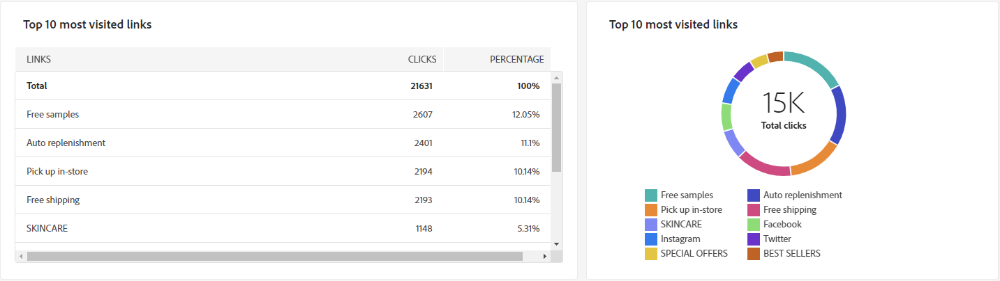

# Campaign reports {#campaign-reports}

## Email channel {#email-channel}

### Delivery summary {#delivery-summary-email}

* **[!UICONTROL Delivery Overview]** provides key performance indicators (KPIs) that give detailed information about how your visitors engage with your email delivery.
    
    +++Learn more on Email campaign report metrics.

    * **[!UICONTROL Total sent]**: Total number of messages processed during the delivery analysis.

    * **[!UICONTROL Delivered]**: Number of messages successfully sent, in relation to the total number of sent messages.

    * **[!UICONTROL Bounces]**: Total of errors cumulated during delivery and automatic return processing in relation to the total number of sent messages.

    * **[!UICONTROL Distinct opens]**: Total number of targeted recipients who opened a message at least once.

    * **[!UICONTROL Distinct clicks]**: Total number of distinct recipients who clicked in a delivery at least once.

    +++

     
    
* **[!UICONTROL Initial target audience statistics]**

    +++Learn more on Email campaign report metrics.

    * **[!UICONTROL Initial audience]**: Total number of targeted recipients.

    * **[!UICONTROL Message to deliver]**: Total number of messages to be delivered after delivery analysis.

    * **[!UICONTROL Rejected by rules]**: Total number of addresses ignored during the analysis when applying rules: address missing, quarantined, on denylist, etc.

    +++

     

* **[!UICONTROL Execution statistics]**

    +++Learn more on Email campaign report metrics.

    * **[!UICONTROL Message to deliver]**: Total number of messages to be delivered after delivery analysis.

    * **[!UICONTROL Success]**: Number of messages processed successfully in relation to the number of messages to be delivered.

    * **[!UICONTROL Errors]**: Total number of errors cumulated during deliveries and automatic rebound processing in relation to the number of messages to be delivered.

    * **[!UICONTROL New quarantines]**: Total number of addresses quarantined following a failed delivery (user unknown, invalid domain) in relation to the number of messages to be delivered.

    +++

     

* **[!UICONTROL Reaction statistics]**

    +++Learn more on Email campaign report metrics.

    * **[!UICONTROL Distinct opens]**: Total number of targeted recipients who opened a message at least once.

    * **[!UICONTROL Opens]**: Number of distinct targeted recipients for this domain who have opened a message at least once.

    * **[!UICONTROL Unsubscriptions]**: Number of recipients who clicked unsubscriptions for the concerned period.

    * **[!UICONTROL Mirror page]**: Number of recipients who clicked on the mirror page link.

    * **[!UICONTROL Forwards]**:  Number of recipients who clicked who forwarded the email. 

     

* **[!UICONTROL Generated click streams]**

    +++Learn more on Email campaign report metrics.

    * **[!UICONTROL Distinct clicks]**: Total number of distinct recipients who clicked in a delivery at least once.

    * **[!UICONTROL Clicks]**: Total number of clicks on links in deliveries.

    * **[!UICONTROL Reactivity]**: Ratio of the number of targeted recipients having clicked in a delivery, in relation to the estimated number of targeted recipients having opened a delivery.

    +++

     

### Non-deliverables {#non-deliverables-email}

* **[!UICONTROL Breakdown of errors per type]** and **[!UICONTROL Breakdown of errors per browsers]**

    +++Learn more on Email campaign report metrics.

    * **[!UICONTROL Errors]**: Total number of errors cumulated during deliveries and automatic rebound processing, in relation to the number of messages to be delivered.

    * **[!UICONTROL Contribution]**: 

    * **[!UICONTROL Breakdown]**: 

    +++

     

### Tracking indicators {#tracking-indicators-email}

* **[!UICONTROL Delivery statistics]**

    +++Learn more on Email campaign report metrics.

    * **[!UICONTROL Success]**: Number of messages processed successfully in relation to the number of messages to be delivered.

    * **[!UICONTROL Distinct opens]**: Total number of targeted recipients who opened a message at least once.

    * **[!UICONTROL Opens]**: Number of distinct targeted recipients for this domain who have opened a message at least once.

    * **[!UICONTROL Clicks on the opt-out link]**:  Number of clicks on the unsubscription link.

    * **[!UICONTROL Clicks on the mirror link]**: Number of clicks on the link to the mirror page.

    * **[!UICONTROL Estimation of forwards]**: Estimation of the number of emails forwarded by the targeted recipients. 
    +++

     

* **[!UICONTROL Open and click-through rate]**

    +++Learn more on Email campaign report metrics.

    * **[!UICONTROL Sent]**: Total number of messages sent.

    * **[!UICONTROL Complaints]**: Number of messages for this domain that have been reported as undesirable by the recipient.

    * **[!UICONTROL Opens]**: Number of distinct targeted recipients for this domain who have opened a message at least once.

    * **[!UICONTROL Clicks]**: Number of distinct targeted recipients who clicked in the same delivery at least once. 

    * **[!UICONTROL Raw reactivity]**: Percentage of the number of recipient who clicked in a delivery at least once compared to the number of recipients who opened a delivery at least once.
    +++

     

### URLs and click streams {#url-email}

* **[!UICONTROL URLs and click streams]**

    +++Learn more on Email campaign report metrics.

    * **[!UICONTROL Reactivity]**: Ratio of the number of targeted recipients having clicked in a delivery, in relation to the estimated number of targeted recipients having opened a delivery.

    * **[!UICONTROL Distinct clicks]**: Total number of distinct recipients who clicked in a delivery at least once.

    * **[!UICONTROL Clicks]**: Total number of clicks on links in deliveries.

    +++

     

* **[!UICONTROL Top 10 most visited links]**

    +++Learn more on Email campaign report metrics.

    * **[!UICONTROL Clicks]**: Total number of clicks on links in deliveries.

    * **[!UICONTROL Percentage]**: Percentage of users who interacted with the delivery.

    +++

    

* **[!UICONTROL Breakdown of clicks over time]**, number of clicks

    

### User Activities {#user-activities-email}

* **[!UICONTROL User activities]**

    * **[!UICONTROL Clicks]**: Total number of clicks on links in deliveries.

    * **[!UICONTROL Opens]**: Number of distinct targeted recipients for this domain who have opened a message at least once.

    +++

    

## SMS channel {#sms-channel}

### Delivery summary {#delivery-summary-sms}

* **[!UICONTROL Delivery Overview]** provides key performance indicators (KPIs) that give detailed information about how your visitors engage with your SMS delivery.
    
    +++Learn more on SMS campaign report metrics.

    * **[!UICONTROL Total sent]**: Total number of messages processed during the delivery analysis.

    * **[!UICONTROL Delivered]**: Number of messages successfully sent, in relation to the total number of sent messages.

    * **[!UICONTROL Errors]**: Total of errors cumulated during delivery and automatic return processing in relation to the total number of sent messages.

    * **[!UICONTROL Distinct clicks]**: Total number of distinct recipients who clicked in a delivery at least once.

    +++

* **[!UICONTROL Initial target audience statistics]**

    +++Learn more on SMS campaign report metrics.

    * **[!UICONTROL Initial audience]**: Total number of targeted recipients.

    * **[!UICONTROL Message to deliver]**: Total number of messages to be delivered after delivery analysis.

    * **[!UICONTROL Rejected by rules]**: Total number of addresses ignored during the analysis when applying rules: address missing, quarantined, on denylist, etc.

    +++

* **[!UICONTROL Execution statistics]**

    +++Learn more on SMS campaign report metrics.

    * **[!UICONTROL Message to deliver]**: Total number of messages to be delivered after delivery analysis.

    * **[!UICONTROL Success]**: Number of messages processed successfully in relation to the number of messages to be delivered.

    * **[!UICONTROL Errors]**: Total number of errors cumulated during deliveries and automatic rebound processing in relation to the number of messages to be delivered.

    * **[!UICONTROL New quarantines]**: Total number of addresses quarantined following a failed delivery (user unknown, invalid domain) in relation to the number of messages to be delivered.

    +++

* **[!UICONTROL Generated click streams]**

    +++Learn more on SMS campaign report metrics.

    * **[!UICONTROL Distinct clicks]**: Total number of distinct recipients who clicked in a delivery at least once.

    * **[!UICONTROL Clicks]**: Total number of clicks on links in deliveries.

    * **[!UICONTROL Reactivity]**: Ratio of the number of targeted recipients having clicked in a delivery, in relation to the estimated number of targeted recipients having opened a delivery.

    +++

## Push channel {#push-channel}

### Delivery summary {#delivery-summary-push}

* **[!UICONTROL Delivery Overview]** provides key performance indicators (KPIs) that give detailed information about how your visitors engage with your push notification delivery.
    
    +++Learn more on Push campaign report metrics.

    * **[!UICONTROL Total sent]**: Total number of messages processed during the delivery analysis.

    * **[!UICONTROL Delivered]**: Number of messages successfully sent, in relation to the total number of sent messages.

    * **[!UICONTROL Errors]**: Total of errors cumulated during delivery and automatic return processing in relation to the total number of sent messages.

    * **[!UICONTROL Distinct clicks]**: Total number of distinct recipients who clicked in a delivery at least once.

    +++

* **[!UICONTROL Initial target audience statistics]**

    +++Learn more on Push campaign report metrics.

    * **[!UICONTROL Initial audience]**: Total number of targeted recipients.

    * **[!UICONTROL Message to deliver]**: Total number of messages to be delivered after delivery analysis.

    * **[!UICONTROL Rejected by rules]**: Total number of addresses ignored during the analysis when applying rules: address missing, quarantined, on denylist, etc.

    +++

* **[!UICONTROL Execution statistics]**

    +++Learn more on Push campaign report metrics.

    * **[!UICONTROL Message to deliver]**: Total number of messages to be delivered after delivery analysis.

    * **[!UICONTROL Success]**: Number of messages processed successfully in relation to the number of messages to be delivered.

    * **[!UICONTROL Errors]**: Total number of errors cumulated during deliveries and automatic rebound processing in relation to the number of messages to be delivered.

    * **[!UICONTROL New quarantines]**: Total number of addresses quarantined following a failed delivery (user unknown, invalid domain) in relation to the number of messages to be delivered.

    +++

* **[!UICONTROL Generated click streams]**

    +++Learn more on Push campaign report metrics.

    * **[!UICONTROL Distinct clicks]**: Total number of distinct recipients who clicked in a delivery at least once.

    * **[!UICONTROL Clicks]**: Total number of clicks on links in deliveries.

    * **[!UICONTROL Reactivity]**: Ratio of the number of targeted recipients having clicked in a delivery, in relation to the estimated number of targeted recipients having opened a delivery.

    +++
