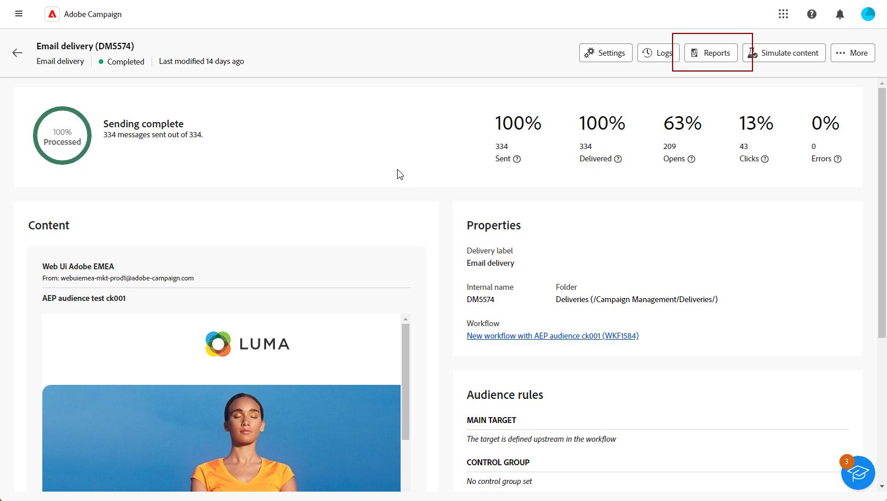

# Get started with delivery reports {#reports}

>[!CONTEXTUALHELP]
>id="acw_campaign_reporting_deliveries_selection"
>title="Aggregated reporting for deliveries"
>abstract="Select at least two deliveries for displaying an aggregated data report."

The **Delivery reports** provide in-depth insights and data exclusively focused on your **deliveries** across each channel. These reports provide detailed information on the performance, effectiveness, and outcomes of your individual deliveries, providing you with a comprehensive overview.

The full list of reports and associated metrics for each channel is available in the following pages:

* [Email delivery reports](email-report.md)
* [SMS delivery reports](sms-report.md)
* [Push delivery reports](push-report.md)

## Manage your report dashboard {#manage-reports}

Adobe Campaign offers several types of reports, accessible for each delivery. These reports allow you to measure and visualize the impact and performances of your messages in a built-in dashboard.

To display and manage reports, follow these steps:

1. To generate a report for a specific delivery, navigate to the **[!UICONTROL Deliveries]** menu and select the delivery you wish to report on.

1. From your **[!UICONTROL Delivery]** dashboard, click **[!UICONTROL Reports]**.

    {zoomable="yes"}

    Alternatively, you can use the three dots **More actions** button next to the delivery name in the deliveries list and select **[!UICONTROL View report]**.

    {zoomable="yes"}

1. From the left menu, select a report from the list.

    {zoomable="yes"}

1. If your delivery is recurring, select a specific delivery to report on by clicking **[!UICONTROL Select deliveries]**. 

    You can also apply a time period to your report by selecting the **[!UICONTROL Contact date]**.

    {zoomable="yes"}

1. From the **[!UICONTROL URLs and click streams]**, you can also choose the **[!UICONTROL Top visited Links]** or the **[!UICONTROL Time period]**.

    The **[!UICONTROL View by]** options allow you to filter on URLs, Labels or Categories.

    {zoomable="yes"}
