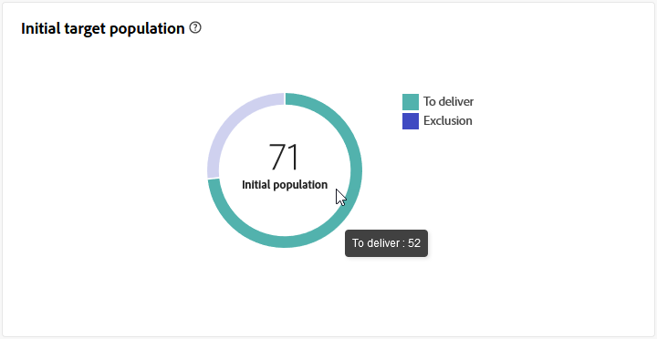
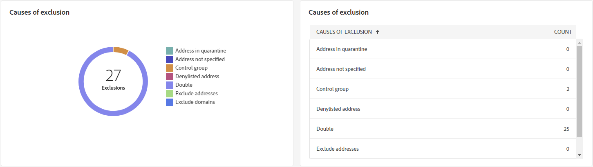
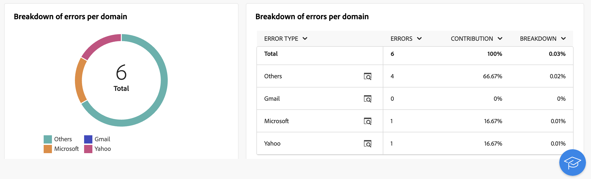

# Email delivery report {#email-report}

The **Email delivery report** offers comprehensive insights and data specific to the email channel. It provides detailed information on the performance, effectiveness, and outcomes of your individual deliveries, providing you with a comprehensive overview.

## Delivery summary {#delivery-summary-email}

>[!CONTEXTUALHELP]
>id="acw_delivery_reporting_sending_email"
>title="Reporting sending"
>abstract="The **Sending** tab within your report provides in-depth insights into your visitors' interactions with your deliveries and any potential errors they may have encountered."

### Initial target population {#email-delivery-targeted-population}

>[!CONTEXTUALHELP]
>id="acw_delivery_reporting_initial_target"
>title="Initial target population"
>abstract="The **Initial target population** graph displays data relative to your recipients and messages, based on the results of the delivery preparation."

The **[!UICONTROL Initial target population]** graph displays data relative to your recipients. Metrics are calculated during delivery preparation and show: the initial audience, the number of messages to send, the number of recipients excluded.

{width="50%" align="left" zoomable="yes"}

Mouse-over a portion of the graph to display the exact number.

{width="50%" align="left" zoomable="yes"}

+++Learn more on Email delivery report metrics.

* **[!UICONTROL Initial audience]**: Total number of targeted recipients.

* **[!UICONTROL To deliver]**: Total number of messages to be delivered after delivery preparation.

* **[!UICONTROL Exclusion]**: Total number of recipients excluded from the target population.
+++

### Delivery statistics {#email-delivery-stats}

>[!CONTEXTUALHELP]
>id="acw_delivery_reporting_delivery_statistics_summary"
>title="Delivery statistics"
>abstract="The **Delivery statistics** graph details the success of your delivery, and errors that occurred."

The **[!UICONTROL Delivery statistics]** graph details the success of your delivery. Metrics are detailed below.

{width="50%" align="left" zoomable="yes"}

+++Learn more on Email campaign report metrics.

* **[!UICONTROL Message sent]**: Total number of messages to be delivered after delivery preparation.

* **[!UICONTROL Success]**: Number of messages processed successfully in relation to the number of messages to be delivered.

* **[!UICONTROL Errors]**: Total number of errors cumulated during deliveries and automatic rebound processing in relation to the number of messages to be delivered.

* **[!UICONTROL New quarantines]**: Total number of addresses quarantined following a failed delivery (user unknown, invalid domain) in relation to the number of messages to be delivered.

+++

### Causes of exclusion  {#email-delivery-exclusions}

>[!CONTEXTUALHELP]
>id="acw_delivery_reporting_exclusion"
>title="Delivery Causes of exclusion"
>abstract="The **Causes of exclusion** graph and table show the breakdown per rule of messages rejected during the delivery preparation."

The **[!UICONTROL Causes of exclusion]** graph and table show the breakdown per rule of messages rejected during the delivery preparation. Exclusion rules are detailed in the [Campaign v8 (console) documentation](https://experienceleague.adobe.com/docs/campaign/campaign-v8/send/failures/delivery-failures.html#email-error-types){_blank}.

{align="center" zoomable="yes"}

+++Learn more on Email delivery report metrics.

* **[!UICONTROL User unknown]**: Error type generated during delivery to indicate that the email address is invalid.

* **[!UICONTROL Invalid domain]**: Error type generated when sending a delivery to indicate that the domain of the email address is wrong or does not exist.

* **[!UICONTROL Mailbox full]**: Error type generated after five delivery attempts to indicate that the recipients' inbox contains too many messages.

* **[!UICONTROL Account disabled]**: Error type generated when sending a delivery to indicate that the address no longer exists.

* **[!UICONTROL Refused]**: Error type generated when an address is rejected by the IAP (Internet Access Provider), for instance following the application of a security rule (anti-spam software).

* **[!UICONTROL Unreachable]**: Error type which occurs in the message distribution string: incident on the SMTP relay, domain temporarily unreachable, etc

* **[!UICONTROL Not connected]**: Error type to indicate that the recipients' mobile phone is switched off or disconnected from the network at the time of sending.

+++

## Delivery throughput {#delivery-throughtput}

>[!CONTEXTUALHELP]
>id="acw_delivery_reporting_throughput_email"
>title="Delivery throughput"
>abstract="The **Delivery throughput** report presents detailed information regarding the delivery throughput of the entire platform within a specified timeframe."

This report presents detailed information regarding the delivery throughput of the entire platform within a specified timeframe. The primary metric used to measure the speed of message delivery is the number of messages sent per hour.

{align="center" zoomable="yes"}

## Broadcast statistics {#broadcast-statistics}

>[!CONTEXTUALHELP]
>id="acw_delivery_reporting_broadcast_statistics"
>title="Broadcast statistics"
>abstract="The **Broadcast statistics** report contains the available data for possible errors encountered with each domain."

The **[!UICONTROL Broadcast statistics]** table contains the available data for possible errors encountered with each domain. Metrics are detailed below.

{align="center" zoomable="yes"}

+++Learn more on Email delivery report metrics.

* **[!UICONTROL Processed emails]**: Total number of messages processed by the delivery server.

* **[!UICONTROL Delivered]**: Percentage of the number of messages successfully processed compared to the total number of messages processed.

* **[!UICONTROL Hard bounces]**: Percentage of the number of "hard" bounces, permanent errors, such as a wrong email address, compared to the total number of messages processed.

* **[!UICONTROL Soft bounces]**: Percentage of the number of "soft" bounces, temporary errors such as a full inbox, compared to the total number of messages processed

* **[!UICONTROL Opens]**: Percentage of the number of targeted recipients who opened a message at least once compared to the number of messages processed successfully.

* **[!UICONTROL Clicks]**: Percentage of the number of people who clicked in a delivery at least once compared to the number of messages processed successfully.

* **[!UICONTROL Unsubscriptions]**: Percentage of the number of clicks on an unsubscription link compared to the number of messages processed successfully.
+++

## Non-deliverables {#non-deliverables-email}

### Breakdown of errors per type {#email-delivery-breakdown-type}

>[!CONTEXTUALHELP]
>id="acw_delivery_reporting_error_type"
>title="Breakdown of errors per type"
>abstract="The **Breakdown of errors per type** table and graph contain the available data for each error type encountered: user unknown, mailbox full, invalid domain, and more."

The **[!UICONTROL Breakdown of errors per type]** table and graph contain the available data for error type. Metrics are detailed below.

The errors shown in this report trigger the quarantine process. For more on quarantine management, refer to [Campaign v8 (client console) documentation](https://experienceleague.adobe.com/docs/campaign/campaign-v8/campaigns/send/failures/delivery-failures.html){target="_blank"}.

{align="left" zoomable="yes"}

+++Learn more on Email delivery report metrics.

* **[!UICONTROL User unknown]**: Error type generated during delivery to indicate that the email address is invalid.

* **[!UICONTROL Invalid domain]**: Error type generated when sending a delivery to indicate that the domain of the email address is wrong or does not exist.

* **[!UICONTROL Mailbox full]**: Error type generated after five delivery attempts to indicate that the recipients' inbox contains too many messages.

* **[!UICONTROL Account disabled]**: Error type generated when sending a delivery to indicate that the address no longer exists.

* **[!UICONTROL Refused]**: Error type generated when an address is rejected by the IAP (Internet Access Provider), for instance following the application of a security rule (anti-spam software).

* **[!UICONTROL Unreachable]**: Error type which occurs in the message distribution string: incident on the SMTP relay, domain temporarily unreachable, etc

* **[!UICONTROL Not connected]**: Error type to indicate that the recipients' mobile phone is switched off or disconnected from the network at the time of sending.

+++

### Breakdown of errors per domain {#email-delivery-breakdown-domain}

>[!CONTEXTUALHELP]
>id="acw_delivery_reporting_error_domain"
>title="Breakdown of errors per domain"
>abstract="The **Breakdown of errors per domain** table and graph display the available data for each error type encountered depending on each domain."

The **[!UICONTROL Breakdown of errors per domain]** table and graph display the available data for possible errors encountered with each domain. 

{align="left" zoomable="yes"}

Click the icon next to the name of each domain to see details.

{align="left" zoomable="yes"}

Metrics available are the same as for the [Breakdown of errors by type](#email-delivery-breakdown-type) described above.

## Tracking indicators {#tracking-indicators-email}

>[!CONTEXTUALHELP]
>id="acw_delivery_reporting_tracking_email"
>title="Reporting tracking"
>abstract="The **Tracking** tab within your report offers valuable data, including recipient behavior per link, breakdown of opens and clicks, as well as detailed information about the most frequently clicked URLs during a delivery."

### Delivery statistics  {#email-tracking-delivery-stats}

>[!CONTEXTUALHELP]
>id="acw_delivery_reporting_delivery_statistics_indicators"
>title=" Delivery statistics"
>abstract="The **Delivery statistics** report provides key performance indicators (KPIs) that give detailed information about data available for sent emails: success, opens, clicks, and more."

The **[!UICONTROL Delivery statistics]** report provides key performance indicators (KPIs) that give detailed information about data available for sent emails. Metrics are detailed below.

{align="center"}

+++Learn more on Email delivery report metrics.

* **[!UICONTROL Success]**: Number of messages processed successfully in relation to the number of messages to be delivered.

* **[!UICONTROL Distinct opens]**: Total number of targeted recipients who opened a message at least once.

* **[!UICONTROL Opens]**: Number of distinct targeted recipients for this domain who have opened a message at least once.

* **[!UICONTROL Clicks on the opt-out link]**:  Number of clicks on the unsubscription link.

* **[!UICONTROL Clicks on the mirror link]**: Number of clicks on the link to the mirror page.

* **[!UICONTROL Estimation of forwards]**: Estimation of the number of emails forwarded by the targeted recipients. 
+++

### Open and click-through rate {#email-tracking-click-through}

>[!CONTEXTUALHELP]
>id="acw_delivery_reporting_open_clickthrough"
>title="Open and click-through rate"
>abstract="The **Open and click-through rate** table displays data relative to your recipients engagement with your delivery."

The **[!UICONTROL Open and click-through rate]** table displays data relative to your recipients. Metrics are detailed below.

{align="center"}

+++Learn more on Email delivery report metrics.

* **[!UICONTROL Sent]**: Total number of messages sent.

* **[!UICONTROL Complaints]**: Number of messages for this domain that have been reported as undesirable by the recipient.

* **[!UICONTROL Opens]**: Number of distinct targeted recipients for this domain who have opened a message at least once.

* **[!UICONTROL Clicks]**: Number of distinct targeted recipients who clicked in the same delivery at least once. 

* **[!UICONTROL Raw reactivity]**: Percentage of the number of recipient who clicked in a delivery at least once compared to the number of recipients who opened a delivery at least once.
+++

## URLs and click streams {#url-email}

>[!CONTEXTUALHELP]
>id="acw_delivery_reporting_urls_clickstreams"
>title="URLs and click streams"
>abstract="The **URLs and click streams** report provides key performance indicators (KPIs) that give detailed information about the URLs that were clicked the most during a delivery."

The **[!UICONTROL URLs and click streams]** report provides key performance indicators (KPIs) that give detailed information about the URLs that were clicked the most during a delivery.

{align="center"}

+++Learn more on Email delivery report metrics.

* **[!UICONTROL Reactivity]**: Ratio of the number of targeted recipients having clicked in a delivery, in relation to the estimated number of targeted recipients having opened a delivery.

* **[!UICONTROL Distinct clicks]**: Total number of distinct recipients who clicked in a delivery at least once.

* **[!UICONTROL Clicks]**: Total number of clicks on links in deliveries.

* **[!UICONTROL Platform average]** : This average rate, displayed under each rate (reactivity, distinct clicks, and cumulated clicks), is calculated for deliveries sent over the previous six months. Only deliveries with the same typology and on the same channel are taken into account. Proofs are excluded.

+++

### Top 10 most visited links {#email-tracking-top10}

>[!CONTEXTUALHELP]
>id="acw_delivery_reporting_urls_clickstreams_top10"
>title="Top 10 most visited links"
>abstract="The **Top 10 most visited links** rgraph and table contain the available data for recipient behavior per link."

The **[!UICONTROL Top 10 most visited links]** graph and table contain the available data for recipient behavior per link.

{align="center"}

+++Learn more on Email delivery report metrics.

* **[!UICONTROL Clicks]**: Total number of clicks on links in deliveries.

* **[!UICONTROL Percentage]**: Percentage of users who interacted with the delivery.

+++

### Breakdown of clicks over time {#email-tracking-breakdown-over-time}

>[!CONTEXTUALHELP]
>id="acw_delivery_reporting_urls_click_breakdown"
>title="Breakdown of clicks over time"
>abstract="The **Breakdown of clicks over time** graph shows the available data for recipient behavior per link."

The **[!UICONTROL Breakdown of clicks over time]** graph contains the available data for recipient behavior per link.

{align="center"}

## User Activities {#user-activities-email}

>[!CONTEXTUALHELP]
>id="acw_delivery_reporting_user_activities"
>title="User activities"
>abstract="The **User activities** graph shows the breakdown of opens and clicks in the form of a chart. You can choose the time period to target data: last day or hour or 30 minutes."

The **[!UICONTROL User activities]** report shows the breakdown of opens and clicks in the form of a chart. You can choose the time period to target data: last day or hour or 30 minutes.

{align="center"}

+++Learn more on Email delivery report metrics.

* **[!UICONTROL Clicks]**: Total number of clicks on links in deliveries.

* **[!UICONTROL Opens]**: Number of distinct targeted recipients for this domain who have opened a message at least once.

+++

## Tracking Statistics {#tracking-statistics}

>[!CONTEXTUALHELP]
>id="acw_delivery_reporting_statistics"
>title="Tracking Statistics"
>abstract="The **Tracking Statistics** graph provides statistics on opens and clicks. You have the option to select the specific time frame for targeting data."

The **[!UICONTROL Tracking Statistics]** graph provides statistics on opens and clicks. You have the option to select the specific time frame for targeting data.

{align="center"}

+++Learn more on Email delivery report metrics.

* **[!UICONTROL Clicks]**: Total number of clicks on links in deliveries.

* **[!UICONTROL Opens]**: Number of distinct targeted recipients for this domain who have opened a message at least once.

+++

## Breakdown of opens {#breakdown-opens}

### Breakdown of opens by device {#breakdown-opens-devices}

>[!CONTEXTUALHELP]
>id="acw_delivery_reporting_breakdown_device"
>title="Breakdown by device"
>abstract="The **Breakdown by device** report shows the breakdown of opens by device for the period. For each category, two charts are used. The first displays statistics regarding opens on a computer and mobile devices. The second displays the exact number and percentage for each device type."

The **Breakdown by device** report shows the breakdown of opens by device for the period: personal computers, Android devices, Apple devices, or others.

For each category, two charts are used. The first displays statistics regarding opens on a computer and mobile devices. The second displays the exact number and percentage for each device type.

{align="center"}

### Breakdown of opens by OS {#breakdown-opens-os}

>[!CONTEXTUALHELP]
>id="acw_delivery_reporting_breakdown_os"
>title="Breakdown by operating system"
>abstract="The **Breakdown by OS** report shows the breakdown of opens by operating system for the period concerned. The first chart displays statistics regarding opens on a computer and mobile devices. The second displays the exact number and percentage for each OS."

The **Breakdown by OS** report shows the breakdown of opens by operating system for the period: Windows systems, Android systems, iOS systems, or others.

For each category, two charts are used. The first displays statistics regarding opens on a computer and mobile operating systems. The second displays the exact number and percentage for each operating system.

{align="center"}

### Breakdown of opens by browser {#breakdown-opens-browser}

>[!CONTEXTUALHELP]
>id="acw_delivery_reporting_breakdown_browser"
>title="Breakdown by browser"
>abstract="The **Breakdown by browser** shows the breakdown of opens by browser for the period. The first chart displays statistics regarding opens on a computer and mobile devices. The second displays the exact number and percentage for each browser."

The **Breakdown by browser** report shows the breakdown of opens by browser: Chrome, Safari, Internet Explorer, and more.

For each category, two charts are used. The first displays statistics regarding opens on a computer and mobile operating systems. The second displays the exact number and percentage for each browser.

{align="center"}

## Hotclicks {#hotclicks}

>[!CONTEXTUALHELP]
>id="acw_delivery_reporting_hotclicks"
>title="Hotclicks report"
>abstract="The **Hotclicks** report presents the email content (HTML and/or text) with, on each link, the percentage of clicks on links. Personalization blocks, unsubscription links, mirror page links, and offer links are taken into account in the total cumulated clicks, but are not displayed in the report."

This report shows the message content (HTML and/or text) with, on each link, the percentage of clicks on links. Personalization blocks, unsubscription links, mirror page links, and offer links are taken into account in the total cumulated clicks, but are not displayed in the report.

