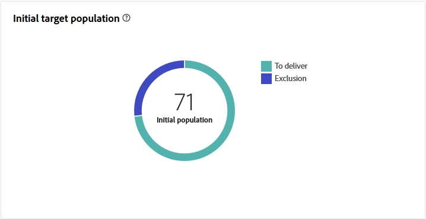

# Email delivery report {#email-report}

The **Email delivery report** offers comprehensive insights and data specific to the email channel. It provides detailed information on the performance, effectiveness, and outcomes of your individual deliveries, providing you with a comprehensive overview.

## Delivery summary {#delivery-summary-email}

* **[!UICONTROL Initial target audience statistics]** table displays data relative to your recipients:

    {align="left"}

    +++Learn more on Email delivery report metrics.

    * **[!UICONTROL Initial audience]**: Total number of targeted recipients.

    * **[!UICONTROL To deliver]**: Total number of messages to be delivered after delivery analysis.

    * **[!UICONTROL Exclusion]**: Total number of messages excluded from the target sent.
    +++

* **[!UICONTROL Delivery statistics]** table details the success of your delivery.

    {align="left"}

    +++Learn more on Email campaign report metrics.

    * **[!UICONTROL Message sent]**: Total number of messages to be delivered after delivery analysis.

    * **[!UICONTROL Success]**: Number of messages processed successfully in relation to the number of messages to be delivered.

    * **[!UICONTROL Errors]**: Total number of errors cumulated during deliveries and automatic rebound processing in relation to the number of messages to be delivered.

    * **[!UICONTROL New quarantines]**: Total number of addresses quarantined following a failed delivery (user unknown, invalid domain) in relation to the number of messages to be delivered.

    +++

* **[!UICONTROL Causes of exclusion]** graph and table show the breakdown per rule of messages rejected during the analysis.

    {align="center"}

    +++Learn more on Email delivery report metrics.

    * **[!UICONTROL User unknown]**: Error type generated during delivery to indicate that the email address is invalid.

    * **[!UICONTROL Invalid domain]**: Error type generated when sending a delivery to indicate that the domain of the email address is wrong or does not exist.

    * **[!UICONTROL Mailbox full]**: Error type generated after five delivery attempts to indicate that the recipients’ inbox contains too many messages.

    * **[!UICONTROL Account disabled]**: Error type generated when sending a delivery to indicate that the address no longer exists.

    * **[!UICONTROL Refused]**: Error type generated when an address is rejected by the IAP (Internet Access Provider), for instance following the application of a security rule (anti-spam software).

    * **[!UICONTROL Unreachable]**: Error type which occurs in the message distribution string: incident on the SMTP relay, domain temporarily unreachable, etc

    * **[!UICONTROL Not connected]**: Error type to indicate that the recipients’ mobile phone is switched off or disconnected from the network at the time of sending.

    +++

## Delivery throughput {#delivery-throughtput}

This report presents detailed information regarding the delivery throughput of the entire platform within a specified timeframe. The primary metric used to measure the speed of message delivery is the number of messages sent per hour.

## Broadcast statistics {#broadcast-statistics}

* **[!UICONTROL Broadcast statistics]** table contains the available data for possible errors encountered with each domain.

    {align="center"}

    +++Learn more on Email delivery report metrics.

    * **[!UICONTROL Processed emails]**: Total number of messages processed by the delivery server.

    * **[!UICONTROL Delivered]**: Percentage of the number of messages successfully processed compared to the total number of messages processed.

    * **[!UICONTROL Hard bounces]**: Percentage of the number of “hard” bounces, permanent errors, such as a wrong email address, compared to the total number of messages processed.

    * **[!UICONTROL Soft bounces]**: Percentage of the number of “soft” bounces, temporary errors such as a full inbox, compared to the total number of messages processed

    * **[!UICONTROL Opens]**: Percentage of the number of targeted recipients who opened a message at least once compared to the number of messages processed successfully.

    * **[!UICONTROL Clicks]**: Percentage of the number of people who clicked in a delivery at least once compared to the number of messages processed successfully.

    * **[!UICONTROL Unsubscriptions]**: Percentage of the number of clicks on an unsubscription link compared to the number of messages processed successfully.
    +++

## Non-deliverables and bounces {#non-deliverables-email}

* **[!UICONTROL Breakdown of errors per type]** and **[!UICONTROL Breakdown of errors per domain]** tables and graphs contain the available data for possible errors encountered with each domain.

    The errors shown in this report trigger the quarantine process. For more on quarantine management, refer to [Quarantine management](https://experienceleague.adobe.com/docs/campaign-classic/using/sending-messages/monitoring-deliveries/understanding-quarantine-management.html).

    

    +++Learn more on Email delivery report metrics.

    * **[!UICONTROL User unknown]**: Error type generated during delivery to indicate that the email address is invalid.

    * **[!UICONTROL Invalid domain]**: Error type generated when sending a delivery to indicate that the domain of the email address is wrong or does not exist.

    * **[!UICONTROL Mailbox full]**: Error type generated after five delivery attempts to indicate that the recipients’ inbox contains too many messages.

    * **[!UICONTROL Account disabled]**: Error type generated when sending a delivery to indicate that the address no longer exists.

    * **[!UICONTROL Refused]**: Error type generated when an address is rejected by the IAP (Internet Access Provider), for instance following the application of a security rule (anti-spam software).

    * **[!UICONTROL Unreachable]**: Error type which occurs in the message distribution string: incident on the SMTP relay, domain temporarily unreachable, etc

    * **[!UICONTROL Not connected]**: Error type to indicate that the recipients’ mobile phone is switched off or disconnected from the network at the time of sending.

    +++

## Tracking indicators {#tracking-indicators-email}

* **[!UICONTROL Delivery statistics]** provides key performance indicators (KPIs) that give detailed information about data available for sent emails.

    {align="center"}

    +++Learn more on Email delivery report metrics.

    * **[!UICONTROL Success]**: Number of messages processed successfully in relation to the number of messages to be delivered.

    * **[!UICONTROL Distinct opens]**: Total number of targeted recipients who opened a message at least once.

    * **[!UICONTROL Opens]**: Number of distinct targeted recipients for this domain who have opened a message at least once.

    * **[!UICONTROL Clicks on the opt-out link]**:  Number of clicks on the unsubscription link.

    * **[!UICONTROL Clicks on the mirror link]**: Number of clicks on the link to the mirror page.

    * **[!UICONTROL Estimation of forwards]**: Estimation of the number of emails forwarded by the targeted recipients. 
    +++

* **[!UICONTROL Open and click-through rate]** table displays data relative to your recipients.

    {align="center"}

    +++Learn more on Email delivery report metrics.

    * **[!UICONTROL Sent]**: Total number of messages sent.

    * **[!UICONTROL Complaints]**: Number of messages for this domain that have been reported as undesirable by the recipient.

    * **[!UICONTROL Opens]**: Number of distinct targeted recipients for this domain who have opened a message at least once.

    * **[!UICONTROL Clicks]**: Number of distinct targeted recipients who clicked in the same delivery at least once. 

    * **[!UICONTROL Raw reactivity]**: Percentage of the number of recipient who clicked in a delivery at least once compared to the number of recipients who opened a delivery at least once.
    +++

## URLs and click streams {#url-email}

* **[!UICONTROL URLs and click streams]** provides key performance indicators (KPIs) that give detailed information about the URLs that were clicked the most during a delivery.

    {align="center"}

    +++Learn more on Email delivery report metrics.

    * **[!UICONTROL Reactivity]**: Ratio of the number of targeted recipients having clicked in a delivery, in relation to the estimated number of targeted recipients having opened a delivery.

    * **[!UICONTROL Distinct clicks]**: Total number of distinct recipients who clicked in a delivery at least once.

    * **[!UICONTROL Clicks]**: Total number of clicks on links in deliveries.

    * **[!UICONTROL Platform average]** : This average rate, displayed under each rate (reactivity, distinct clicks, and cumulated clicks), is calculated for deliveries sent over the previous six months. Only deliveries with the same typology and on the same channel are taken into account. Proofs are excluded.

    +++

* **[!UICONTROL Top 10 most visited links]** graph and table contain the available data for recipient behavior per link.

    {align="center"}

    +++Learn more on Email delivery report metrics.

    * **[!UICONTROL Clicks]**: Total number of clicks on links in deliveries.

    * **[!UICONTROL Percentage]**: Percentage of users who interacted with the delivery.

    +++

* **[!UICONTROL Breakdown of clicks over time]** graph contains the available data for recipient behavior per link.

    {align="center"}

## User Activities {#user-activities-email}

* **[!UICONTROL User activities]** shows the breakdown of opens and clicks in the form of a chart. You can choose the time period to target data: last day or hour or 30 minutes.

    {align="center"}

    +++Learn more on Email delivery report metrics.

    * **[!UICONTROL Clicks]**: Total number of clicks on links in deliveries.

    * **[!UICONTROL Opens]**: Number of distinct targeted recipients for this domain who have opened a message at least once.

    +++

## Tracking Statistics {#tracking-statistics}

* **[!UICONTROL Tracking Statistics]** graph provides statistics on opens and clicks. You have the option to select the specific time frame for targeting data.

    {align="center"}

    +++Learn more on Email delivery report metrics.

    * **[!UICONTROL Clicks]**: Total number of clicks on links in deliveries.

    * **[!UICONTROL Opens]**: Number of distinct targeted recipients for this domain who have opened a message at least once.

    +++

## Breakdown of opens {#breakdown-opens}

This report shows the breakdown of opens by operating system, device and browser for the period concerned. For each category, two charts are used. The first displays statistics regarding opens on a computer and mobile devices. The second displays statistics relating only to opens on mobile devices.
You have the flexibility to switch from **[!UICONTROL Fix & mobile]** to exclusively target **[!UICONTROL Mobile only]** for more precise targeting.

{align="center"}

## Hotclicks {#hotclicks}

This report shows the message content (HTML and/or text) with, on each link, the percentage of clicks on links. Personalization blocks unsubscription links, mirror page links and offer links are taken into account in the total cumulated clicks but are not displayed in the report.

