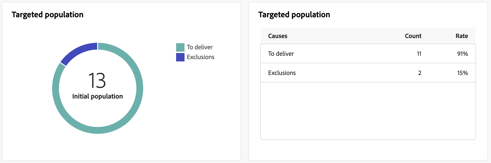

# Push delivery reports {#push-report}

>[!CONTEXTUALHELP]
>id="acw_delivery_reporting_sending_push"
>title="Reporting sending"
>abstract="he **Sending** tab within your report provides in-depth insights into your visitors' interactions with your deliveries and any potential errors they may have encountered."

The **Push delivery report** provides a thorough overview of the push channel, offering extensive insights and specific data. It offers comprehensive information regarding the performance, effectiveness, and results of each delivery.

## Push summary {#push-summary}

### Delivery overview {#push-delivery-overview}

>[!CONTEXTUALHELP]
>id="acw_push_report_overview"
>title="Push delivery overview"
>abstract="The **Push delivery overview** offers a comprehensive overview of your push delivery, providing extensive insights and specific data. It furnishes comprehensive information about the performance, effectiveness, and results of your delivery."

The **[!UICONTROL Delivery overview]** report provides key performance indicators (KPIs) that give detailed information about how your visitors engage with your push messages.

+++Learn more on Push delivery report metrics.

* **[!UICONTROL Total sent]**: Total number of messages processed during the delivery preparation.

* **[!UICONTROL Delivered]**: Number of messages successfully sent, in relation to the total number of sent messages.

* **[!UICONTROL Clicks]**: Total number of recipients who interacted with the Push message.

* **[!UICONTROL Errors]**: Total number of errors that occurred during a delivery preventing it from being sent to profiles.

+++

### Targeted population {#push-delivery-targeted-population}

>[!CONTEXTUALHELP]
>id="acw_delivery_reporting_push_targeted_population"
>title="Push targeted population"
>abstract="The **Targeted population** graph and table display data relative to your push messaging audience: messages to deliver and exclusions."

The **Targeted population** graph and table display data relative to your audience: messages to deliver and exclusions. Metrics are detailed below.

+++Learn more on Push delivery report metrics.

* **[!UICONTROL To deliver]**: Total number of messages processed during the delivery preparation.

* **[!UICONTROL Exclusions]**: Number of profiles that have been excluded from the analysis.

+++

### Overall statistics {#push-delivery-overall}

>[!CONTEXTUALHELP]
>id="acw_delivery_reporting_push_overall_stats"
>title="Push overall statistics"
>abstract="The **Overall statistics** report presents data for the sent push notifications: success, errors and quarantines."

The **Overall statistics** report presents data for the sent push notifications: success, errors and quarantines. Metrics are detailed below.

 

+++Learn more on Push delivery report metrics.

* **[!UICONTROL Success]**: Number of messages processed successfully.

* **[!UICONTROL Errors]**: Total number of errors that occurred during delivery, preventing the messages from being sent to certain profiles.

* **[!UICONTROL New quarantine]**:  Number of profiles that have been excluded and added to the quarantine.

    Learn more about delivery failures and quarantines in [this technote](../technotes/failures-and-quarantines.md).

+++

### Exclusions {#push-delivery-exclusions}

>[!CONTEXTUALHELP]
>id="acw_delivery_reporting_push_exclusions"
>title="Push exclusions"
>abstract="The **Exclusions** graph and table display the various reasons that prevented user profiles, which were excluded from the targeted profiles, from receiving the message."

The **[!UICONTROL Exclusions]** graph and table display the various reasons that prevented user profiles, which were excluded from the targeted profiles, from receiving the message. Exclusion rules are detailed in the [Campaign v8 (console) documentation](https://experienceleague.adobe.com/docs/campaign/campaign-v8/send/failures/delivery-failures.html#push-error-types){_blank}.

 

## Delivery throughput {#delivery-throughput}

>[!CONTEXTUALHELP]
>id="acw_delivery_reporting_throughput_push"
>title="Delivery throughput report"
>abstract="The Delivery throughput report presents detailed information regarding the delivery throughput of the entire platform within a specified timeframe."

The **Delivery throughput** report presents detailed information regarding the delivery throughput of the entire platform within a specified timeframe. The primary metric used to measure the speed of message delivery is the number of messages sent per hour.

