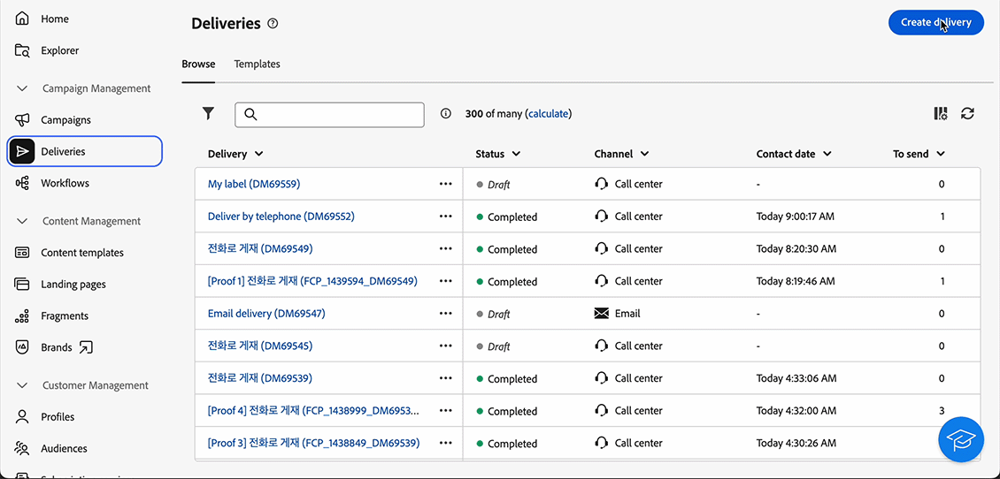
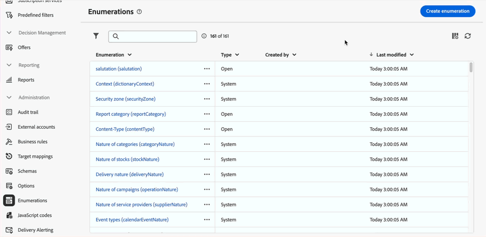

# 2025 release notes {#2025-release}

This page lists all changes and improvements available with **2025 releases**. Latest relese notes are available in [this page](release-notes.md). 

## October '25 release {#25-10-updates} 

_Nov 3, 2025_

<table>
<thead>
<tr>
<th><strong>Multilingual Capabilities for Transactional Messaging, Push Notifications and SMS (LA)</strong> </th> 
</tr>
</thead>
<tbody>
<tr>
<td>

You can now send multiple transactional messages, push notifications and SMS messages in different languages in Adobe Campaign Web User Interface. The Multilingual delivery feature allows you to choose the default language of your delivery as well as the different languages in which the delivery can be sent. You can also preview these deliveries in the languages you have chosen.

Note: this capability is only available for a set of organizations (Limited Availability), and will be rolled out globally in a future release.

For more information, refer to the <a href="../msg/multilingual.md">detailed documentation</a>.

</td>
</tr>
</tbody>
</table>

<!--
* Enable OOTB File Upload for Multi-lingual Push Notification Deliveries. 
-->

<table>
<thead>
<tr>
<th><strong>Profile enrichment in Transactional Messages (LA)</strong> </th> 
</tr>
</thead>
<tbody>
<tr>
<td>

This capability allows you to personalize transactional messages by linking Adobe Campaign database fields to the message content. You can select target mappings, enrichment columns, and a reconciliation key to ensure accurate, real-time personalization while maintaining performance thresholds.

Note: this capability is only available for a set of organizations (Limited Availability), and will be rolled out globally in a future release. This feature is currently only available for emails.

For more information, refer to the <a href="../transactional-messaging/profile-enrichment.md">detailed documentation</a>.

</td>
</tr>
</tbody>
</table>

<table>
<thead>
<tr>
<th><strong>Integration with Adobe GenStudio</strong> </th>
</tr>
</thead>
<tbody>
<tr>
<td>

To enhance marketing efficiency and to maintain brand consistency, you can now seamlessly integrate GenStudio for Performance Marketing experiences with Campaign. This enables you to leverage GenStudio's AI-power content creation alongside Campaign's advanced orchestration capabilities.

For more information, refer to the <a href="../integrations/genstudio.md">detailed documentation</a>.

</td>
</tr>
</tbody>
</table>

<table>
<thead>
<tr>
<th><strong>Dark mode support in the Email designer</strong> </th> 
</tr>
</thead>
<tbody>
<tr>
<td>

The Email Designer now offers the ability to switch to dark mode view, where you can additionally define specific custom settings. Note that the final rendering depends on the recipient's email client, and not all email clients support dark mode.

For more information, refer to the <a href="../email/dark-mode.md">detailed documentation</a>.

</td>
</tr>
</tbody>
</table>

<!-- table>
<thead>
<tr>
<th><strong>Continuous delivery activity</strong> </th> not ready
</tr>
</thead>
<tbody>
<tr>
<td>

Continuous delivery activity

For more information, refer to the detailed documentation.

</td>
</tr>
</tbody>
</table-->

### Improvements {#25-10-improvements}

* In deliveries created in the client Console, the **Audience** section now indicates whether a dynamic condition has been defined for proof targets. <!-- [Learn more](../msg/gs-deliveries.md#access)-->

* You can now switch between the new and legacy rule builder when setting up a condition using the Email Designer's conditional content capability. <!-- [Learn more](../personalization/conditions.md#condition-condition-builder)-->

* You can now select collection links, such as purchases, in the screen definition of the Recipients schema. This displays the related data on profile screens through a dedicated tab. <!-- [Learn more](../administration/schemas.md)-->

* As a Campaign administrator, you can now set up connections to Salesforce CRM and Microsoft Dynamics.
[Learn more](../administration/external-crm.md)

<!--
* Stop button for deliveries not linked to release and no info
-->

## September '25 release {#25-9-release} 

_Sept 23, 2025_

The following features are available starting September release.

<table>
<thead>
<tr>
<th><strong>Custom channel for API deliveries</strong> </th>
</tr>
</thead>
<tbody>
<tr>
<td>

You can now, directly from Adobe Campaign Web UI, orchestrate and execute deliveries based on custom API channels. These deliveries can be standalone or part of a workflow. The configuration of the custom API channel is performed in the console.

For more information, refer to the <a href="../call-center/gs-custom-channel.md">detailed documentation</a>.

</td>
</tr>
</tbody>
</table>

<table>
<thead>
<tr>
<th><strong>External account authoring</strong> </th>
</tr>
</thead>
<tbody>
<tr>
<td>

As a Campaign administrator, you can now set up new connections with external systems from Campaign Web user interface. You can also view, update and manage existing external accounts.

For more information, refer to the <a href="../administration/create-external-account.md">detailed documentation</a>.

</td>
</tr>
</tbody>
</table>

<table>
<thead>
<tr>
<th><strong>Email Content Locking</strong> </th>
</tr>
</thead>
<tbody>
<tr>
<td>

Campaign now allows you to lock content in email templates, either by locking the entire template or specific structures and components. This allows you to prevent unintentional edits or deletions, giving you greater control over template customization, and improving the efficiency and reliability of your email campaigns.

For more information, refer to the <a href="../content/content-locking.md">detailed documentation</a>.

</td>
</tr>
</tbody>
</table>

<!--table>
<thead>
<tr>
<th><strong>Integration with Adobe GenStudio</strong> </th>  LA? sort? Juliette
</tr>
</thead>
<tbody>
<tr>
<td>

To enhance marketing efficiency and to maintain brand consistency, you can now seamlessly integrate GenStudio for Performance Marketing experiences with Campaign. This enables you to leverage GenStudio's AI-power content creation alongside Campaign's advanced orchestration capabilities.

For more information, refer to the detailed documentation.

</td>
</tr>
</tbody>
</table-->

<!--table>
<thead>
<tr>
<th><strong>Dark mode support in the Email designer</strong> </th> -> pas sept, modifier composant... -> Juliette
</tr>
</thead>
<tbody>
<tr>
<td>

The Email Designer now offers the ability to switch to dark mode view, where you can additionally define specific custom settings. Note that the final rendering depends on the recipient's email client, and not all email clients support dark mode.

For more information, refer to the detailed documentation.

</td>
</tr>
</tbody>
</table-->

<!--table>>
<thead>
<tr>
<th><strong>Multilingual capabilities for transactional messaging and push notifications (LA)</strong> </th> 
</tr>
</thead>
<tbody>
<tr>
<td>

You can now send multiple transactional messages and push notifications in different languages in Adobe Campaign Web User Interface. The Multilingual delivery feature allows you to choose the default language of your delivery as well as the different languages in which the delivery can be sent. You can also preview these deliveries in the languages you have chosen.

Note: this capability is only available for a set of organizations (Limited Availability), and will be rolled out globally in a future release.

For more information, refer to the detailed documentation.

</td>
</tr>
</tbody>
</table-->

<!--table>
<thead>
<tr>
<th><strong>Profile enrichment in Transactional Messages (LA)</strong> </th> 
</tr>
</thead>
<tbody>
<tr>
<td>

This capability allows you to personalize transactional messages (Email, SMS, Push) by linking Adobe Campaign database fields to the message content. You can select target mappings, enrichment columns, and a reconciliation key to ensure accurate, real-time personalization while maintaining performance thresholds.

Note: this capability is only available for a set of organizations (Limited Availability), and will be rolled out globally in a future release.

For more information, refer to the detailed documentation.

</td>
</tr>
</tbody>
</table-->

<!--table>
<thead>
<tr>
<th><strong>Dynamic reporting for transactional messaging (LA)</strong> </th> 
</tr>
</thead>
<tbody>
<tr>
<td>

Note: this capability is only available for a set of organizations (Limited Availability), and will be rolled out globally in a future release.

For more information, refer to the detailed documentation.

</td>
</tr>
</tbody>
</table-->

### Improvements {#25-9-improvements}

* A set of new operators has been added when setting up a condition using the Email Designer’s conditional content capability.
* The filtering dimension is now available in the **Build audience** workflow activity. To view or change it, click the icon next to the targeting dimension. [Learn more](../workflows/activities/build-audience.md#build-audience-configuration).
<!--

NEO-84915 Stop button for deliveries???? ->>> met pas, juste bouton ajouté dans webUI meme comportement que console. bleu, marche, marche pas.
NEO-90345 WebUI - Extended operators for dynamic content ->>>> deja mis
NEO-88858 WebUI - Send proof from execution recurring delivery -> bug
NEO-89777 Content locking on create email template -> juliette
NEO-90365 Multi-lingual – Identify fields editable from variants???? -> fix pour SMS
query activity -> query ds workflow fitleting dimentsion 

-->

## August '25 release {#25-8-release} 

This release comes with a series of bug fixes, including:

* The profile duplication process has been improved to match the Client Console behavior, ensuring a consistent experience across both interfaces. This fixes an issue which could prevent the duplicated profiles from being created.

* The **[!UICONTROL Email BCC]** option, in the delivery configuration screen, now works with Momentum (Enhanced MTA). This functionality was previously only available in the Client Console.

## July '25 release {#25-7-release} 

### New features {#25-7-features} 

The following features are available starting July release.

<!--table>
<thead>
<tr>
<th><strong>Multilingual email and SMS</strong> </th>
</tr>
</thead>
<tbody>
<tr>
<td>

You can now send multiple email and SMS deliveries in different languages in Adobe Campaign Web UI. The multilingual delivery feature allows you to choose the default language of your delivery as well as the different languages in which the delivery can be sent. You can also preview these deliveries in the languages you have chosen.

For Multilingual email, your server must be upgraded to 8.8.1 minimum. Refer to the Client Console <a href="https://experienceleague.adobe.com/docs/campaign/campaign-v8/releases/release-notes.html" target="_blank">release notes</a>.

For more information, refer to the <a href="../email/edit-content.md#multilingual-delivery">detailed documentation</a>.

</td>
</tr>
</tbody>
</table-->

<!--table>
<thead>
<tr>
<th><strong>Custom channel for API deliveries</strong> </th>
</tr>
</thead>
<tbody>
<tr>
<td>

You can now, directly from Adobe Campaign Web UI, orchestrate and execute deliveries based on custom API channels. These deliveries can be standalone or part of a workflow. The configuration of the custom API channel is performed in the console.

For more information, refer to the detailed documentation.

</td>
</tr>
</tbody>
</table-->

<table>
<thead>
<tr>
<th><strong>Support of custom CSS in the Email Designer</strong> </th>
</tr>
</thead>
<tbody>
<tr>
<td>

When designing your emails, you can now add your own custom CSS directly within the Email Designer. This capability enables you to apply advanced and specific styling, for greater flexibility and control over the appearance of your content.

For more information, refer to the <a href="../email/custom-css.md">detailed documentation</a>.

</td>
</tr>
</tbody>
</table>

<table>
<thead>
<tr>
<th><strong>Brands</strong> </th>
</tr>
</thead>
<tbody>
<tr>
<td>

You can now create and customize your own Brands to clearly define your visual and verbal identity across communications. With the Brand alignment score, you can receive real-time feedback on how well your content reflects your brand's tone, style, and guidelines, helping you stay consistently on-brand with every message you send.

For more information, refer to the <a href="../content/brands.md">detailed documentation</a>.

</td>
</tr>
</tbody>
</table>

<table>
<thead>
<tr>
<th><strong>Delivery alerting</strong> </th>
</tr>
</thead>
<tbody>
<tr>
<td>

The Delivery alerting feature is an alert management system that enables a group of users to automatically receive notifications containing information on the execution of their deliveries.

For more information, refer to the <a href="../msg/delivery-alerting.md">detailed documentation</a>.

</td>
</tr>
</tbody>
</table>

<!--table>
<thead>
<tr>
<th><strong>Landing pages improvements</strong> </th>
</tr>
</thead>
<tbody>
<tr>
<td>

The following improvements to landing pages are now available:

<ul>
    <li>You can now reference a default subscription/unsubscription landing page when configuring a service. When designing an email, if you define a link to that landing page, users submitting the landing page form are automatically subscribed to or unsubscribed from this service. <a href="../audience/manage-services.md#create-service">Read more</a></li>
    <li>A new option in the landing page configuration allows anonymous visitors to access the landing page. If you unselect this option, only identified users can access and submit the form. <a href="../landing-pages/create-lp.md#create-landing-page">Read more</a></li>
    <li>A new option in the landing page configuration allows to store additional internal data when the landing page is being submitted. <a href="../landing-pages/create-lp.md#create-landing-page">Read more</a></li>
    <li>A new option enables to use a landing page for several services, making it dynamic. When adding a link to an email, if you select a dynamic landing page, you can select any service. If you select a landing page that has a specific service associated, this service will be automatically used (you cannot select another one). <a href="../landing-pages/create-lp.md#define-actions-on-form-submission">Read more</a></li>
    <li>Conditional content is now supported in landing pages. <a href="../landing-pages/lp-content.md">Read more</a></li>
    <li>You can link a landing page to a service, and send a confirmation message when users validate it. <a href="../landing-pages/lp-content.md#lp-message">Read more</a></li>
    <li>You can add captcha to protect your landing page from spam and abuse caused by bots. This is non-intrusive for your customers since it does not require any interaction from them and is based on interactions with your site. <a href="../landing-pages/create-lp.md#captcha">Read more</a></li>
</ul>
</td>
</tr>
</tbody>
</table-->

<table>
<thead>
<tr>
<th><strong>Dynamic Reporting</strong> </th>
</tr>
</thead>
<tbody>
<tr>
<td>

You can now access Dynamic Reporting which provides fully customizable and real-time reports to measure the impact of your marketing activities. It adds access to profile data, enabling demographic analysis by profile dimensions such as gender, city and age in addition to functional email campaign data like opens and clicks. Dynamic reporting is also available for multilingual email deliveries and transactional messages.

This capability is only available on demand. To gain access, contact your Adobe representative. Your server must be upgraded to 8.8.1 minimum. Refer to the Client Console <a href="https://experienceleague.adobe.com/docs/campaign/campaign-v8/releases/release-notes.html" target="_blank">release notes</a>.

For more information, refer to the <a href="../reporting/dynamic-reporting/get-started-reporting.md">detailed documentation</a>.

</td>
</tr>
</tbody>
</table>

<table>
<thead>
<tr>
<th><strong>Centralized Branding</strong> </th>
</tr>
</thead>
<tbody>
<tr>
<td>

Your technical administrators can now define one or several brands to centralize the parameters that affect a brand's identity. This includes the brand logo, the domain of the landing pages' access URL, or message tracking settings. You can create these brands and link them to messages or landing pages. This configuration is managed in templates. Branding options are available for all channels, including SMS and Direct mail.

This capability is only available on demand, for new implementations. To gain access, contact your Adobe representative. Your server must be upgraded to 8.8.1 minimum. Refer to the Client Console <a href="https://experienceleague.adobe.com/docs/campaign/campaign-v8/releases/release-notes.html" target="_blank">release notes</a>.

For more information, refer to the <a href="../administration/branding/branding-gs.md">detailed documentation</a>.

</td>
</tr>
</tbody>
</table>

In addition to the features listed above, this release also comes with a set of functionalities available in the Client Console:

* [New SMS sending connector](https://experienceleague.adobe.com/docs/campaign/campaign-v8/send/sms/sms.html) (FDA environments)
* [Rest APIs](https://experienceleague.adobe.com/docs/campaign/campaign-v8/developer/apis/get-started-apis.html) (on demand, FDA environments)

Refer to the Client Console [release notes](https://experienceleague.adobe.com/docs/campaign/campaign-v8/releases/release-notes.html){target="_blank"}.

<!--

### Features previously in Limited Availability {#25-7-limited} 

>[!AVAILABILITY]
>
>To benefit from these updates, your server must be upgrated to 8.8.1 mininum. Refer to the Client Console [release notes](https://experienceleague.adobe.com/docs/campaign/campaign-v8/releases/release-notes.html){target="_blank"}.

Previously released in Limited Availability, the following capabilities are now available to all environments (General Availability):

* **Multilingual delivery creation** - You can now send multiple email deliveries in different languages in Adobe Campaign Web User Interface. The Multilingual delivery feature allows you to choose the default language of your delivery as well as the different languages in which the delivery can be sent. You can also preview these deliveries in the languages you have chosen. [Read more](../email/edit-content.md#multilingual-delivery).

* **Visual fragments** - You can now create, use and archive content fragments. Visual fragments are pre-defined visual blocks that you can reuse across multiple email deliveries, or in content templates. [Learn more](https://experienceleague.adobe.com/docs/campaign-web/v8/content/manage-reusable-content/fragments/fragments.html){target="_blank"}

* **Delivery alerting** - The Delivery alerting feature is an alert management system that enables a group of users to automatically receive notifications containing information on the execution of their deliveries. [Read more](../msg/delivery-alerting.md)

* **Landing pages improvements** - The following improvements to landing pages are now available:

    * You can now reference a default subscription/unsubscription landing page when configuring a service. When designing an email, if you define a link to that landing page, users submitting the landing page form are automatically subscribed to or unsubscribed from this service. [Read more](../audience/manage-services.md#create-service)
    * A new option in the landing page configuration allows anonymous visitors to access the landing page. If you unselect this option, only identified users can access and submit the form. [Read more](../landing-pages/create-lp.md#create-landing-page)
    * A new option in the landing page configuration allows to store additional internal data when the landing page is being submitted. [Read more](../landing-pages/create-lp.md#create-landing-page)
    * A new option enables to use a landing page for several services, making it dynamic. When adding a link to an email, if you select a dynamic landing page, you can select any service. If you select a landing page that has a specific service associated, this service will be automatically used (you cannot select another one). [Read more](../landing-pages/create-lp.md#define-actions-on-form-submission)
    * Conditional content is now supported in landing pages. [Read more](../landing-pages/lp-content.md)
    * You can link a landing page to a service, and send a confirmation message when users validate it. [Learn more](../landing-pages/lp-content.md#lp-message)
    * You can add captcha to protect your landing page from spam and abuse caused by bots. This is non-intrusive for your customers since it does not require any interaction from them and is based on interactions with your site. [Learn more](../landing-pages/create-lp.md#captcha)

Previously released in Limited Availability, the following capabilities are now available **on demand**:

* **Dynamic Reporting** - You can now access Dynamic Reporting which provides fully customizable and real-time reports to measure the impact of your marketing activities. It adds access to profile data, enabling demographic analysis by profile dimensions such as gender, city and age in addition to functional email campaign data like opens and clicks. Dynamic reporting is also available for multilingual email deliveries and transactional messages. [Read more](../reporting/dynamic-reporting/get-started-reporting.md)

* **Centralized Branding** -  Your technical administrators can now define one or several brands to centralize the parameters that affect a brand's identity. This includes the brand logo, the domain of the landing pages' access URL, or message tracking settings. You can create these brands and link them to messages or landing pages. This configuration is managed in templates. Branding options are available for all channels, including SMS and Direct mail. [Read more](../administration/branding/branding-gs.md){target="_blank"}

    >[!NOTE]
    >
    >This feature is only available for new implementations.

In addition to the features listed above, this release also comes with a set of functionalities available in the Client Console:

* [New SMS sending connector](https://experienceleague.adobe.com/docs/campaign/campaign-v8/send/sms/sms.html) (FDA environments)
* [Rest APIs](https://experienceleague.adobe.com/docs/campaign/campaign-v8/developer/apis/get-started-apis.html) (on demand, FDA environments)

Refer to the Client Console [release notes](https://experienceleague.adobe.com/docs/campaign/campaign-v8/releases/release-notes.html){target="_blank"}.

-->

### Improvements {#25-7-improvements}

* You can now calculate the target population directly on each condition and group in the rule builder. Click on the result number to view the detailed list of records. [Learn more](../query/build-query.md#validate-query)

* You can now edit or delete a predefined filter directly from the rule builder. [Learn more](../get-started/predefined-filters.md#manage-predefined-filter)

* When configuring an SMS delivery, in the **SMS** section, you now have access to the **Optional SMPP parameters (TLV)**. This parameter is the same as in the Client Console. [Learn more](../advanced-settings/delivery-settings.md#sms-tab)

* You can now enable background notifications on iOS using the new **Content Available** option, available in the **Advanced settings** section of the iOS content edition screen. This adds the `content-available:1` flag in the `aps` payload. Learn more [on this page](../push/content-push.md). See also [this page](../push/rich-push-ios.md)

* The following landing page improvements are now available:

    * You can now reference a default subscription/unsubscription landing page when configuring a service. When designing an email, if you define a link to that landing page, users submitting the landing page form are automatically subscribed to or unsubscribed from this service. [Read more](../audience/manage-services.md#create-service)
    * A new option in the landing page configuration allows anonymous visitors to access the landing page. If you unselect this option, only identified users can access and submit the form. [Read more](../landing-pages/create-lp.md#create-landing-page)
    * A new option in the landing page configuration allows to store additional internal data when the landing page is being submitted. [Read more](../landing-pages/create-lp.md#create-landing-page)
    * A new option enables to use a landing page for several services, making it dynamic. When adding a link to an email, if you select a dynamic landing page, you can select any service. If you select a landing page that has a specific service associated, this service will be automatically used (you cannot select another one). [Read more](../landing-pages/create-lp.md#define-actions-on-form-submission)
    * Conditional content is now supported in landing pages. [Read more](../landing-pages/lp-content.md)
    * You can link a landing page to a service, and send a confirmation message when users validate it. [Learn more](../landing-pages/lp-content.md#lp-message)
    * You can add captcha to protect your landing page from spam and abuse caused by bots. This is non-intrusive for your customers since it does not require any interaction from them and is based on interactions with your site. [Learn more](../landing-pages/create-lp.md#captcha)

## June '25 release {#25-6-release} 

### Improvements {#25-6-improvements}

* The Delivery Summary report is now available for both Call Center and Custom channels. [Learn more](../reporting/direct-mail.md)

* When configuring an SMS delivery, you now have access to the specific SMS parameters. These are the same parameters available in the Client Console. [Learn more](../advanced-settings/delivery-settings.md#sms-tab)

* Your favorite folders now appear at the top of the left panel on the Explorer page, making them easier to access. [Learn more](../get-started/work-with-folders.md#favorite-folders)

* The Rule Builder now supports drag-and-drop, allowing you to rearrange components of your query more efficiently. [Learn more](../query/build-query.md#drag-and-drop)

* The "human condition" in the Rule Builder has been improved. This is the written, plain-language version of your rules, displayed at the bottom of the screen:

    * Attributes are now highlighted and the associated schema is displayed.
    * You can click on these elements to view more detailed information.
    * You can now copy the human condition using the corresponding button.

* Access to the folders "Technical workflows" and "Objects created automatically" is now restricted to prevent them from being viewed. [Learn more](../get-started/work-with-folders.md#about-folders)

## May '25 release {#25-5-release} 

The following features are available to all users starting May release.

<table>
<thead>
<tr>
<th><strong>Brand alignment score (Beta)</strong> </th>
</tr>
</thead>
<tbody>
<tr>
<td>

The Brand alignment score feature offers clear feedback directly in the email designer, helping you see whether your content aligns with your brand's tone, style, and guidelines. This feature is available in Beta.

For more information, refer to the <a href="../content/brands-score.md">detailed documentation</a>.

</td>
</tr>
</tbody>
</table>

<table>
<thead>
<tr>
<th><strong>Custom channel for external deliveries</strong> </th>
</tr>
</thead>
<tbody>
<tr>
<td>

You can now, directly from Adobe Campaign Web UI, orchestrate and execute deliveries based on custom external channels. These deliveries can be standalone or part of a workflow. The creation of the custom external channel integrated with a third-party is performed in the console.

Note: Reporting is not available in the Web UI for the custom channel. You must browse to the Client Console to access reports.

For more information, refer to the <a href="../call-center/gs-custom-channel.md">detailed documentation</a>.

</td>
</tr>
</tbody>
</table>

### Improvements {#25-5-improvements}

The typology rules creation screen has been updated to facilitate the selection of the type of rule.

## April '25 release {#25-4-release}

**Release date**: April 29, 2025

### New features {#25-4-features}

The following features are available to all users starting April release.

<table>
<thead>
<tr>
<th><strong>Call center channel</strong> </th>
</tr>
</thead>
<tbody>
<tr>
<td>

The call center channel is now available in Campaign Web User interface. This channel refers to a communication method used to manage and track communications or interactions that are handled via a call center — typically phone calls made by agents to customers or prospects.

Note: Reporting is not available in the Web UI for the call center channel. You must browse to the Client Console to access reports.

For more information, refer to the <a href="../call-center/gs-call-center.md">detailed documentation</a>.

</td>
</tr>
</tbody>
</table>

<table>
<thead>
<tr>
<th><strong>New rule builder</strong> </th>
</tr>
</thead>
<tbody>
<tr>
<td>

A new rule builder is now available to help you define complex conditions in an improved user interface. You can switch from the old to the new rule builder as needed.

For more information, refer to the <a href="../query/query-modeler-overview.md">detailed documentation</a>.

</td>
</tr>
</tbody>
</table>

<table>
<thead>
<tr>
<th><strong>External account authoring</strong> </th>
</tr>
</thead>
<tbody>
<tr>
<td>

As a Campaign administrator, you can now set up new connections with external systems from Campaign Web user interface.
You can also view, update and manage existing external accounts.

For more information, refer to the <a href="../administration/external-account.md">detailed documentation</a>.

</td>
</tr>
</tbody>
</table>
 
### Improvements {#25-4-improvements}

**General interface improvements**

* The Field description, Add to favorites and Distribution of values options for schema attributes are now more visible in the user interface. For more information, refer to the [detailed documentation](../get-started/attributes.md).
* In the interface, the date and time is now displayed according to the primary language set in the Experience League preferences. This improvement is only available for several languages. To see the complete list of supported languages, refer to the [detailed documentation](https://experienceleague.adobe.com/en/docs/core-services/interface/features/browser-language){target=_blank}.

<!--
ko * Built-in options are now only visible in the list of options if the **Show advanced options** toggle is activated.
ko * The typology rules creation screen has been updated to facilitate the selection of the type of rule.
-->

**Email Editor**: To enhance accessibility in Campaign Web UI, two new fields are now available in the Email Designer: they correspond to the `title` element and lang attribute in the `html` element of your email content. You can define these settings in addition to the Preheader field, in the email Body section. For more information, refer to the [detailed documentation](../email/metadata.md).

<!--
**Workflow**: You can now select an existing Javascript code in workflow properties or in a Javascript activity.    
-->

**Schemas**

* You can now edit the temporary schema of a list from Campaign web user interface. For more information, refer to the [detailed documentation](../audience/manage-audience.md).
* You can now preview the custom fields of a schema in a sample screen. For more information, refer to the [detailed documentation](../administration/schemas-custom-fields.md).
* You can now move custom fields in the list using drag and drop. For more information, refer to the [detailed documentation](../administration/schemas-custom-fields.md).

### New features in Limited Availability {#25-4-features-la}

>[!AVAILABILITY]
>
>The following capabilities are in Limited Availability (LA). They are restricted to customers migrating **from Adobe Campaign Standard to Adobe Campaign v8**, and cannot be deployed on any other environment. They require an upgrade of the Campaign server to v8.7.4.
>
>Refer to the following documentation pages: [Campaign Standard transition to Campaign v8](../rn/acs-migration.md) and [Features for Campaign Standard users](https://experienceleague.adobe.com/docs/experience-cloud/campaign/campaign-standard-migration-home.html).

* **Multilingual delivery creation** - You can now send multiple email deliveries in different languages in Adobe Campaign Web User Interface. The Multilingual delivery feature allows you to choose the default language of your delivery as well as the different languages in which the delivery can be sent. You can also preview these deliveries in the languages you have chosen. For more information, refer to the [detailed documentation](../email/edit-content.md).

* **Dynamic Reporting for Multilingual** - Dynamic reporting is now available for multilingual email deliveries. For more information, refer to the [detailed documentation](../reporting/global-reports.md).

* **SMS REST API support (LA)** - The Transactional Messaging REST API is now available for the SMS channel. When both email and mobilePhone are present in the payload, you can use the "wishedChannel" field to specify the channel. If not provided, email will be used by default unless wishedChannel explicitly requests SMS. For more information, refer to the [detailed documentation](https://experienceleague.adobe.com/docs/campaign/campaign-v8/developer/apis/get-started-apis.html){target=_blank}.

## February '25 release {#25-2-release}

**Release date**: Feb 18, 2025

The following features and improvements are available starting February release.

### Features {#25-2-features}

<table>
<thead>
<tr>
<th><strong>Create business rules (typology rules)</strong> </th>
</tr>
</thead>
<tbody>
<tr>
<td>

You can now create typologies and typology rules in Adobe Campaign Web User Interface. Typologies let you control, filter, and prioritize the sending of deliveries. Typologies are used to validate that deliveries always contain mandatory components (such as an unsubscription link or a subject line) or filtering rules to exclude groups from your audience (like unsubscribers, competitors, or non-loyalty customers).

For more information, refer to the <a href="../administration/typologies.md">detailed documentation</a>.

</td>
</tr>
</tbody>
</table>

<table>
<thead>
<tr>
<th><strong>Target mappings</strong> </th>
</tr>
</thead>
<tbody>
<tr>
<td>

You can now create target mappings in Campaign Web User Interface. Target mappings define how different delivery channels (email, SMS, push notifications) link to the data fields of a schema. The target mapping lets you define the targeted audience: profiles, contract beneficiaries, operators, subscribers, prospects, etc.

For more information, refer to the <a href="../administration/target-mappings.md">detailed documentation</a>.

</td>
</tr>
</tbody>
</table>

<table>
<thead>
<tr>
<th><strong>Schema details</strong> </th>
</tr>
</thead>
<tbody>
<tr>
<td>

You can now access the details of a schema by selecting its name in the list. Custom fields edition is now accessible from the <b>Edit custom fields</b> button available in the schema details.

For more information, refer to the <a href="../administration/schemas.md">detailed documentation</a>.

</td>
</tr>
</tbody>
</table>

## January '25 release {#25-1-release}

**Release date**: Feb 5, 2025

The following features and improvements are available starting January release.

### Features {#25-1-features}

<table>
<thead>
<tr>
<th><strong>Create and use visual fragments</strong> </th>
</tr>
</thead>
<tbody>
<tr>
<td>

Visual fragments are pre-defined visual blocks that you can reuse across multiple email deliveries, or in content templates. This feature is now available to all customers running on server build 8.6.4 and above.

For more information, refer to the <a href="../content/use-visual-fragments.md">detailed documentation</a>.

</td>
</tr>
</tbody>
</table>

<table>
<thead>
<tr>
<th><strong>Use a third-party system to send deliveries</strong> </th>
</tr>
</thead>
<tbody>
<tr>
<td>

You can now define external deliveries and external delivery templates in the Campaign web interface. In this mode, messages are compiled into an output file, which can be shared with your external provider. By default, the external delivery mode is used for the direct mail channel.

For more information, refer to the <a href="../msg/send-external-deliveries.md">detailed documentation</a>.

</td>
</tr>
</tbody>
</table>

<table>
<thead>
<tr>
<th><strong>Manage your enumerations</strong> </th>
</tr>
</thead>
<tbody>
<tr>
<td>

You can now create enumerations directly through Adobe Campaign Web User Interface. An enumeration is a list of values suggested by the system to populate fields. Use enumerations to standardize the values of these fields, help with data input or use within queries.

For more information, refer to the <a href="../administration/enumerations.md">detailed documentation</a>.

</td>
</tr>
</tbody>
</table>

<table>
<thead>
<tr>
<th><strong>Create custom options</strong> </th>
</tr>
</thead>
<tbody>
<tr>
<td>

You can now access technical options within Adobe Campaign Web User Interface and create your own custom options to suit your needs. This is particularly useful when working with JavaScript code workflow activities to store intermediate data.

For more information, refer to the <a href="../administration/options.md">detailed documentation</a>.

</td>
</tr>
</tbody>
</table>

<table>
<thead>
<tr>
<th><strong>Define and call Javascript codes</strong> </th>
</tr>
</thead>
<tbody>
<tr>
<td>

You can now create JavaScript codes in Adobe Campaign Web User Interface. This allows you to create reusable functions that can be utilized across workflows, similar to a library.

For more information, refer to the <a href="../administration/javascript-codes.md">detailed documentation</a>.

</td>
</tr>
</tbody>
</table>

<table>
<thead>
<tr>
<th><strong>Landing page generation with the AI Assistant</strong> </th>
</tr>
</thead>
<tbody>
<tr>
<td>

The AI Assistant is now available with your landing page deliveries, enabling you to generate text, images, or complete page layouts.

For more information on AI Assistant, refer to the <a href="../content/generative-full-content.md">detailed documentation</a>.

</td>
</tr>
</tbody>
</table>

### Improvements {#25-1-improvements}

* Customize the display of custom fields in the interface:
    
    * You can now select additional custom fields to display in the interface
    * You can now set rules for displaying link-type custom fields, such as restricting list values based on another field's input
    * You can now arrange fields in the interface with more flexibly: fields can span a single column, or be grouped into subsections for better organization
    * You can now set specific fields as read-only

* Recent and Favorites filters: To quickly reuse attributes that are frequently used, you can now add them to favorites. This ensures they are readily accessible for future tasks. In addition to favorites, you can also view and use the most recently selected attributes.

* External accounts: The new **[!UICONTROL Routing]** type is available for selection when creating a new external account. It allows you to configure a specific external account for use in your external deliveries. [Learn more](../administration/external-account.md#routing)
