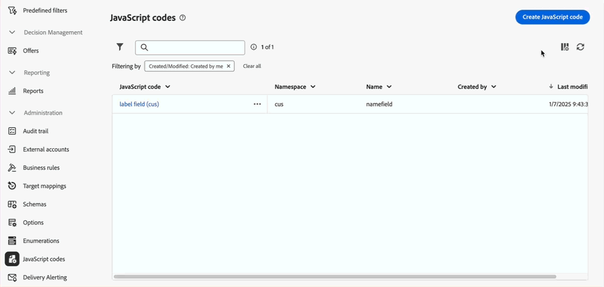

# 2025 release notes {#2025-release}

This page lists all changes and improvements available with **2025 releases**. Latest relese notes are available in [this page](release-notes.md).

## April '25 release {#25-4-release}

**Release date**: April 29, 2025

### New features {#25-4-features}

The following features are available to all users starting April release.

<table>
<thead>
<tr>
<th><strong>Call center channel</strong> </th>
</tr>
</thead>
<tbody>
<tr>
<td>

The call center channel is now available in Campaign Web User interface. This channel refers to a communication method used to manage and track communications or interactions that are handled via a call center — typically phone calls made by agents to customers or prospects.

Note: Reporting is not available in the Web UI for the call center channel. You must browse to the Client Console to access reports.

For more information, refer to the <a href="../call-center/gs-call-center.md">detailed documentation</a>.

</td>
</tr>
</tbody>
</table>

<table>
<thead>
<tr>
<th><strong>New rule builder</strong> </th>
</tr>
</thead>
<tbody>
<tr>
<td>

A new rule builder is now available to help you define complex conditions in an improved user interface. You can switch from the old to the new rule builder as needed.

For more information, refer to the <a href="../query/query-modeler-overview.md">detailed documentation</a>.

</td>
</tr>
</tbody>
</table>

<table>
<thead>
<tr>
<th><strong>External account authoring</strong> </th>
</tr>
</thead>
<tbody>
<tr>
<td>

As a Campaign administrator, you can now set up new connections with external systems from Campaign Web user interface.
You can also view, update and manage existing external accounts.

For more information, refer to the <a href="../administration/external-account.md">detailed documentation</a>.

</td>
</tr>
</tbody>
</table>
 
### Improvements {#25-4-improvements}

**General interface improvements**

* The Field description, Add to favorites and Distribution of values options for schema attributes are now more visible in the user interface. For more information, refer to the [detailed documentation](../get-started/attributes.md).
* In the interface, the date and time is now displayed according to the primary language set in the Experience League preferences. This improvement is only available for several languages. To see the complete list of supported languages, refer to the [detailed documentation](https://experienceleague.adobe.com/en/docs/core-services/interface/features/browser-language){target=_blank}.

<!--
ko * Built-in options are now only visible in the list of options if the **Show advanced options** toggle is activated.
ko * The typology rules creation screen has been updated to facilitate the selection of the type of rule.
-->

**Email Editor**: To enhance accessibility in Campaign Web UI, two new fields are now available in the Email Designer: they correspond to the `title` element and lang attribute in the `html` element of your email content. You can define these settings in addition to the Preheader field, in the email Body section. For more information, refer to the [detailed documentation](../email/metadata.md).

<!--
**Workflow**: You can now select an existing Javascript code in workflow properties or in a Javascript activity.    
-->

**Schemas**

* You can now edit the temporary schema of a list from Campaign web user interface. For more information, refer to the [detailed documentation](../audience/manage-audience.md).
* You can now preview the custom fields of a schema in a sample screen. For more information, refer to the [detailed documentation](../administration/custom-fields.md#add).
* You can now move custom fields in the list using drag and drop. For more information, refer to the [detailed documentation](../administration/custom-fields.md#add).

### New features in Limited Availability {#25-4-features-la}

>[!AVAILABILITY]
>
>The following capabilities are in Limited Availability (LA). They are restricted to customers migrating **from Adobe Campaign Standard to Adobe Campaign v8**, and cannot be deployed on any other environment. They require an upgrade of the Campaign server to v8.7.4.
>
>Refer to the following documentation pages: [Campaign Standard transition to Campaign v8](../rn/acs-migration.md) and [Features for Campaign Standard users](https://experienceleague.adobe.com/docs/experience-cloud/campaign/campaign-standard-migration-home.html).

* **Multilingual delivery creation** - You can now send multiple email deliveries in different languages in Adobe Campaign Web User Interface. The Multilingual delivery feature allows you to choose the default language of your delivery as well as the different languages in which the delivery can be sent. You can also preview these deliveries in the languages you have chosen. For more information, refer to the [detailed documentation](../email/edit-content.md).

* **Dynamic Reporting for Multilingual** - Dynamic reporting is now available for multilingual email deliveries. For more information, refer to the [detailed documentation](../reporting/global-reports.md).

* **SMS REST API support (LA)** - The Transactional Messaging REST API is now available for the SMS channel. When both email and mobilePhone are present in the payload, you can use the "wishedChannel" field to specify the channel. If not provided, email will be used by default unless wishedChannel explicitly requests SMS. For more information, refer to the [detailed documentation](https://experienceleague.adobe.com/en/docs/experience-cloud/campaign/apis/managing-transactional-messages){target=_blank}.

## February '25 release {#25-2-release}

**Release date**: Feb 18, 2025

The following features and improvements are available starting February release.

### Features {#25-2-features}

<table>
<thead>
<tr>
<th><strong>Create business rules (typology rules)</strong> </th>
</tr>
</thead>
<tbody>
<tr>
<td>

You can now create typologies and typology rules in Adobe Campaign Web User Interface. Typologies let you control, filter, and prioritize the sending of deliveries. Typologies are used to validate that deliveries always contain mandatory components (such as an unsubscription link or a subject line) or filtering rules to exclude groups from your audience (like unsubscribers, competitors, or non-loyalty customers).

For more information, refer to the <a href="../administration/typologies.md">detailed documentation</a>.

</td>
</tr>
</tbody>
</table>

<table>
<thead>
<tr>
<th><strong>Target mappings</strong> </th>
</tr>
</thead>
<tbody>
<tr>
<td>

You can now create target mappings in Campaign Web User Interface. Target mappings define how different delivery channels (email, SMS, push notifications) link to the data fields of a schema. The target mapping lets you define the targeted audience: profiles, contract beneficiaries, operators, subscribers, prospects, etc.

For more information, refer to the <a href="../administration/target-mappings.md">detailed documentation</a>.

</td>
</tr>
</tbody>
</table>

<table>
<thead>
<tr>
<th><strong>Schema details</strong> </th>
</tr>
</thead>
<tbody>
<tr>
<td>

You can now access the details of a schema by selecting its name in the list. Custom fields edition is now accessible from the <b>Edit custom fields</b> button available in the schema details.

For more information, refer to the <a href="../administration/schemas.md">detailed documentation</a>.

</td>
</tr>
</tbody>
</table>

## January '25 release {#25-1-release}

**Release date**: Feb 5, 2025

The following features and improvements are available starting January release.

### Features {#25-1-features}

<table>
<thead>
<tr>
<th><strong>Create and use visual fragments</strong> </th>
</tr>
</thead>
<tbody>
<tr>
<td>

Visual fragments are pre-defined visual blocks that you can reuse across multiple email deliveries, or in content templates. This feature is now available to all customers running on server build 8.6.4 and above.

For more information, refer to the <a href="../content/use-visual-fragments.md">detailed documentation</a>.

</td>
</tr>
</tbody>
</table>

<table>
<thead>
<tr>
<th><strong>Use a third-party system to send deliveries</strong> </th>
</tr>
</thead>
<tbody>
<tr>
<td>

You can now define external deliveries and external delivery templates in the Campaign web interface. In this mode, messages are compiled into an output file, which can be shared with your external provider. By default, the external delivery mode is used for the direct mail channel.

For more information, refer to the <a href="../msg/send-external-deliveries.md">detailed documentation</a>.

</td>
</tr>
</tbody>
</table>

<table>
<thead>
<tr>
<th><strong>Manage your enumerations</strong> </th>
</tr>
</thead>
<tbody>
<tr>
<td>

You can now create enumerations directly through Adobe Campaign Web User Interface. An enumeration is a list of values suggested by the system to populate fields. Use enumerations to standardize the values of these fields, help with data input or use within queries.

For more information, refer to the <a href="../administration/enumerations.md">detailed documentation</a>.

</td>
</tr>
</tbody>
</table>

<table>
<thead>
<tr>
<th><strong>Create custom options</strong> </th>
</tr>
</thead>
<tbody>
<tr>
<td>

You can now access technical options within Adobe Campaign Web User Interface and create your own custom options to suit your needs. This is particularly useful when working with JavaScript code workflow activities to store intermediate data.

For more information, refer to the <a href="../administration/options.md">detailed documentation</a>.

</td>
</tr>
</tbody>
</table>

<table>
<thead>
<tr>
<th><strong>Define and call Javascript codes</strong> </th>
</tr>
</thead>
<tbody>
<tr>
<td>

You can now create JavaScript codes in Adobe Campaign Web User Interface. This allows you to create reusable functions that can be utilized across workflows, similar to a library.

For more information, refer to the <a href="../administration/javascript-codes.md">detailed documentation</a>.

</td>
</tr>
</tbody>
</table>

<table>
<thead>
<tr>
<th><strong>Landing page generation with the AI Assistant</strong> </th>
</tr>
</thead>
<tbody>
<tr>
<td>

The AI Assistant is now available with your landing page deliveries, enabling you to generate text, images, or complete page layouts.

For more information on AI Assistant, refer to the <a href="../email/generative-lp.md">detailed documentation</a>.

</td>
</tr>
</tbody>
</table>

### Improvements {#25-1-improvements}

* Customize the display of custom fields in the interface:
    
    * You can now select additional custom fields to display in the interface
    * You can now set rules for displaying link-type custom fields, such as restricting list values based on another field's input
    * You can now arrange fields in the interface with more flexibly: fields can span a single column, or be grouped into subsections for better organization
    * You can now set specific fields as read-only

* Recent and Favorites filters: To quickly reuse attributes that are frequently used, you can now add them to favorites. This ensures they are readily accessible for future tasks. In addition to favorites, you can also view and use the most recently selected attributes.

* External accounts: The new **[!UICONTROL Routing]** type is available for selection when creating a new external account. It allows you to configure a specific external account for use in your external deliveries. [Learn more](../administration/external-account.md#routing)
