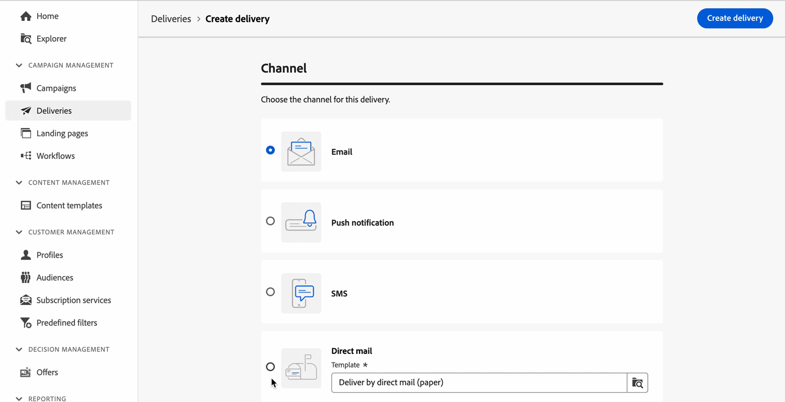

# Release notes {#latest-release}

>[!CONTEXTUALHELP]
>id="acw_homepage_learning_card2"
>title="What's new"
>abstract="Adobe Campaign Web user interface releases operate on a continuous delivery model which allows for a more scalable, phased approach to feature deployment. Release notes get updated several times a month."
>
>"**March release is now live**, including Direct mail channel, the new Change data source workflow activity, and other improvements."

<!--Last update: **March 19, 2024**-->

Adobe Campaign Web user interface releases operate on a continuous delivery model which allows for a more scalable, phased approach to feature deployment. Accordingly, these release notes get updated several times a month. Please check them regularly.

>[!AVAILABILITY]
>
>This version is available to all users starting [Campaign (console) v8.6 release](https://experienceleague.adobe.com/docs/campaign/campaign-v8/releases/release-notes.html). Learn more about Adobe Campaign client console releases and upgrades in [Campaign v8 (console) documentation](https://experienceleague.adobe.com/docs/campaign/campaign-v8/releases/upgrades.html){target="_blank"}.

## March release {#24-3-release}

**Release date**: March 19-20, 2024

### Direct Mail Channel {#24-3-dm}

**Direct mail** channel is now available for use in workflows and as standalone deliveries. Direct mail is an offline channel that allows you to create, personalize and generate an extraction files, and share it with your direct mail providers to send mail to your customers. [Read more](../direct-mail/gs-direct-mail.md)

### New Change data source workflow activity {#24-3-change-data-source}

The **Change data source** targeting activity allows you to change the data source used by your workflow's working table. This activity provides more flexibility by allowing you to manage data across your different databases and improve performances. [Read more](../workflows/activities/change-data-source.md)

### Split workflow activity improvement {#24-3-split}

You can now use the **Generate all subsets in the same table** option in the **Split** workflow activity to group all the subsets into a single output transition. [Read more](../workflows/activities/split.md)

### Query modeler {#24-3-query-modeler}

* The query modeler is now available for use in the Email Designer. It allows you to build conditions when creating conditional content. [Read more](../personalization/conditions.md)
* Predefined values are now available for date-type attributes when creating a custom condition. [Read more](../query/build-query.md)
* Operators can no longer be added on a new transition in the diagram. They can only be added on an existing transition before filtering components to group them together. [Read more](../query/build-query.md)
