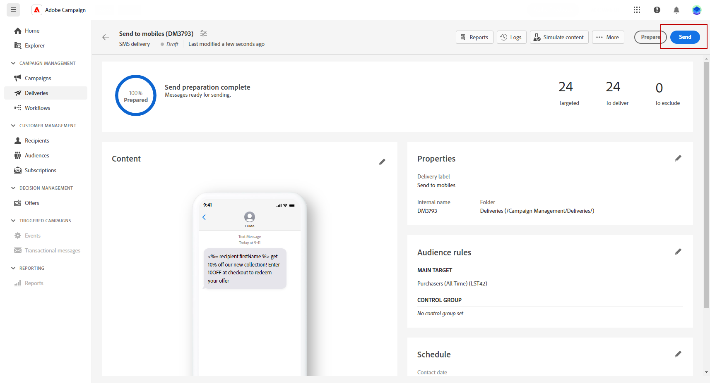

# Preview and send an SMS delivery {#send-sms}

## Preview your SMS delivery{#preview-sms}

Once you have defined your message content, you can utilize test profiles to preview and test it. If you have included personalized content, you can examine how this content is displayed in the message by using test profile data. This allows you to ensure that the message appears as intended and that any personalized information is correctly presented.

The main steps to preview your SMS delivery are as follows. More details on how to preview deliveries are available in [this section](../preview-test/preview-content.md).

1. From your delivery content page, use **[!UICONTROL Simulate content]** to preview your personalized content.

    

1. Click **[!UICONTROL Add test profile(s)]** to select one or several test profiles or profiles.
    
    <!--
    Once your test profiles are selected, click **[!UICONTROL Select]**.
    
    -->

1. In the right pane, you will find a preview of the SMS delivery, where personalized elements are dynamically replaced with data from the selected profile. 

    

You can now review and send your SMS message to your audience.

## Test your SMS delivery {#test-sms}

With **Adobe Campaign**, you have the ability to test a message before sending it to the main audience, which is an essential step in validating your email campaign and identifying potential issues.

Sending test SMS is an important step in ensuring the quality and effectiveness of your delivery. Test recipients can review various elements such as links, opt-out links and images, as well as identify any errors in rendering, content, personalization settings, and SMS configuration. This process helps you thoroughly evaluate and optimize your SMS before reaching your main audience.

 Learn how to send test SMS in [this section](../preview-test/proofs.md).

## Send your SMS delivery {#send-sms}

1. After personalizing your SMS content, click **[!UICONTROL Review & send]** from your **[!UICONTROL Delivery]** page.

    

1. Click **[!UICONTROL Prepare]** and monitor the progress and statistics provided. 

    If any errors occur, refer to the Logs menu for detailed information about the failure.

1. Send the messages by clicking on **[!UICONTROL Send]** to proceed with the final sending process.

    

1. Confirm the send action by clicking the **[!UICONTROL Send]** button.

Once your delivery is sent, you can track your KPIs (Key Performance Indicator) data from your delivery page and data from the **[!UICONTROL Logs]** menu.

You can now start measuring the impact of your message with built-in reports. [Learn more](../reporting/sms-report.md)

