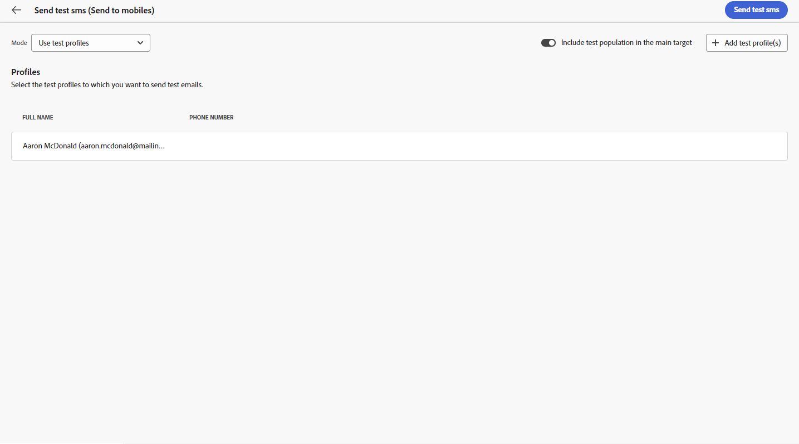

# Preview and send an SMS delivery {#send-sms-delivery}

>[!CONTEXTUALHELP]
>id="acw_deliveries_metrics_newquarantines"
>title="New quarantines metric"
>abstract="Total number of addresses quarantined following a failed delivery (user unknown, invalid domain) in relation to the number of messages to be delivered."

## Preview your SMS delivery {#preview-sms}

Once you define your message content, use test profiles to preview and test it. If personalized content is included, examine how this content appears in the message by using test profile data. This ensures the message displays as intended and that personalized information is correctly presented.

The main steps to preview your SMS delivery are as follows. More details on how to preview deliveries are available in [this section](../preview-test/preview-content.md).

1. From your delivery content page, use **[!UICONTROL Simulate content]** to preview your personalized content.

    {zoomable="yes"}

1. Click **[!UICONTROL Add test profile(s)]** to select one or several test profiles or profiles.
    
    <!--
    Once your test profiles are selected, click **[!UICONTROL Select]**.
    {zoomable="yes"}
    -->

1. In the right pane, view a preview of the SMS delivery, where personalized elements are dynamically replaced with data from the selected profile. 

    {zoomable="yes"}

Review and send your SMS message to your audience.

## Test your SMS delivery {#test-sms}

With **Adobe Campaign**, test a message before sending it to the main audience. This step validates your email campaign and identifies potential issues.

Sending proofs is crucial for ensuring the quality and effectiveness of your delivery. Proof recipients review various elements such as links, opt-out links, and images, and identify any errors in rendering, content, personalization settings, and SMS configuration. This process thoroughly evaluates and optimizes your SMS before reaching your main audience.

 Learn how to send proofs in [this section](../preview-test/test-deliveries.md).

{zoomable="yes"}

## Send your SMS delivery {#send-sms}

1. After personalizing your SMS content, click **[!UICONTROL Review & send]** from your **[!UICONTROL Delivery]** page.

    {zoomable="yes"}

1. Click **[!UICONTROL Prepare]** and monitor the progress and statistics provided. 

    If errors occur, refer to the Logs menu for detailed information about the failure.

1. Send the messages by clicking **[!UICONTROL Send]** to proceed with the final sending process.

    {zoomable="yes"}

    If the SMS delivery is scheduled, click the **[!UICONTROL Send as scheduled]** button. Learn more about delivery scheduling in [this section](../msg/gs-messages.md#schedule-the-delivery-sending).

1. Confirm the send action by clicking the **[!UICONTROL Send]** button.

Once your delivery is sent, track your KPIs (Key Performance Indicator) data from your delivery page and data from the **[!UICONTROL Logs]** menu.

Start measuring the impact of your message with built-in reports. [Learn more](../reporting/sms-report.md)