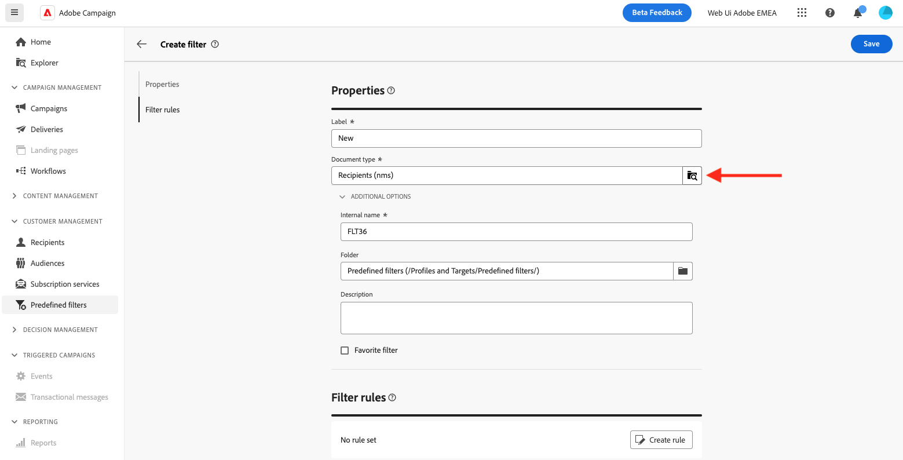
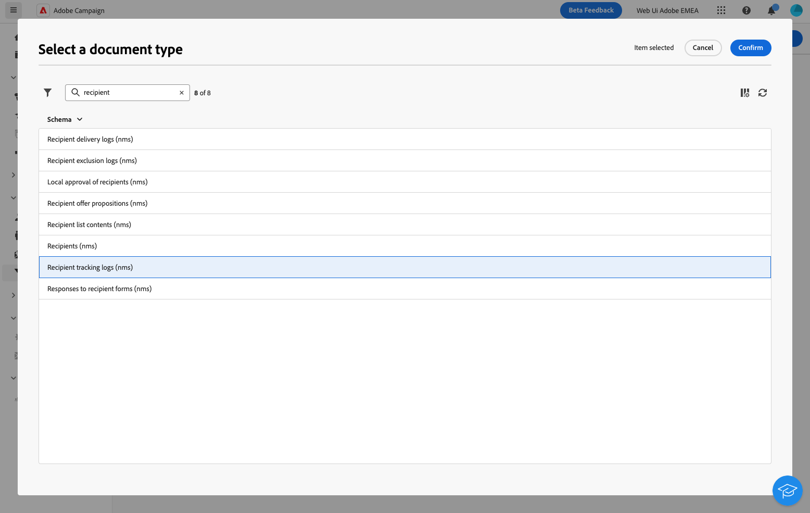
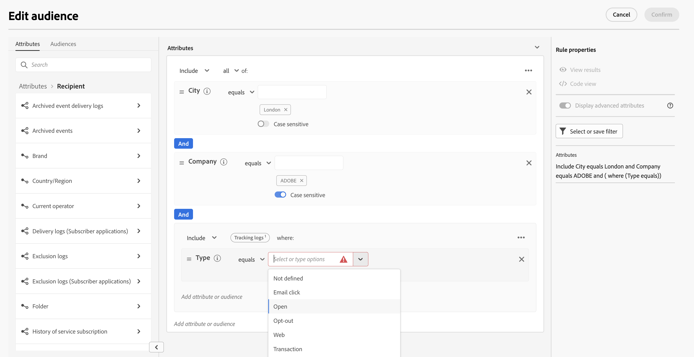

# Campaign key tables{#campaign-datamodel-tables}

Adobe Campaign relies on a relational database containing tables that are linked together. The pre-defined Adobe Campaign datamodel includes the main tables listed below.

When creating a rule, browse the type of documents to select a schema. In Adobe Campaign, all of the data types are defined by schemas, and each schema is implemented by a table in the database. 

Use the search field of the Select a document type screen to find the correct schema to filter from.

## Recipient table {#NmsRecipient}

Each profile in Campaign is a record in the **Recipient (nms)** table (or an external table) which stores all the profile attributes, such as first name, last name, email address, a cookie ID, Customer ID, mobile identifier or other information relevant to a particular channel. 

Other tables linked to the recipient table contain profile-related data, for example the [delivery logs](#ootb-logs) table which contains records of all deliveries sent to recipients.

The built-in **Recipient (nms)** table in Adobe Campaign has a number of pre-defined fields and table links. It is the default table used for the **recipients of deliveries**. As a result, it contains the information required for deliveries across different channels, such as the email address, format, mobile number, and more.

This table relates to the **nms:recipient** schema.

Exemple of query on the recipient table:

Learn more about recipients and profiles in [this section](../audience/about-recipients.md).

>[!NOTE]
>
> As an expert user, you can extend the recipient table, but cannot to reduce the number of fields or links in the table. Learn more in [Adobe Campaign (console) documentation](https://experienceleague.adobe.com/docs/campaign/campaign-v8/developer/shemas-forms/extend-schema.html).

## List table {#NmsGroup}

This table relates to the **nms:group** schema.

It enables you to create **lists of recipients**, or audiences. There is a many-to-many (N-N) relation between recipients and lists. A profile can belong to several lists and one list can contain several profiles. Lists are often used as audiences for deliveries. 

There is a unique index on the field representing the internal name of the list. The list is linked to a folder. For more on this, refer to the [Folder table](#XtkFolder).

Learn how to create a list of recipients in [this section](../audience/create-audience.md).

<!--
### NmsRcpGrpRel {#NmsRcpGrpRel}

The **NmsRcpGrpRel** relationship table only contains the two fields corresponding to the identifiers of the RecipientId and GroupId linked tables.
-->

## Service and subscription tables

### Service table {#NmsService}

This table relates to the **nms:service** schema.

In Adobe Campaign, you can create and manage subscriptions to information services. The **NmsService** table stores the definition of the information services (topics) that you offer your recipients to subscribe to (a newsletter for example).

<!--Services are entities which are similar to lists (static recipient groupings), except that they circulate more information and enable easy management of subscriptions and unsubscriptions via forms.-->

There is a unique index on the field representing the internal name of the service. The service is linked to a folder. The key is FolderId. For more on this, refer to the [Folder table](#XtkFolder). 

The Type field specifies the delivery channel of this service: 0 for email, 1 for SMS. Note that services do not apply to the push notification channel.

Learn more about services in [this section](../audience/manage-services.md).

### Subscription table {#NmsSubscription}

This table relates to the **nms:subscription** schema.

It enables you to manage recipient subscriptions to information services.

Learn more about subscriptions in [this section](../audience/manage-subscribers.md).

### History of service subscription table {#NmsSubHisto}

This table relates to the **nms:subHisto** schema.

All susbcriptions and unsubscriptions are tracked in the **SubHisto (nms)** table. The Action field specifies the action (0 for unsubscription and 1 for subscription) performed on the date stored in the Date field.

Learn how to monitor your subscription services in [this section](../audience/manage-services.md#logs-and-reports).

<!--
### Delivery table {#NmsDelivery}

This table relates to the **nms:delivery** schema.

Each record in this table represents a **delivery** or a **delivery template**. It contains all the necessary parameters for performing deliveries (the target, the content, etc.). Delivery logs (NmsBroadLog) and associated tracking URLs (NmsTrackingUrl) are created during the preparation phase.

There is a unique index on the field representing the internal name of the delivery or template. The delivery is linked to an execution folder. For more on this, see [XtkFolder](#XtkFolder).

Learn more about messages and deliveries in [this section](../msg/gs-messages.md).
-->

## Delivery table {#ootb-delivery}

The **Delivery  (nms)** table represents a delivery action or a delivery template. It contains all the necessary parameters for performing deliveries such as target, content, etc. Each record is updated on a regular basis to reflect delivery progress.

## Log tables {#ootb-logs}

These tables store all the logs associated with the execution of the campaigns and deliveries.

* Delivery logs are all messages sent to recipients or devices across all channels. The main Delivery logs table **BroadLogRcp (nms)** contains the delivery logs for all recipients. This table is related to the **nms:broadlogRcp** schema, and has all the details about recipients for any particular delivery.

* The **Broadlog (nms)** table is the largest table in the system. It stores one record per message sent, and these records are inserted, updated to track the delivery status, and deleted when the history is purged. 

* The **TrackingLogRcp (nms)** table is the main Tracking logs table: it stores the tracking logs for all recipients. The tracking logs refer to reactions of recipients, such as email openings and clicks. Each reaction corresponds to a tracking log.
    
Delivery logs and tracking logs are deleted after a certain period, which is specified in Adobe Campaign and can be modified. Therefore, it is highly recommended to export the logs on a regular basis. Learn more about retention period in Campaign in [this page](retention.md).

The **BroadLogMsg (nms)** table relates to the **nms:broadLogMsg** schema. It is an extension of the delivery log table. This table contains information used for qualifying SMTP errors.

Learn more about delivery logs in [this page](../monitor/delivery-logs.md).

## Technical tables {#ootb-tech}

Log tables gather technical data used for the applicative process, including for example:

* Operators and user rights, in the **Group (xtk)** table
* Campaign User sessions, in the **SessionInfo (xtk)** table
* Folders in Campaign explorer, in the **Folder (xtk)** table
* Workflows, in the **Workflow (xtk)** table
  and more.

### Folder table {#XtkFolder}

This table contains **all the folders in the tree** visible in the **Explorer** tab. It relates to the **xtk:folder** schema.

The folders are typed: the value of the Model field specifies the type of data that can be contained in the folder.

The explorer tree is managed by the ParentId and ChildCount fields. The FullName field gives the full path of the folder in the tree. Finally, there is a unique index on the field representing the internal name of the folder.

Learn more about Campaign explorer and deliveries in [this page](../get-started/user-interface.md#explorer).

## Campaign management {#campaign-management}

The following set of tables is linked to your **Marketing campaigns**.

* **Campaign (nms)**: This table matches the **nms:operation** schema. It contains the data of marketing campaigns.
<!--
* **NmsDeliveryOutline**: This table matches the **nms:deliveryOutline** schema. It contains the extended properties of the delivery (delivery outline).
* **NmsDlvOutlineItem**: This table matches the **nms:dlvOutlineItem** schema. It contains the articles of a delivery outline.-->
* **Budget (nms)**: This table matches the **nms:budget** schema. It contains the data of a budget on a campaign, a plan, a program, a task and/or deliveries.
* **Marketing documents (nms)**: This table matches the **nms:document** schema. It contains the marketing documents of the campaign in the form of files (images, excel or word files, etc.)
* **Workflow (xtk)**: This table matches the **xtk:workflow** schema. It contains campaign targeting.
* **Typology rules (nms)**: This table matches the **nms:typologyRules** schema. It contains the rules which apply to deliveries depending on typologies.
<!--
## Response management {#response-management}

This set of tables is linked to the **Response Manager** module, which allows to measure the success and profitability of marketing campaigns or offer propositions for all communication channels. For more on this, see [About response manager](../../response/using/about-response-manager.md).

### NmsRemaHypothesis {#NmsRemaHypothesis}

This table coincides with the **nms:remaHypothesis** schema. It contains the definition of the measurement hypothesis.

This table contains significant information stored in XML, including:

**Execution context (information stored in XML)**

The execution context populates the tables and fields to be taken into account for measurement calculation, namely:
* The nms:remaMatchRcp reaction log storage schema.
* The transaction table schema (purchases for example).
* The querying schema, which enables you to define the start table of the hypothesis conditions.
* The links to individuals, which enable you to identify the individual based on the querying schema.
* The transaction date. This field is not mandatory but we recommend that you use it to restrict the calculation perimeter.
* The transaction amount: it is an optional field for automatically calculating revenue indicators.

**Hypothesis perimeter (information stored in XML)**

The hypothesis perimeter consists in the filtering of the hypothesis based on the table of the querying schema.

**Hypothesis overload script (information stored in XML)**

The hypothesis overload script is a JavaScript code which enables you to overload the content of the hypothesis during execution.

**Measurement indicators**

The following indicators are updated automatically during the hypothesis execution:

* Number of reactions: **iTransaction**. Number of lines in the reaction logs table.
* Number of contacted: **iContactReacted**. Distinct number of targeted contacts in the hypothesis.
* Control group count: **iProofReacted**. Distinct number of targeted control group contacts in the hypothesis.
* Contacted response rate: **dContactReactedRate**. Response rate of the targeted contacts in the hypothesis.
* Response rate of the control group: **dProofReactedRate**. Response rate of the hypothesis control group.
* Total revenue of population contacted: **dContactReactedTotalAmount**. Total revenue of the targeted contacts in the hypothesis.
* Average revenue of control group: **dContactReactedAvgAmount**. Average revenue of the targeted control group contacts in the hypothesis.
* Total revenue of the control group: **dProofReactedTotalAmount**. Total revenue of the hypothesis control group.
* Average revenue of control group: **dProofReactedAvgAmount**. Average revenue of the hypothesis control group.
* Total margin per contact: **dContactReactedTotalMargin**. Total margin per contact targeted in the hypothesis.
* Average margin per contact: **dContactReactedAvgMargin**. Average margin per contact targeted in the hypothesis.
* Total margin of control group: **dProofReactedTotalMargin**. Total margin of the control group targeted in the hypothesis.
* Average margin of control group: **dProofReactedAvgMargin**. Average margin of the control group targeted in the hypothesis.
* Additional revenue: **dAdditionnalAmount**. (Average revenue of contacted - Average revenue of control group) * Number of contacted.
* Additional margin: **dAdditionnalMargin**. (Average margin of contacted - Average margin of control group) / Number of contacted.
* Average cost per contact (SQL expression). Calculated cost of the delivery / Number of contacted.
* ROI (SQL expression). Calculated cost of the delivery / Total margin of contacted.
* Effective ROI (SQL expression). Calculated cost of the delivery / Additional margin.
* Significance: **iSignificativy** (SQL expression). Contains values from 0 to 3 depending on the significance of the campaign.

### NmsRemaMatchRcp {#NmsRemaMatchRcp}

This table matches the **nms:remaMatchRcp** schema.

It contains a record representing an individual's reaction to a given hypothesis. These records were created during hypothesis execution.
-->

## Offer tables {#interaction-module}

This set of tables is linked to the **Interaction** module, which allows to respond in real time during an interaction with a given contact by making them a single or several adapted offers.

* **Marketing offers (nms)**: This table matches the **nms:offer** schema. It contains the definition of each marketing offer.
* **Offer proposition (nms)**: This table matches the **nms:propositionRcp** schema. It contains the cross-channel log of marketing propositions sent to each individual. The record is created when a proposition is prepared or effectively made to an individual.
* **Offer spaces (nms)**: This table matches the **nms:offerSpace** schema. It contains the definition of locations on which propositions are made.
* **Marketing offers category (nms)**: This table matches the **nms:offerCategory** schema. It contains the offer categories.
* **Marketing offers environments (nms)**: This table matches the **nms:offerEnv** schema. It contains the offer environments.

### Simulation {#simulation}

This set of tables is linked to the **Simulation** module, which allows to test the distribution of offers belonging to a category or an environment before sending your proposition to recipients.

* **Simulation (nms)**: This table matches the **nms:simulation** schema. It represents a simulation for a set of deliveries or offers on a given population.
* **Deliveries to simulation relation (nms)**: This table matches the **nms:dlvSimulationRel** schema. It contains the list of deliveries taken into account in the simulation. The scope of the simulation is stored in XML.
* **Offers to simulation relation (nms)**: This table matches the **nms:offerSimulationRel** schema. It lets you link up a simulation with an offer.

## Mobile channels {#mobile-tables}

### Push notification channel{#nmac-module}

This set of tables is linked to the **Mobile App Channel**, which allows to send personalized notifications to iOS and Android terminals via apps.

* **Mobile applications (nms)**: This table matches the **nms:mobileApp** schema. It contains the mobile applications defined in Adobe Campaign.
* **Exclusion logs (Subscriber applications)**: This table matches the **nms:excludeLogAppSubRcp** schema.
* **Tracking logs (Subscriber applications)**: This table matches the **nms:trackingLogAppSubRcp** schema.
* **Delivery logs (Subscriber applications)**: This table matches the **nms:broadLogAppSubRcp** schema.

### Twitter channel {#social-marketing-module}

This table is linked to the **Managing social networks** module, which allows to interact with customers via Twitter. 

* **NmsVisitor**: This table matches the **nms:visitor** schema. It contains information on visitors.
