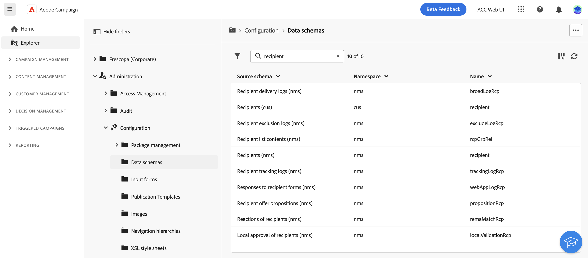
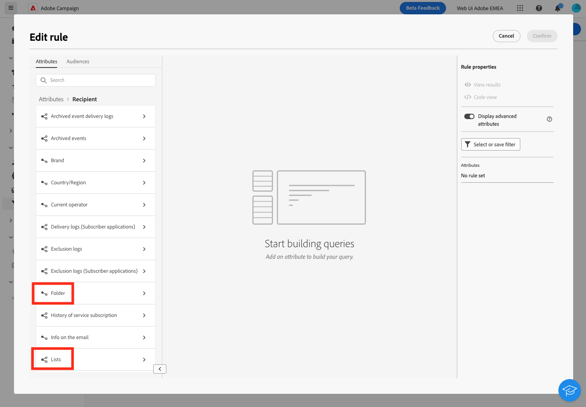

# Work with Campaign datamodel{#campaign-datamodel}

## Get started with Campaign data model{#gs-datamodel}

Adobe Campaign comes with a pre-defined data model. This section gives some details on the built-in tables of the Adobe Campaign data model and their interaction. Adobe Campaign relies on a Cloud database containing tables that are linked together.

The basic structure of the Adobe Campaign data model can be described as follows:

* **Recipient table**: The datamodel relies on a main table which is by default the Recipient table (**nmsRecipient**). This table stores all the marketing profiles. Learn more about the recipient table in [this section](#ootb-profiles).

* **Delivery table**: This table stores one record per delivery action. Learn more about the delivery table in [this section](#ootb-delivery).

* **Log tables**: These tables store all the logs associated with the execution of the campaigns, and deliveries. Learn more about the log tables in [this section](#ootb-logs).

* **Technical tables**: Gather technical data used for the applicative process. Learn more about the technical tables in [this section](#ootb-tech).


>[!NOTE]
>
> Key tables of Campaign datamodel are listed in [this page](datamodel-tables.md).

## Datamodel structure{#datamodel-structure}

### Built-in profile table {#ootb-profiles}

Each profile in Campaign is a record in the **nmsRecipient** table (or an external table) which stores all the profile attributes, such as first name, last name, email address, a cookie ID, Customer ID, mobile identifier or other information relevant to a particular channel. 

Other tables linked to the recipient table contain profile-related data, for example the [delivery logs](#ootb-logs) table which contains records of all deliveries sent to recipients.

The built-in recipient table (**nmsrecipient**) in Adobe Campaign has a number of pre-defined fields and table links. This is particularly useful when you are mainly targeting recipients, because it fits a simple recipient-centric datamodel.

Exemple of query on the recipient table:


Learn more about the Recipient table in [this section](datamodel-tables.md#nmsdelivery).


>[!NOTE]
>
> Adobe Campaign allows to build a custom recipient table from the Client console. However, in most cases, it is recommended to leverage the built-in Recipient table which already has pre-built additional tables and features.
>
> As an expert user, you can extend the recipient table, but cannot to reduce the number of fields or links in the table. Learn more in [Adobe Campaign (console) documentation](https://experienceleague.adobe.com/docs/campaign/campaign-v8/developer/shemas-forms/extend-schema.html).


### Log tables {#ootb-logs}

These tables store all the logs associated with the execution of the campaigns and deliveries.

* Delivery logs are all messages sent to recipients or devices across all channels. The main Delivery logs table (**NmsBroadLogRcp**) contains the delivery logs for all recipients. The **NmsBroadlogRcp** table (and related `broadlogRcp` schema) has all the details about recipients for any particular delivery.

* The **nmsBroadlog** table is the largest table in the system. It stores one record per message sent, and these records are inserted, updated to track the delivery status, and deleted when the history is purged. 

* The **NmsTrackingLogRcp** table is the main Tracking logs table: it stores the tracking logs for all recipients. The tracking logs refer to reactions of recipients, such as email openings and clicks. Each reaction corresponds to a tracking log.
    
Delivery logs and tracking logs are deleted after a certain period, which is specified in Adobe Campaign and can be modified. Therefore, it is highly recommended to export the logs on a regular basis. Learn more about retention period in Campaign in [this page](retention.md).

### Delivery table {#ootb-delivery}

The Delivery table (**NmsDelivery**) represents a delivery action or a delivery template. It contains all the necessary parameters for performing deliveries such as target, content, etc. Each record is updated on a regular basis to reflect delivery progress.

Learn more about the Delivery table in [this section](datamodel-tables.md#NmsDelivery).

### Log tables {#ootb-tech}

Log tables gather technical data used for the applicative process, including foe example:

* Operators and user rights, in the **xtkGroup** table
* Campaign User sessions, in the **xtkSessionInfo** table
* Folders in Campaign explorer, in the **XtkFolder** table
* Workflows, in the **xtkWorkflow** table
  and more.

## Browse Campaign datamodel {#browse-datamodel}

### Schemas and tables {#tables-and-schemas}

The physical and logical structure of the data carried in the application is described in XML. It obeys a grammar specific to Adobe Campaign, called a **schema**. A schema is an XML document associated with a database table. It defines data structure and describes the SQL definition of the table: the name of the table, fields, links with other tables.

It also describes the XML structure used to store data: elements and attributes, their types, hierarchy of elements, default values, labels, descriptions, and other properties.

Adobe Campaign relies on data schemas to:

* Define how data object within the application are tied to underlying database tables.
* Define links between the different data objects within the Campaign application.
* Define and describe the individual fields included in each object.

You can browse Campaign schemas from the **Explorer** view. To access the list of schemas, browse to **Administration > Configuration > Data schemas**.



From Campaign client console, you can access the description of each table. Browse to **Administration > Configuration > Data schemas**, select a resource from the list, and click the **Documentation** tab.

### Syntax of schemas {#syntax-of-schemas}

The root element of the schema is **`<srcschema>`**. It contains the **`<element>`** and **`<attribute>`** sub-elements.

The first **`<element>`** sub-element coincides with the root of the entity.

```
<srcSchema name="recipient" namespace="cus">
  <element name="recipient">  
    <attribute name="lastName"/>
    <attribute name="email"/>
    <element name="location">
      <attribute name="city"/>
   </element>
  </element>
</srcSchema>
```

>[!NOTE]
>
>The root element of the entity has the same name as the schema.

### Schema identification {#identification-of-a-schema}

A data schema is identified by its name and its namespace.

A namespace lets you group a set of schemas by area of interest. For example, the **cus** namespace is used for customer-specific configuration (**customers**).

### Create and extend schemas {#create-or-extend-schemas}

To add a field or other element to one of the core data schemas in Campaign, such as the recipient table (nms:recipient), you have to extend that schema. 

To add an entirely new type of data that does not exist in Adobe Campaign (a table of contracts for example) you can create a custom schema directly. 

These actions can only be performed by expert users from Campaign client console.

### Browse links and attributes {#links-and-attributes}

When using the rule builder, you can browse Campaign data model and query the database, to retrieve the exact data you need. You can filter and preview any data associated to the current targeting dimension. All of the data types are defined by schemas, and each schema is implemented by a table in the database.

In the rule builder, you can expand the links of the table you are working on. These links connect the current table to other tables, and helps you understand the relationships between tables in the database. Once these links and tables are expanded, you can view the attributes you can use to create your filtering conditions, and save them as rules. In addition, you can also preview the data that is retrieved, and check your filtering rules.


For example, when creating a filtering rule on the recipient table (**nmsRecipient**), you can see the links to the other tables. The cardinality between the links can be unique (1:1), or multiple (1:N). The link cardinality type is represented by a specific icon.

>[!NOTE]
>
>To view linked tables, you must activate the **Display advanced attributes** toggle.


For example there is a single Folder for each recipient - 1:1 cardinality -, but a recipient can be included in multiple lists - 1:N cardinality.



In the main table, and in each linked table, you can select the attributes to use to design your filtering rules. Learn steps to define a rule with the rule builder in [this section](../audience/create-audience.md).