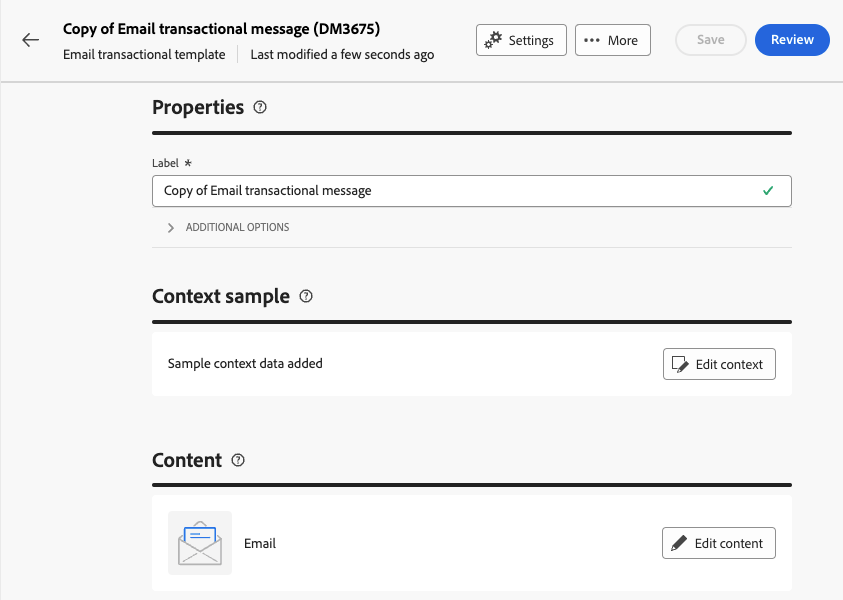
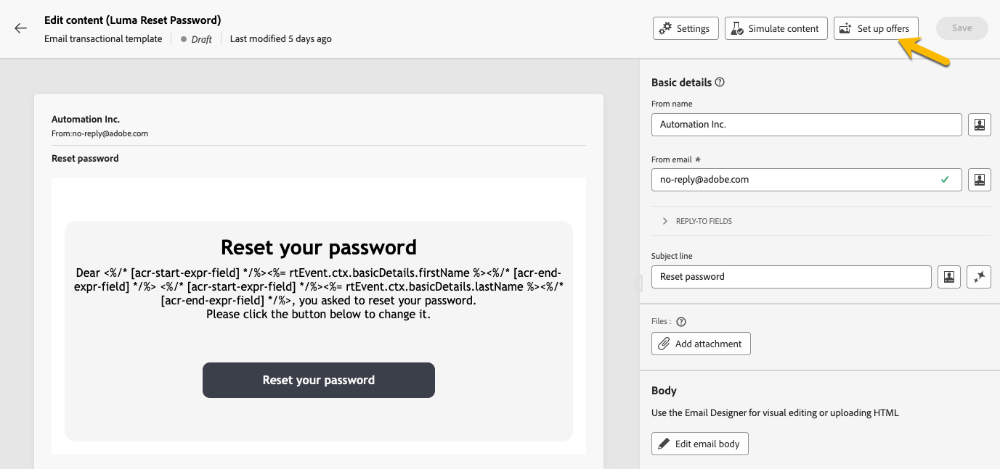

# Create transactional messages

In transactional messaging, an event triggers the sending of a personalized message.
To enable this, you need to create a message template for each event type. These templates contain all the necessary information for personalizing the transactional message.

## Create a transactional message template {#transactional-template}

In Campaign Web User Interface, the first step in transactional messaging configuration is the creation of the template or the direct creation of the message. This differs with [the configuration of transactional messages on client console](https://experienceleague.adobe.com/en/docs/campaign/campaign-v8/send/real-time/transactional).

A transactional message template can be used to preview the delivery content received by the profile before it reaches the final audience. For instance, an administrator can set up and configure the templates, making them ready for use by marketing users.

To create a transactional message template, follow the steps below: 

* In the **[!UICONTROL Triggered messages]** section, go to **[!UICONTROL Transactional messages]**. In the **[!UICONTROL Templates]** tab, you can see all the delivery templates for transactional messages. Click on the **[!UICONTROL Create transactional message template]** button to begin the creation of your template.

    {zoomable="yes"}

* In the new page displayed, choose the channel of your template. For our example, we select **[!UICONTROL Email]** channel. You can also work from another message template and select it in the templates list.

    {zoomable="yes"}

    Click again on the **[!UICONTROL Create transactional message]** button to validate the creation of your template on the channel selected.

* You now have access to the configuration of your transactional messages template.

    {zoomable="yes"}

### Transactional message properties {#transactional-properties}

The **[!UICONTROL Properties]** section of a transactional message will help you to set up: 

* The **[!UICONTROL Label]**: it is the name who is displayed in the transactional message list. Make it clear for research and future use.
* The **[!UICONTROL Internal name]**: it is a unique name that differentiates your message from the others messages created. 
* The **[!UICONTROL Folder]**: the folder where the transactional message template is created.
* The **[!UICONTROL Execution folder]**: the folder where the message belongs after execution.
* The **[!UICONTROL Delivery code]**: a code that helps to recognize the message for reporting, if needed.
* The **[!UICONTROL Description]**: a short description about the transactional message.
* The **[!UICONTROL Nature]**: the nature of your delivery, as listed in the enumeration *deliveryNature*

{zoomable="yes"}

### Context sample {#context-sample}

The context sample allows you to create a test event to preview the transactional message received with the profile personalization. 

This step is optional. You can use the template without the context sample, but the drawback is that you cannot preview the personalized content.

In our example of setting the password, the event will send the user's first name,  last name, and a personalized link to reset his password. The context can be configured as shown below.

The content of the context depends on the personalization you need.

{zoomable="yes"}

### Transactional message template content {#transactional-content}

Working on the content of a transactional message is like the content creation of a delivery. Click on **[!UICONTROL Open email designer]** or **[!UICONTROL Edit email body]** and select a template content or import you HTML code.

{zoomable="yes"}

To add the personalization in the content, click on the section where you want to add it and choose the **[!UICONTROL Add Personalization]** icon.

{zoomable="yes"}

You will have access to the **[!UICONTROL Edit personalisation]** window.
To add the variables from the trigger event, click on the **[!UICONTROL Event context]** icon. You can navigate the context you defined for your template ([learn more about the context](#context-sample)), and click on the **[!UICONTROL +]** button to insert the variable needed.

You can see in the image below how to add the personnalization of the first name.

{zoomable="yes"}

In our example, we add the first name, then, the last name, and we personalize the **[!UICONTROL Reset your password]** button link.

{zoomable="yes"}

### Preview your template

At this stage of the template creation, you may want to preview the template content, and check the personalization.

To do so, fill in the [context sample](#context-sample), and click on **[!UICONTROL Simulate content]** button.

{zoomable="yes"}

## Create a transactional message {#transactional-message}

You can create a transactional message directly or by using a transactional message template. [Learn how to create a transactional message template](#transactional-template). 

To create a transactional message, follow the steps below: 

* In the **[!UICONTROL Triggered messages]** section, go to **[!UICONTROL Transactional messages]**. In the **[!UICONTROL Browse]** tab, you can see all the transactional messages created. Click on the **[!UICONTROL Create transactional message]** button to begin the creation of your message.

    {zoomable="yes"}

* In the new page displayed, choose the channel of your message and choose the template you want to work with. In our example, we choose [the template we created here](#transactional-template).

    {zoomable="yes"}

    Click again on the **[!UICONTROL Create transactional message]** button to validate the creation of your message on the channel selected.

* You now have access to the configuration of your transactional message. Your message inherits the configuration of the template. This page is almost identical to the transactional message template configuration page, except it also includes the event type configuration.

    {zoomable="yes"}

    Fill in the configuration of your message as for a template: 
    * [The transactional message properties](#transactional-properties)
    * [The context sample](#context-sample)
    * [The message content](#transactional-content)
    and [configure the event-type](#event-type) as detailed below.

* After [validating your transactional message](validate-transactional.md), click on **[!UICONTROL Review and publish]** button to create and publish your message.
    The triggers can now push the sending of your transactional message.

### About the event-type {#event-type}

The configuration of the event-type links the message to the trigger event.

In Campaign Web User Interface, you can select and event-type already created or create directly your event-type in this configuration page.

{zoomable="yes"}

>[!CAUTION]
>
>If you select an event type that is currently being used by another transactional message, it will trigger the two messages. For best practices, **we highly recommend linking ONE event type to only ONE transactional message.**

## Add offers to your transactional messages {#transactional-offers}

You have the option to include offers in your transactional messages, allowing you to present relevant proposals to your end users, even when the message is event-triggered.

This feature is accessible during the content editing phase of your transactional message. Simply click on **[!UICONTROL Set up offers]** button to configure it.

The setup process is identical to configuring offers for standards deliveries. [Learn how to add offers to your message](../msg/offers.md).

{zoomable="yes"}
