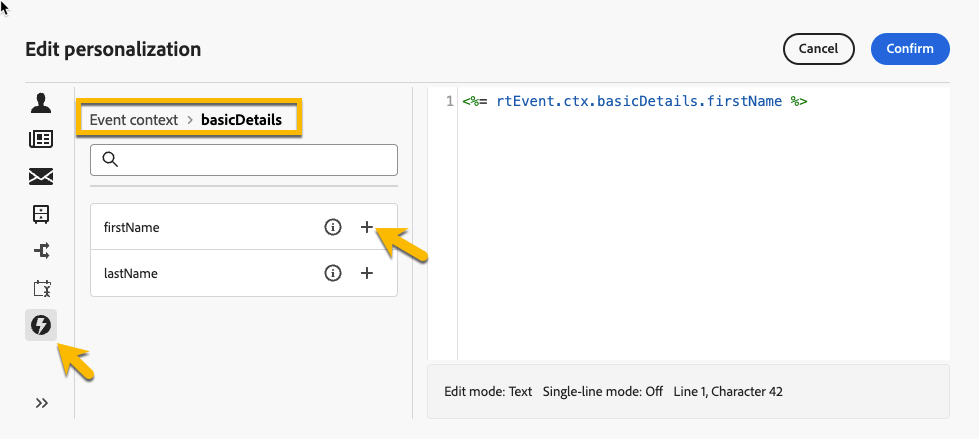
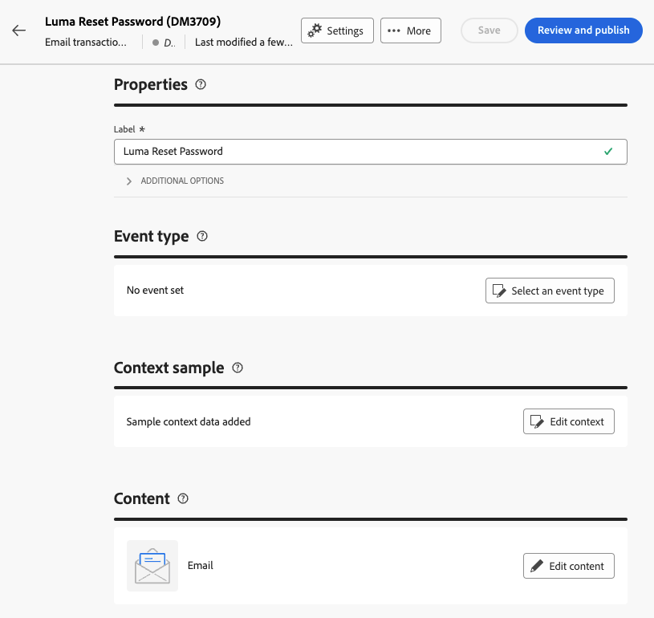

# Create transactional messages

In transactional messaging, an event triggers the sending of a personalized message. To enable this, create a message template for each event type. These templates contain all the necessary information for personalizing the transactional message.

## Create a transactional message template {#transactional-template}

In Campaign Web User Interface, the first step in transactional messaging configuration is the creation of the template or the direct creation of the message. This differs from [the configuration of transactional messages on the client console](https://experienceleague.adobe.com/en/docs/campaign/campaign-v8/send/real-time/transactional).

A transactional message template can be used to preview the delivery content received by the profile before it reaches the final audience. For instance, an administrator can set up and configure the templates, making them ready for use by marketing users.

To create a transactional message template, follow the steps below:

* In the **[!UICONTROL Triggered messages]** section, go to **[!UICONTROL Transactional messages]**. In the **[!UICONTROL Templates]** tab, you can see all the delivery templates for transactional messages. Click on the **[!UICONTROL Create transactional message template]** button to begin the creation of your template.

    {zoomable="yes"}

* In the new page displayed, choose the channel of your template. For this example, select the **[!UICONTROL Email]** channel. You can also work from another message template and select it in the templates list.

    {zoomable="yes"}

    Click again on the **[!UICONTROL Create transactional message]** button to validate the creation of your template on the selected channel.

* Access the configuration of your transactional message template.

    {zoomable="yes"}

### Transactional message properties {#transactional-properties}

>[!CONTEXTUALHELP]
>id="acw_transacmessages_properties"
>title="Transactional messaging properties"
>abstract="Fill in this form to configure the transactional messaging properties."

>[!CONTEXTUALHELP]
>id="acw_transacmessages_email_properties"
>title="Transactional messaging Email properties"
>abstract="Fill in this form to configure the transactional messaging email properties."

>[!CONTEXTUALHELP]
>id="acw_transacmessages_sms_properties"
>title="Transactional messaging SMS properties"
>abstract="Fill in this form to configure the transactional messaging SMS properties."

>[!CONTEXTUALHELP]
>id="acw_transacmessages_push_properties"
>title="Transactional messaging Push properties"
>abstract="Fill in this form to configure the transactional messaging Push properties."

The **[!UICONTROL Properties]** section of a transactional message helps you set up:

* The **[!UICONTROL Label]**, which is the name displayed in the transactional message list. Make it clear for research and future use.
* The **[!UICONTROL Internal name]**, which is a unique name that differentiates your message from other messages created.
* The **[!UICONTROL Folder]**, where the transactional message template is created.
* The **[!UICONTROL Execution folder]**, where the message is stored after execution.
* The **[!UICONTROL Delivery code]**, which is a code that helps recognize the message for reporting, if needed.
* The **[!UICONTROL Description]**.
* The **[!UICONTROL Nature]**, which is the nature of your delivery, as listed in the enumeration *deliveryNature*. [Learn more about enumerations](https://experienceleague.adobe.com/en/docs/campaign/campaign-v8/config/configuration/ui-settings#enumerations).

{zoomable="yes"}

### Mobile app {#mobile-app}

>[!CONTEXTUALHELP]
>id="acw_transacmessages_mobileapp"
>title="Transactional messaging Mobile App"
>abstract="In this section, you can select the application where you want to push your message."

In this section, select the application where you want to push your message.

By clicking on the search icon, access the list of mobile applications in your Adobe Campaign instance.

{zoomable="yes"}

### Context sample {#context-sample}

>[!CONTEXTUALHELP]
>id="acw_transacmessages_context"
>title="Transactional messaging context"
>abstract="The context sample allows you to create a test event to preview the transactional message received with the profile personalization."

>[!CONTEXTUALHELP]
>id="acw_transacmessages_addcontext"
>title="Transactional messaging context"
>abstract="The context sample allows you to create a test event to preview the transactional message received with the profile personalization."

The context sample allows you to create a test event to preview the transactional message received with the profile personalization.

This step is optional. You can use the template without the context sample, but the drawback is that you cannot preview the personalized content.

In the example of setting the password, the event sends the user's first name, last name, and a personalized link to reset their password. The context can be configured as shown below.

The content of the context depends on the personalization you need.

{zoomable="yes"}

### Transactional message template content {#transactional-content}

>[!CONTEXTUALHELP]
>id="acw_transacmessages_content"
>title="Transactional messaging content"
>abstract="Learn how to create the transactional messaging content."

>[!CONTEXTUALHELP]
>id="acw_transacmessages_personalization"
>title="Transactional messaging personalization"
>abstract="Learn how to personalize the transactional messaging content."

>[!CONTEXTUALHELP]
>id="acw_personalization_editor_event_context"
>title="Event context"
>abstract="This menu provides variables from the trigger event that you can leverage to personalize your transactional message content."

Working on the content of a transactional message is similar to the content creation of a delivery. Click on **[!UICONTROL Open email designer]** or **[!UICONTROL Edit email body]**, and select a template content or import your HTML code.

{zoomable="yes"}

To add personalization to the content, click on the section where you want to add it and choose the **[!UICONTROL Add Personalization]** icon.

{zoomable="yes"}

Access the **[!UICONTROL Edit personalisation]** window. To add variables from the trigger event, click on the **[!UICONTROL Event context]** icon. Navigate the context you defined for your template ([learn more about the context](#context-sample)), and click on the **[!UICONTROL +]** button to insert the required variable.

The image below shows how to add personalization for the first name.

{zoomable="yes"}

In this example, add the first name, last name, and personalize the **[!UICONTROL Reset your password]** button link.

{zoomable="yes"}

### Preview your template

At this stage of template creation, preview the template content and check the personalization.

To do so, fill in the [context sample](#context-sample), and click on the **[!UICONTROL Simulate content]** button.

{zoomable="yes"}

## Create a transactional message {#transactional-message}

You can create a transactional message directly or by using a transactional message template. [Learn how to create a transactional message template](#transactional-template).

To create a transactional message, follow the steps below:

* In the **[!UICONTROL Triggered messages]** section, go to **[!UICONTROL Transactional messages]**. In the **[!UICONTROL Browse]** tab, you can see all the transactional messages created. Click on the **[!UICONTROL Create transactional message]** button to begin the creation of your message.

    {zoomable="yes"}

* In the new page displayed, choose the channel of your message and select the template you want to work with. In this example, choose [the template created earlier](#transactional-template).

    {zoomable="yes"}

    Click again on the **[!UICONTROL Create transactional message]** button to validate the creation of your message on the selected channel.

* Access the configuration of your transactional message. Your message inherits the configuration of the template. This page is almost identical to the transactional message template configuration page, except it also includes the event type configuration.

    {zoomable="yes"}

    Fill in the configuration of your message as for a template:
    * [Transactional message properties](#transactional-properties)
    * [Context sample](#context-sample)
    * [Message content](#transactional-content)
    and [configure the event type](#event-type) as detailed below.

* After [validating your transactional message](validate-transactional.md), click on the **[!UICONTROL Review and publish]** button to create and publish your message. The triggers can now push the sending of your transactional message.

### About the event type {#event-type}

>[!CONTEXTUALHELP]
>id="acw_transacmessages_event"
>title="Transactional messaging event"
>abstract="The configuration of the event type links the message to the trigger event."

The configuration of the event type links the message to the trigger event.

In Campaign Web User Interface, select an event type already created or create your event type directly in this configuration page.

{zoomable="yes"}

>[!CAUTION]
>
>If you select an event type that is currently being used by another transactional message, it will trigger both messages. For best practices, **link ONE event type to only ONE transactional message.**

## Add offers to your transactional messages {#transactional-offers}

You can include offers in your transactional messages, allowing you to present relevant proposals to your end users, even when the message is event-triggered.

This feature is accessible during the content editing phase of your transactional message. Click on the **[!UICONTROL Set up offers]** button to configure it.

The setup process is identical to configuring offers for standard deliveries. [Learn how to add offers to your message](../msg/offers.md).

{zoomable="yes"}