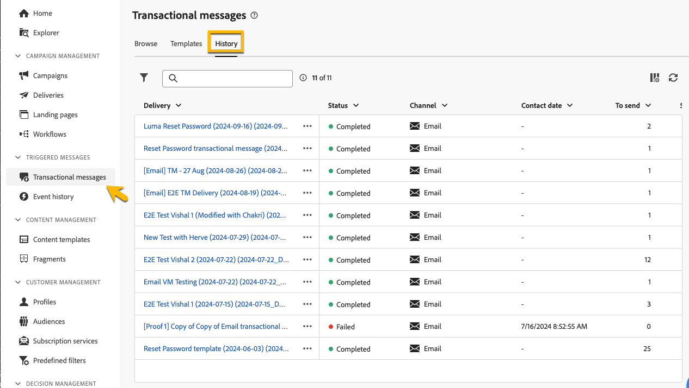

# Monitor transactional messages

After the publishing and the sending of your transactional message, you can have reporting and logs about it.

## Transactional message logs {#transactional-logs}

After your message has been published, you can review its execution by clicking on the **[!UICONTROL Logs]** button.

{zoomable="yes"}

This gives you access to detailed logs about the message's publication in **[!UICONTROL logs]** tab. 

{zoomable="yes"}

Additionally, you can view the list of **[!UICONTROL Proofs]** sent along with their logs, in the corresponding tab.

## Transactional messages history {#transactional-history}

In the **[!UICONTROL Triggered messages]** section, you can view details about all the transactional messages that have been executed. To access this, navigate to **[!UICONTROL Transactional messages]**. In the **[!UICONTROL History]** tab, you can see the list of executed transactional messages along with their status and additional information.

{zoomable="yes"}

Do a research there to find your message and click on it.
You can view the details there.

{zoomable="yes"}

## Event history {#event-history}

You can also have a view on the events that trigger your transactional message.
To see them, go on **[!UICONTROL Event history]** section.

You can see them with the event type name.

{zoomable="yes"}

You have more details as below by clicking on the **[!UICONTROL Event]** ID:

* The contact information
* All about the processus dates

You can even have a preview on the message sent with the **[!UICONTROL Preview]** button, and see the data received that triggers the message with the **[!UICONTROL View data]** button.

{zoomable="yes"}

The **[!UICONTROL More]** button allows you to delete the event history.
