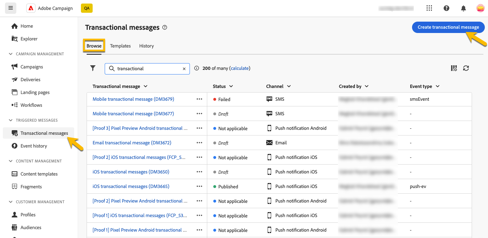
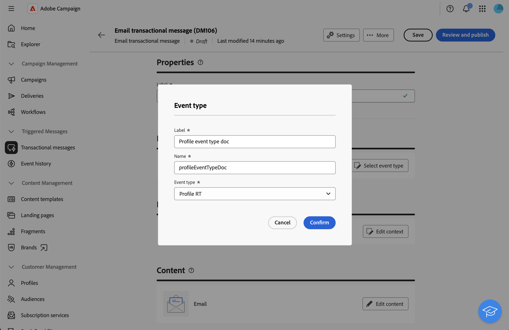

# Enrich transactional messages with Profile Data{#profile-enrichment}

This capability allows you to personalize transactional messages by linking Adobe Campaign database fields to message content. You can select target mappings, enrichment columns, and a reconciliation key to ensure accurate, real-time personalization while maintaining performance thresholds.

* Event-based transactional messages use data contained in the event itself.
* Profile-based transactional messages use data contained in the Adobe Campaign database.

To set up profile enrichment, follow these main steps:

1. Create the transactional message, [read more](#create-enrichment)
1. Define the event type, [read more](#event-enrichment)
1. Set up the enrichment settings, [read more](#settings-enrichment)
1. Define the content, [read more](#content-enrichment)
1. Validate and send, [read more](#send-enrichment)

>[!NOTE]
>
>Your server must be upgraded to 8.8.2 or later.
>
>This feature is currently only available for emails, SMS and push notifications.

## Create the transactional message{#create-enrichment}

First, you need to create a new transactional message.

1. In the **[!UICONTROL Triggered messages]** section, go to **[!UICONTROL Transactional messages]** and create a new transactional message. 

    {zoomable="yes"}

1. Choose a template and define the properties. For more on this, refer to this [page](create-transactional.md#transactional-message).

## Define the event type{#event-enrichment}

Then, you need to define the event as profile-based to target data contained in the Adobe Campaign database.

1. In the **Event type** section, select **Select event type**, then choose if you want to use an existing event type or create your own.

    >[!NOTE]
    >
    >You cannot choose an event type already used in another transactional message template.

    {zoomable="yes"}

1. Enter the event type information: 

    * For an existing event type, select it from the list. 
    * For a new one, add a label and name.

1. Then, choose **Profile RT** in the **Event type** drop-down.

    {zoomable="yes"}

## Set up the enrichment settings{#settings-enrichment}

Now, let's add fields to the event which will allow you to personalize the transactional message.

1. In the **Data** section, click **Enrichment settings**. 

    {zoomable="yes"}

    >[!NOTE]
    >
    >This button is available only when you define a profile-based event. 

1. In the **Additional attributes** section, click **add attribute** and select the fields needed.

    {zoomable="yes"}

1. Define which attribute will be used as the reconciliation key.

1. Choose what should happen if the key is not available in the payload. 

    * Message is sent with no personalization
    * Message is not sent

## Define the content{#content-enrichment}

Then, you need to define the content of the transactional message.

1. In the **Content** section, click the **Edit content** button and define your message content. Refer to this [page](create-transactional.md#transactional-content).

    {zoomable="yes"}

1. When using personalization, on the subject line for example, use the **Profile enrichment** menu to add the profile-based fields previously defined.

    {zoomable="yes"}

## Validate and send{#send-enrichment}

Finally, you need to validate and send the delivery. 

1. Validate the delivery by simulating the content and sending proofs. Refer to this [page](validate-transactional.md).

1. Click on the **[!UICONTROL Review and publish]** button to create and publish the message. The triggers can now initiate the sending of your transactional message.

<!--
When creating the event configuration, select the Profile event targeting dimension (see Creating an event).

Add fields to the event, in order to be able to personalize the transactional message (see Defining the event attributes). You must add at least one field to create an enrichment. You do not need to create other fields such as First name and Last name as you will be able to use personalization fields from the Adobe Campaign database.

Create an enrichment in order to link the event to the Profile resource (see Enriching the event) and select this enrichment as the Targeting enrichment.

IMPORTANT
This step is mandatory for profile-based events.
Preview and publish the event (see Previewing and publishing the event).

When previewing the event, the REST API does not contain an attribute specifying the email address, mobile phone, or push notification specific attributes, as it will be retrieved from the Profile resource.

Once the event has been published, a transactional message linked to the new event is automatically created. In order for the event to trigger sending a transactional message, you must modify and publish the message that was just created…

Integrate the event into your website (see Integrate the event triggering).
-->

