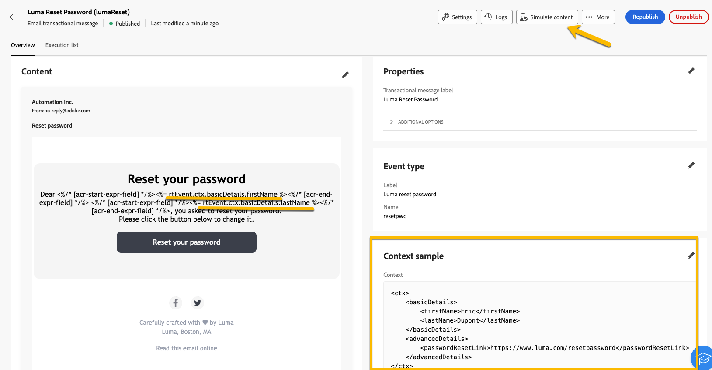

# Validate transactional messages

During or after creating your transactional message, you may want to validate the content using a data sample.

## Simulate content {#simulate-content}

Follow these steps to simulate the content of your message: 

* Ensure that the personalization path in your message content matches your context sample. In the example below, to display the first name of the test profile, we use the path *rtEvent.ctx.basicDetails.firstName* 

    You can change the message content or the context sample to make them align.

    {zoomable="yes"}

* Click on the **[!UICONTROL Simulate content]** button to preview your transactional message with the data you entered in the context sample.

    {zoomable="yes"}

    After checking your content, click on the **[!UICONTROL Close]** button.

* Do not forget to click **[!UICONTROL Republish]** button if you have made any changes to your content.

## Send proof

If you want to test and experience the transactional message as it would be delivered through you chosen channel (such as email, SMS or push notification), you can use the proof feature.

In the [simulation content window](#simulate-content), click on the **[!UICONTROL Send proof]** button.

{zoomable="yes"}

In the new window that appears, enter the email address (or phone number, depending on the channel) where you would like to receive the proof. Once you have input the desired address, click on **[!UICONTROL Send proof]** and on **[!UICONTROL Confirm]** buttons. This action allows you to send a sample of your transactional message, ensuring that all personalizations, dynamic content, and formatting appear correctly as they would for your end users.

{zoomable="yes"}

This is an essential step to identify any potential issues before publishing your transactional message.
