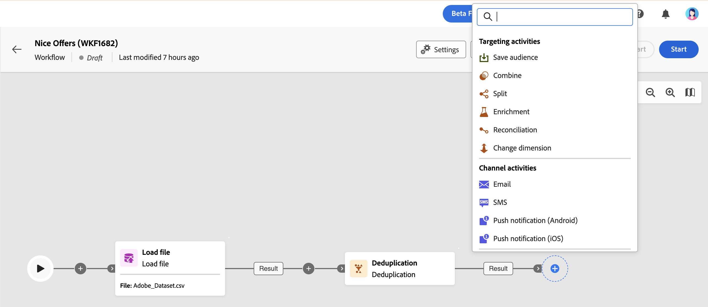

# About workflow activities {#workflow-activities}

Workflow activities are grouped into three categories. Depending on the context, available activities may differ.

All activities are detailed in the sections below:

* [Targeting and data management activities](#targeting)
* [Channel activities](#channel)
* [Flow control activities](#flow-control)

## Targeting activities {#targeting}

These activities are specific to targeting. They allow you to build one or more target audiences by defining an audience and splitting or combining these audiences using intersection, union, or exclusion operations.

* [Build audience](build-audience.md): Define your target population. Select an existing audience or use the query modeler to define your own query.
* [Change data source](change-data-source.md): Change the data source for the working table of your workflow.
* [Change dimension](change-dimension.md): Change the targeting dimension while building your workflow.
* [Combine](combine.md): Perform segmentation on your inbound population. Use a union, an intersection, or an exclusion.
* [Deduplication](deduplication.md): Remove duplicates in the results of inbound activities.
* [Enrichment](enrichment.md): Define additional data to process in your workflow. Configure the activity to complete the output transition with additional data.
* [Incremental query](incremental-query.md): Query the database on a scheduled basis. Each time this activity runs, it excludes results from previous executions, targeting only new elements.
* [Reconciliation](reconciliation.md): Define the link between the data in the Adobe Campaign database and the data in a work table, such as data loaded from an external file.
* [Save audience](save-audience.md): Update an existing audience or create a new audience from the population computed upstream in a workflow.
* [Split](split.md): Segment the incoming population into several subsets.

## Data management activities {#data}

These activities are specific to manipulating and enriching population data.

* [Extract file](extract-file.md): Export data from Adobe Campaign to another system as an external file.
* [Load file](load-file.md): Work with profiles and data stored in an external file.
* [Transfer file](transfer-file.md): Receive or send files, test for file presence, or list files on a server. The protocol used can be either server-to-server protocol or HTTP protocol.
* [JavaScript code](javascript-code.md): Execute a JavaScript code snippet within the context of a workflow.
* [Subscription services](subscription-services.md): Subscribe or unsubscribe multiple profiles to or from a service in a single action.
* [Update data](update-data.md): Perform mass updates on fields in the database. Several options allow you to personalize the data update.

## Channel activities {#channel}

Adobe Campaign Web allows you to automate and execute marketing campaigns across multiple channels. Combine channel activities into the canvas to create cross-channel workflows that trigger actions based on customer behavior. The following **Channel** activities are available: Email, SMS, Android, and iOS Push notifications. [Learn how to set up a delivery in the context of a workflow](channels.md).

## Flow control activities {#flow-control}

>[!CONTEXTUALHELP]
>id="acw_orchestration_end"
>title="End activity"
>abstract="The **End** activity allows you to graphically mark the end of a workflow. This activity has no functional impact and is therefore optional."

The following activities are specific to organizing and executing workflows. Their main task is to coordinate the other activities:

* [And-join](and-join.md): Synchronize multiple execution branches of a workflow.
* **End**: Graphically mark the end of a workflow. This activity has no functional impact and is therefore optional.
* [External signal](external-signal.md): Trigger the execution of a workflow from another workflow or an API call.
* [Fork](fork.md): Create outbound transitions to start several activities simultaneously.
* [Scheduler](scheduler.md): Schedule when the workflow starts.
* [Test](test.md): Enable transitions based on specified conditions.
* [Wait](wait.md): Pause execution of a part of a workflow temporarily.