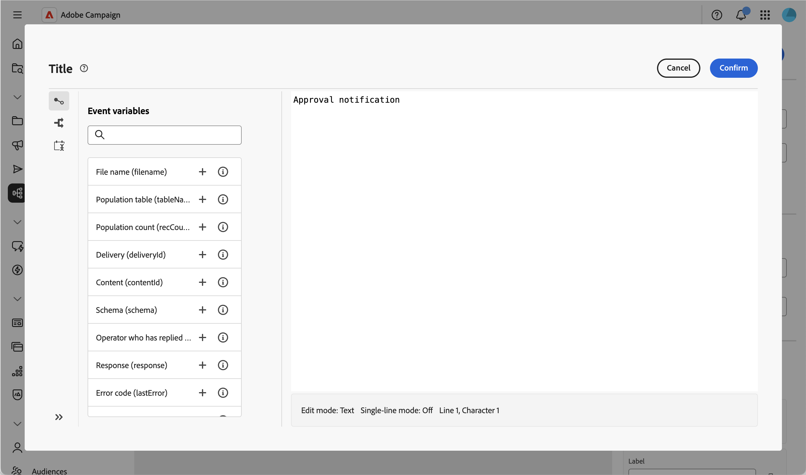

# Approval {#approval}

>[!CONTEXTUALHELP]
>id="acw_orchestration_approval"
>title="Approval activity"
>abstract="The **Approval** activity requires the participation of an operator. Assign the task to a group or an individual operator, customize the notification title and message, and define the possible answers as output branches."

The **Approval** workflow activity allows you to assign a task to a group or an individual operator, customize the notification email title and message, and define the possible answers (for example Yes/No) as output branches.

Use this activity whenever a step in your workflow requires a human decision before continuing, for example to get sign-off on a budget, a target audience, or content, before the workflow proceeds.

## How the approval process works {#process}

It requires the participation of at least one operator. This activity does not block the workflow: other tasks can run while the workflow waits for a reply.

While waiting for an answer, the activity is shown as pending on the canvas. The assignee responds using the link included in the notification message.

Here is the approval task process:

1. Create a workflow and configure an **Approval** activity.
1. Start the workflow. When it reaches the **Approval** activity, a task is created for the assignee.
1. The assignee receives the notification message, clicks on the link and selects an answer.
1. Once the assignee replies, the workflow continues through the transition matching their answer.

To configure this activity, follow these steps:

1. Assign the task, [read more](#assignment)
1. Define the notification message, [read more](#message)
1. Define the possible answers, [read more](#answers)
1. Optionally, define an expiration, [read more](#expiration)

## Assign the task {#assignment}

Assigning the task to a group or an operator is mandatory: a warning is displayed until you do so.

{zoomable="yes"}

Follow these steps:

1. In the **[!UICONTROL Assignment type]** field, choose whether the task is assigned to a **[!UICONTROL Group]** (default) or an **[!UICONTROL Operator]**.

1. Then select the **[!UICONTROL Group]** (of operators) or an **[!UICONTROL Operator]** (single operator).

1. Enable **[!UICONTROL Multiple approval]** if you want every assignee to reply before the workflow continues. This option is available regardless of the assignment type. When disabled, the workflow continues as soon as any one assignee replies, and that reply is the one taken into account.

1. Click **[!UICONTROL Advanced parameters]** to select the delivery template used for the notification. By default, a built-in template is used, but you can select any other delivery template.

   {zoomable="yes"}

## Define the notification message {#message}

You can now define the notification message sent to the assignee.

{zoomable="yes"}

Follow these steps:

1. Define the **[!UICONTROL Title]** of the notification sent to the assignee.

1. Define the **[!UICONTROL Message]** of the notification sent to the assignee. 

Both fields support personalization: click the personalization icon to insert event variables, such as the **[!UICONTROL Operator who has replied]** and the **[!UICONTROL Response]**, which you can reuse elsewhere in your workflow.

{zoomable="yes"}

## Define the possible answers {#answers}

The activity comes with two default answers, **[!UICONTROL Yes]** and **[!UICONTROL No]**. Each answer corresponds to an output transition on the canvas.

{zoomable="yes"}

Click **[!UICONTROL Add answer]** to define additional choices.

When the assignee answers, the workflow continues through the transition matching their choice.

## Define an expiration {#expiration}

Finally, you can define an expiration for the approval task. Like an answer, an expiration triggers its own output transition if the assignee has not replied by the deadline.

{zoomable="yes"}

1. Click **[!UICONTROL Add expiration]**.

1. Define a **[!UICONTROL Label]** for the corresponding output transition.

1. In the **[!UICONTROL Expiration type]** drop-down, choose one of the following options:

   * **[!UICONTROL Delay after task start]**: Define a delay to wait after the approval task starts.
   * **[!UICONTROL Delay after a date]**: Define a delay to wait after a specific date.
   * **[!UICONTROL Delay before a date]**: Define a delay to wait before a specific date.
   * **[!UICONTROL Expiration calculated by script]**: Use a script to calculate the expiration.

1. Enable **[!UICONTROL Do not terminate the task]** if you want the expiration transition to be activated without ending the approval task, so the assignee can still reply afterwards.

You can define multiple expirations for the same approval task.

You can then start the workflow. Once the assignee replies, the workflow continues through the transition matching their answer. [Read more](#process)

## Related topics {#related}

* [About workflow activities](about-activities.md)
* [Set up and manage the approval process](../../campaigns/campaign-approvals.md)
