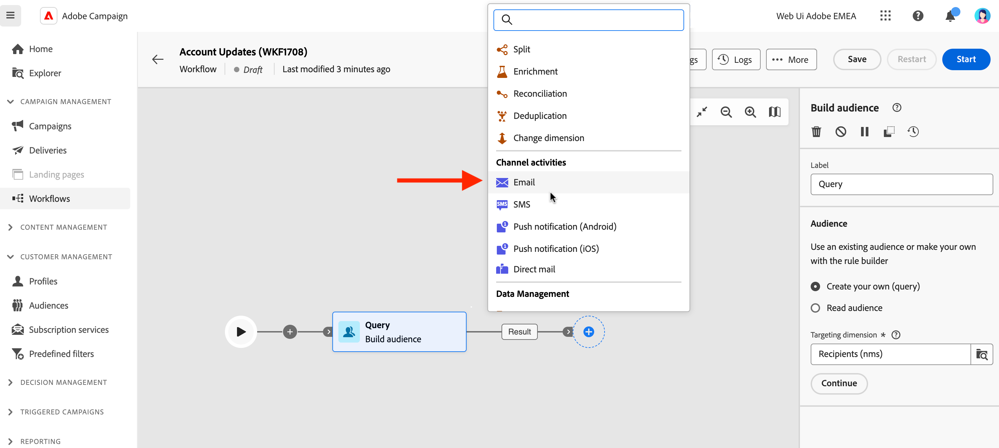

# Email, SMS, Push activities {#channel}

Adobe Campaign Web allows you to automate and execute marketing campaigns across email, SMS and push channels. You can combine channel activities into the workflow canvas to create cross-channel workflows that can trigger actions based on customer behavior and data. 

For example, you can create a welcome email campaign that includes a series of messages across different channels, such as email, SMS, and push. You can also send a follow-up email after a customer has completed a purchase, or send a personalized birthday message to a customer via SMS. 

By using channel activities, you can create comprehensive and personalized campaigns that engage customers across multiple touchpoints and drive conversions.

>[!NOTE]
>
>You can also create a one-shot delivery, outside of the context of a campaign workflow. Learn more in these sections:
>*  [Create standalone email delivery](../../email/create-email.md)
>*  [Create standalone SMS delivery](../../sms/create-sms.md)
>*  [Create standalone push delivery](../../push/create-push.md)
>

## Create a delivery in a campaign workflow{#create-a-delivery-in-a-workflow}

To create an email, a SMS, or a push delivery in the context of a campaign workflow, follow the steps below:

1. Make sure you have added a **Build audience** activity. The audience is the main target of your delivery: the recipients who receive the messages. When sending messages in the context of a campaign workflow, the message audience is not defined in the channel activity, but in the **Build audience** activity. See [this section](build-audience.md).

    

1. Select a delivery activity: **[!UICONTROL Email]**, **[!UICONTROL SMS]**, **[!UICONTROL Push notification (Android)]** or **[!UICONTROL Push notification (iOS)]**.

1. Select a delivery **Template**. Templates are pre-configured delivery settings, specific to a channel. A built-in template is available for each channel, and pre-filled by default. [Learn more](../../msg/delivery-template.md)

    
   

    You can select another template from the channel activity configuration left pane. If the previously selected audience is not compatible with the channel, then you cannot select a template. To solve this, update the **Build audience** activity to select an audience with the correct target mapping. Learn more about target mappings in [Adobe Campaign v8 (client console) documentation](https://experienceleague.adobe.com/docs/campaign/campaign-v8/audience/add-profiles/target-mappings.html){target="_blank"}.

1. Click **Create delivery**. Define your message settings and content the same way you create a standalone delivery. You can also schedule and simulate the content. [Learn more](../../msg/gs-messages.md).

1. Navigate back to your workflow. Choose if you want to continue your workflow **Generate an outbound transition** if you want to add a transition after the channel activity.

1. Click **Start** to launch your workflow.

    By default, starting a workflow triggers the message preparation stage, without immediately sending the message.
    
1. Open your delivery activity to confirm the sending from the **Review & send** button.

1. From your delivery dashboard, click **Send**.

## Example{#cross-channel-workflow-sample}

Here is a cross-channel workflow example with a segmentation and two deliveries. The workflow targets all customers who live in Paris and who are interested in coffee machines. Among this population, an email is sent to the regular customers and an SMS is sent to the VIP clients.

<!--
description, which use case you can perform (common other activities that you can link before of after the activity)

how to add and configure the activity

example of a configured activity within a workflow
The Email delivery activity allows you to configure the sending an email in a workflow. 

-->

<!-- Scheduled emails available?

This can be a single send email and sent just once, or it can be a recurring email.
* Single send emails are standard emails, sent once.
* Recurring emails allow you to send the same email multiple times to different targets over a defined period. You can aggregate the deliveries per period in order to get reports that correspond to your needs.

When linked to a scheduler, you can define recurring emails.
Email recipients are defined upstream of the activity in the same workflow, via an Audience targeting activity.

-->

<!--The message preparation is triggered according to the workflow execution parameters. From the message dashboard, you can select whether to request or not a manual confirmation to send the message (required by default). You can start the workflow manually or place a scheduler activity in the workflow to automate execution.-->
