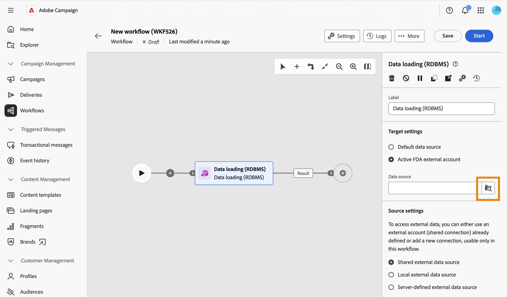
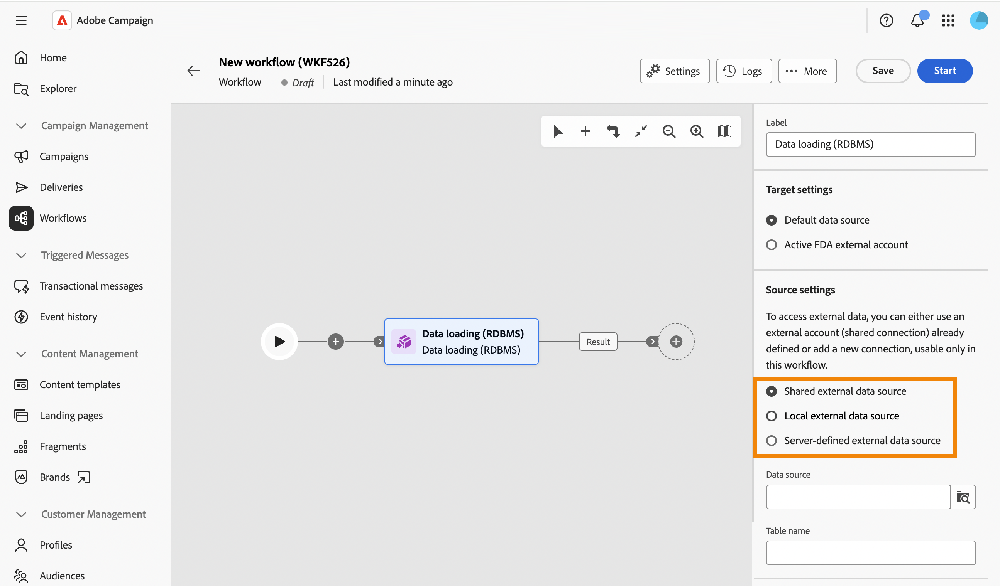
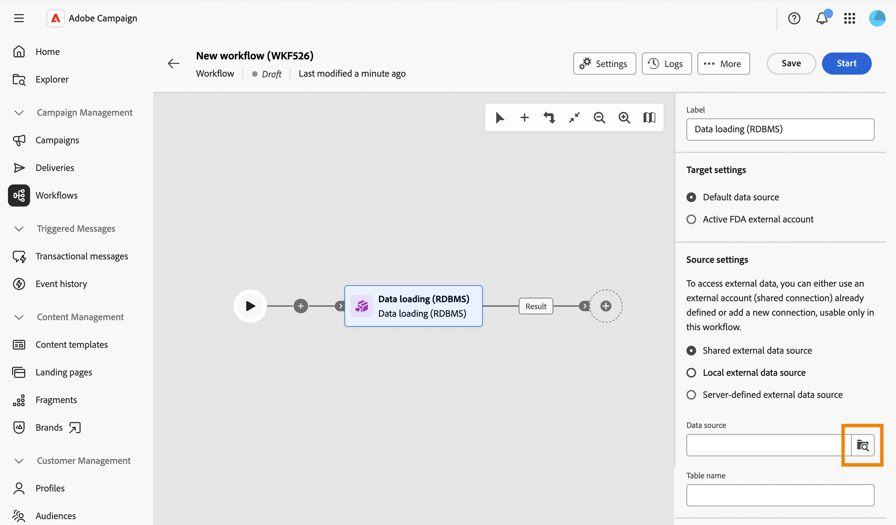
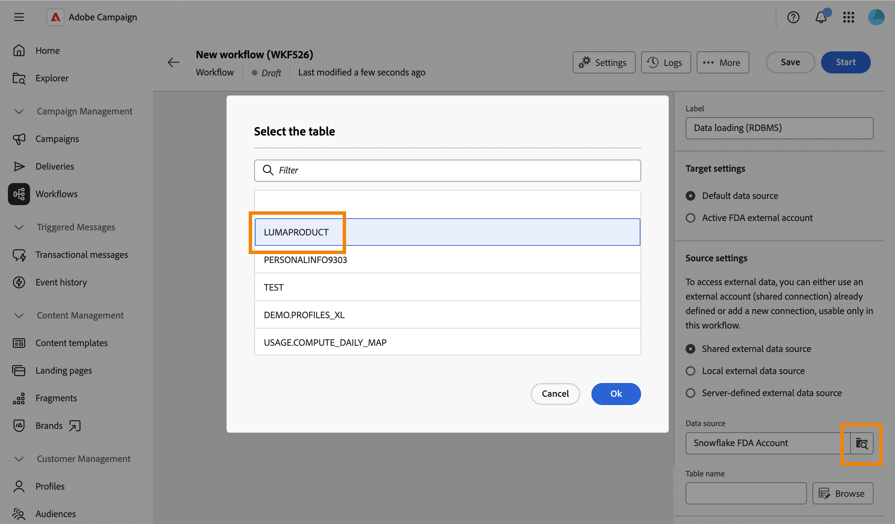
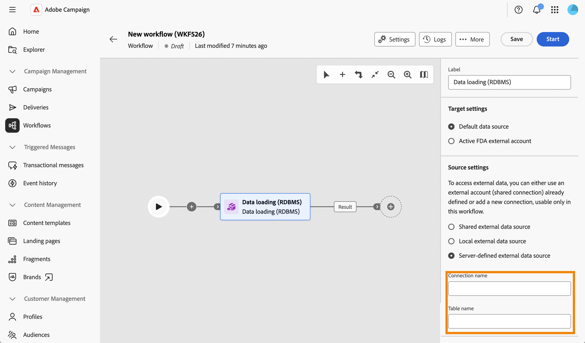
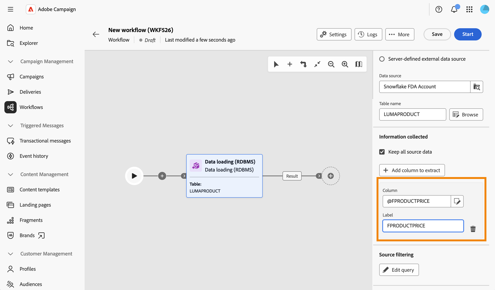
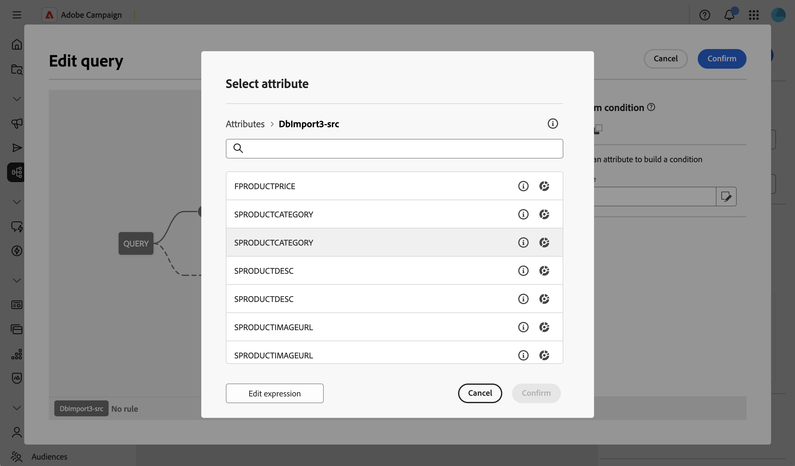

# Data loading (RDBMS) {#data-loading-rdbms}

>[!CONTEXTUALHELP]
>id="acw_orchestration_data_loading_rdbms"
>title="Data loading (RDBMS) activity"
>abstract="The **Data loading (RDBMS)** activity is a **Data management** activity. Use this activity to load data directly from an external relational database into your workflow. The extracted data is available throughout the workflow and can be used for targeting, enrichment, or further data processing."

The **Data loading (RDBMS)** activity is a **Data management** activity. Use this activity to load data directly from an external relational database into your workflow. The extracted data is available throughout the workflow and can be used for targeting, enrichment, or further data processing.

<!--
This activity relies on the [Federated Data Access (FDA)](https://experienceleague.adobe.com/docs/campaign/campaign-v8/connect/fda.html){target="_blank"} option, which lets Adobe Campaign process information stored in one or more external databases without changing the structure of the Adobe Campaign data.
-->

>[!NOTE]
>
>To improve performance, consider using a **[!UICONTROL Build audience]** activity (query type) with external data instead, when the amount of data to collect from the external database allows it.
>
>A **[!UICONTROL Data loading (RDBMS)]** activity must be the first activity of a workflow branch. It cannot be added after another activity in the canvas.

First of all, add a **Data loading (RDBMS)** activity as the first activity of a workflow branch.

The activity is divided into four sections: 

* **[!UICONTROL Target settings]**: 
* **[!UICONTROL Source settings]**: 
* **[!UICONTROL Information collected]**: 
*  **[!UICONTROL Source filtering]**: 

Note that the last two sections only appear when the **[!UICONTROL Source settings]** are defined.

## Target settings {#target-settings}

In the **[!UICONTROL Target settings]** section, choose where the loaded data is stored. Two options are available: **[!UICONTROL Default data source]** and **[!UICONTROL Active FDA external account]**.

   

### Default data source {#default-data-source}

This option is selected by default. It lets you store the loaded data in the default Campaign database. You just need to select the option.

### Active FDA external account {#active-fda-external-account}

This option lets you store the loaded data in an external account.

1. Click the button located on the right side of the **[!UICONTROL Data source]** field.
1. Select the account to use.

   

## Source settings {#source-settings}

In the **[!UICONTROL Source settings]** section, choose how to access the external database that contains the data to load. Three options are available: **[!UICONTROL Shared external data source]**, **[!UICONTROL Local external data source]**, and **[!UICONTROL Server-defined external data source]**.

   

### Shared external data source {#shared-data-source}

This option is selected by default. It allows you to use an external account already configured by a Campaign administrator. [Learn how to configure an external account](../../administration/create-external-account.md).

1. Click the button located on the right side of the **[!UICONTROL Data source]** field and select the account to use.

   

1. Click the **[!UICONTROL Browse]** button next to the **[!UICONTROL Table name]** field and select the table that contains the data you want to load.

   

### Local external data source {#local-external-data-source}

This option lets you define a connection to an external database directly in the activity, for temporary usage within this workflow only. This connection is not saved as an external account.

1. Click the **[!UICONTROL Define the data source]** button and select the database engine to connect to.

    

1. Fill in the connection fields displayed for the selected engine.

    

<!--
1. Click **[!UICONTROL Ok]** to confirm. The button is then relabeled **[!UICONTROL Edit data source]**, allowing you to open the dialog again to change the connection settings.
-->

1. Enter the name of the table to load in the **[!UICONTROL Table name]** field.

### Server-defined external data source {#server-defined-external-data-source}

This option allows you to use a database connection already defined at server level.

1. Enter the name of the connection to use in the **[!UICONTROL Connection name]** field.
1. Enter the name of the table to load in the **[!UICONTROL Table name]** field.

    

## Information collected {#information-collected}

Once the table is set, the **[!UICONTROL Information collected]** section lets you define which columns are collected from the external table:

1. Check the **[!UICONTROL Keep all source data]** option (default) if you need to collect every column of the selected table.
1. Click **[!UICONTROL Add column to extract]** to collect specific columns instead, or in addition. 

    

<!--
In the **[!UICONTROL Select attribute]** dialog, scoped to the schema of the selected table, pick an attribute and confirm. [Learn how to select attributes and add them to favorites](../../get-started/attributes.md)
-->

1. Select an attribute and confirm. The attribute is added as a row with a **[!UICONTROL Column]** field and an editable **[!UICONTROL Label]** field. Use the delete icon to remove it.

    

<!--
## Link to another table (optional) {#link}

NOT CONFIRMED — restore and verify before publishing.

Source: transcript of the ACC Web UI - Handsoff 12-06 demo (Herve Phulpin, ~20:49-21:04 mark). At the time of that demo, this part of the activity was explicitly described as unfinished: "the next part is not yet available", "this part is missing", "we are not able to add a link condition". No screenshot of a completed, working flow for this section has been captured since. Two related sub-bugs were still open against NEO-95826 at last check: NEO-97147 ("DBMS activity transition results not shown") and NEO-97148 ("local external data table name is not a picker").

If you need to reconcile the loaded data with an existing table, such as the Recipients table, add a link:

1. Click **Add link**.
1. Select the table to link to. You can browse tables from the Campaign database or from the external data source.
1. Define the join condition between the loaded table and the target table:
   * Simple join: Select the attributes to match between the two tables.
   * Advanced join: Use the query modeler to build the join condition.

[Learn more about link definitions in the Enrichment activity](enrichment.md#create-links).
-->

## Source filtering (optional) {#filter}

To collect only part of the data from the external table, you can define a filter:

1. In the **[!UICONTROL Source filtering]** section, click **[!UICONTROL Edit query]**.

    

1. The query modeler opens on a dedicated screen, scoped to the schema of the selected table. Use it to build a condition on the table's attributes. [Learn how to work with the query modeler](../../query/query-modeler-overview.md)

    

<!--
>[!NOTE]
>
>Some advanced options available for this activity in the client console, such as computing the table name from the inbound transition, are not yet exposed in the Campaign Web User Interface.
-->