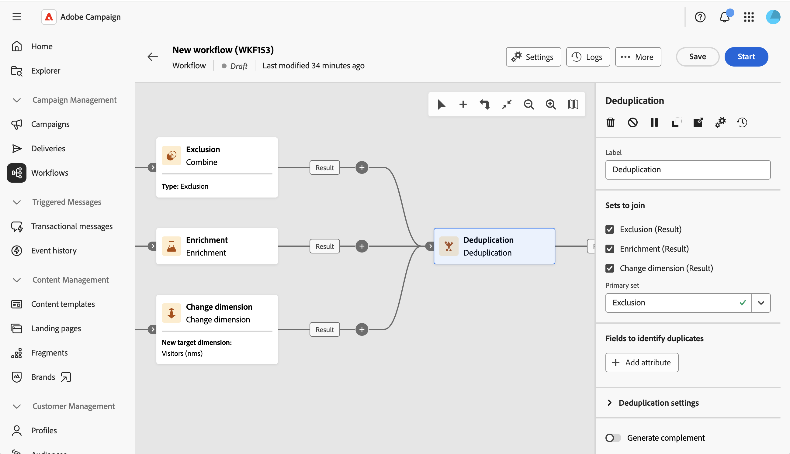

# Deduplication {#deduplication}

>[!CONTEXTUALHELP]
>id="acw_orchestration_deduplication_fields"
>title="Fields to identify duplicates"
>abstract="In the **Fields to identify duplicates** section, click the **Add attribute** button to specify the fields for which identical values allow duplicates to be identified, such as email address, first name, and last name. The order of the fields specifies those to process first."

>[!CONTEXTUALHELP]
>id="acw_orchestration_deduplication"
>title="Deduplication activity"
>abstract="The **Deduplication** activity deletes duplicates in the results of inbound activities. It is mostly used after targeting activities and before activities that use targeted data. When more than one inbound transition is available, use the **Sets to join** section to select which transitions to connect to the activity."

>[!CONTEXTUALHELP]
>id="acw_orchestration_deduplication_sets"
>title="Sets to join"
>abstract="Check the previous activities you wish to connect as inbound transitions of the **Deduplication** activity. The selected activities are then connected to the **Deduplication**. This section is only displayed when more than one inbound transition is available to be connected to the activity."

>[!CONTEXTUALHELP]
>id="acw_orchestration_deduplication_complement"
>title="Generate a complement"
>abstract="You can generate an additional outbound transition with the remaining population excluded as duplicates. To do this, toggle on the **Generate complement** option."

>[!CONTEXTUALHELP]
>id="acw_orchestration_deduplication_settings"
>title="Deduplication settings"
>abstract="To delete duplicates in the incoming data, define the deduplication method in the fields below. By default, only one record is kept. Select the deduplication mode based on an expression or an attribute. By default, the record to keep out of the duplicates is randomly selected."

The **Deduplication** activity is a **Targeting** activity. This activity deletes duplicates in the results of inbound activities, such as duplicated profiles in the recipient list. The **Deduplication** activity is generally used after targeting activities and before activities that use targeted data.

The activity supports multiple inbound transitions. When more than one inbound transition is available, use the **Sets to join** section in the activity properties to select which transitions to connect to the activity. The selected transitions are then linked to the **Deduplication** in the workflow canvas.

## Configure the Deduplication activity {#deduplication-configuration}

Follow these steps to configure the **Deduplication** activity:

 

1. Add a **Deduplication** activity to your workflow.

1. In the **Sets to join** section, check the previous activities you wish to connect as inbound transitions of the **Deduplication** activity. The selected activities are then linked to the **Deduplication** in the workflow canvas. Use the **Primary set** field to define the reference inbound transition. Records from the other sets are matched against the primary set to identify duplicates. 

    >[!NOTE]
    >
    >This section is only displayed when more than one inbound transition is available.

1. In the **Fields to identify duplicates** section, click the **Add attribute** button to specify the fields for which identical values allow duplicates to be identified, such as email address, first name, and last name. The order of the fields specifies those to process first. [Learn how to select attributes and add them to favorites](../../get-started/attributes.md).

1. In the **Deduplication settings** section, select the number of unique **Duplicates to keep**. The default value for this field is 1. The value 0 keeps all the duplicates.

    For example, if records A and B are considered duplicates of record Y, and record C is considered a duplicate of record Z:

    * If the value of the field is 1: only the Y and Z records are kept.
    * If the value of the field is 0: all the records are kept.
    * If the value of the field is 2: records C and Z are kept, and two records from A, B, and Y are kept, either by chance or depending on the deduplication method selected.

1. Select the **Deduplication method** to use:

    * **[!UICONTROL Random selection]**: Randomly selects the record to keep out of the duplicates.
    * **[!UICONTROL Using an expression]**: Keeps the records for which the specified expression has the smallest or largest value. Enter the **[!UICONTROL Expression]**, then choose the **[!UICONTROL Sort]** order: **[!UICONTROL Ascending (smallest values first)]** or **[!UICONTROL Descending (largest values first)]**.
    * **[!UICONTROL Non-empty value]**: Keeps the records for which the expression is not empty.
    * **[!UICONTROL Following a list of values]**: Defines the record priority by matching one or more values for an attribute or expression. Click **[!UICONTROL Add attribute]** to add an attribute. For each attribute:

        * In the **[!UICONTROL Attribute]** field, select the attribute or create an expression.
        * Click **[!UICONTROL Add value]** to build the ordered list of values to prioritize.
        * Use the **[!UICONTROL Sort for other values]** drop-down to choose how to sort the values that are not in the list, for example **[!UICONTROL Indifferent (random)]**.

        When several attributes are defined, the first one is used as the main sorting criterion, and the following attributes act as tie-breakers, in order.

1. Check the **Generate complement** option to exploit the remaining population. The complement consists of all the duplicates. An additional transition is then added to the activity.

## Example {#deduplication-example}

In the following example, use a deduplication activity to exclude duplicates from the target before sending a delivery. The identified duplicated profiles are added to a dedicated audience that can be reused if necessary. Choose the **Email** address to identify the duplicates. Keep 1 entry and select the **Random** deduplication method.

  