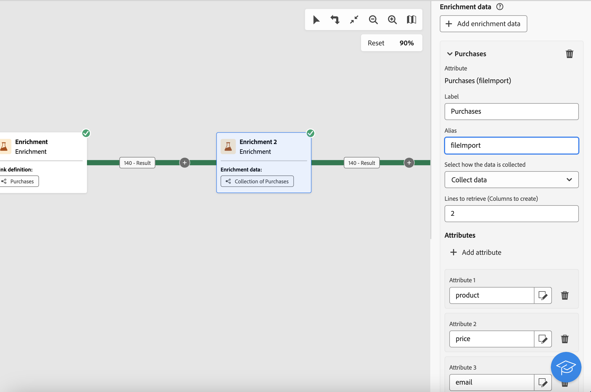

# Enrichment {#enrichment}

>[!CONTEXTUALHELP]
>id="acw_orchestration_enrichment"
>title="Enrichment activity"
>abstract="The **Enrichment** activity allows you to enhance the targeted data with additional information from the database. It is commonly used in a workflow after segmentation activities."

>[!CONTEXTUALHELP]
>id="acw_orchestration_enrichment_offer_proposition"
>title="Offer proposition"
>abstract="Offer proposition"

The **Enrichment** activity is a **Targeting** activity. It allows you to enhance the targeted data with additional information from the database. It is commonly used in a workflow after segmentation activities.

Enrichment data can come either:

* **From the same work table** as the one targeted into your workflow:

    *Target a group of customers and add the "Birth date" field to the current work table*.

* **From another work table**:

    *Target a group of customers and add the "Amount" and "Type of product" fields coming from the "Purchase" table*.

Once the enrichment data has been added to the workflow, it can be used in the activities added after the **Enrichment** activity to segment customers into distinct groups based on their behaviors, preferences, and needs, or to create personalized marketing messages and campaigns that are more likely to resonate with your target audience.

For instance, you can add to the workflow working table information related to customers' purchases and use this data to personalize emails with their latest purchase or the amount spent on these purchases.

## Add an Enrichment activity {#enrichment-configuration}

Follow these steps to configure the **Enrichment** activity:

1. Add activities such as **Build audience** and **Combine** activities.
1. Add an **Enrichment** activity.
1. If multiple transitions have been configured in your workflow, you can use the **[!UICONTROL Primary set]** field to define which transition should be used as primary set to enrich with data.

## Add enrichment data {#enrichment-add}

>[!CONTEXTUALHELP]
>id="acw_targetdata_personalization_enrichmentdata"
>title="Enrichment data"
>abstract="Select the data to use to enrich your workflow. You can select two types of enrichment data: a single enrichment attribute from the target dimension, or a collection link, which is a link with a 1-N cardinality between tables."

>[!CONTEXTUALHELP]
>id="acw_orchestration_enrichment_data"
>title="Enrichment activity"
>abstract="Once enrichment data has been added to the workflow, it can be used in the activities added after the Enrichment activity to segment customers into distinct groups based on their behaviors, preferences, and needs, or to create personalized marketing messages and campaigns that are more likely to resonate with your target audience."

1. Click **Add enrichment data** and select the attribute to use to enrich the data.

    You can select two types of enrichment data: a single enrichment attribute from the target dimension, or a collection link. Each of these types is detailed in the examples below:
    * [Single enrichment attribute](#single-attribute)
    * [Collection lnk](#collection-link)

    >[!NOTE]
    >
    >The **Edit expression button** in the attribute selection screen allows you to build advanced expressions to select the attribute. [Learn how to work with the expression editor](../../query/expression-editor.md)

    

## Create links between tables {#create-links}

>[!CONTEXTUALHELP]
>id="acw_orchestration_enrichment_simplejoin"
>title="Link definition"
>abstract="Create a link between the working table data and the Adobe Campaign database. For example, if you load data from a file which contains the account number, country and email of recipients, you have to create a link towards the country table in order to update this information in their profiles."

The **[!UICONTROL Link definition]** section allows you to create a link between the working table data and the Adobe Campaign database. For example, if you load data from a file which contains the account number, country and email of recipients, you have to create a link towards the country table in order to update this information in their profiles.

There are several types of links available:

* **[!UICONTROL 1 cardinality simple link]**: Each record from the primary set can be associated with one and only one record from the linked data.
* **[!UICONTROL 0 or 1 cardinality simple link]**: Each record from the primary set can be associated with 0 or 1 record from the linked data, but not more than one.
* **[!UICONTROL N cardinality collection link]**: Each record from the primary set can be associated with 0, 1 or more (N) records from the linked data.

To create a link, follow these steps:

1. In the **[!UICONTROL Link definition]** section, click the **[!UICONTROL Add link]** button.

    

1. In the **Relation type** drop-down list, choose the type of link you want to create.

1. Identify the target you want to link the primary set to:

    * To link an existing table in the database, choose **[!UICONTROL Database schema]** and select the desired table from the **[!UICONTROL Target schema]** field.
    * To link with data from the input transition, choose **Temporary schema** and select the transition whose data you want to use.

1. Define the reconciliation criteria to match data from the primary set with the linked schema. There are two types of joins available:

    * **Simple join**: Select a specific attribute to match data from the two schemas. Click **Add join** and select the **Source** and **Destination** attributes to use as reconciliation criteria. 
    * **Advanced join**: Create a join using advanced conditions. Click **Add join** and click the **Create condition** button to open the query modeler.

A workflow example using links is available in the [Examples](#link-example) section.

## Data reconciliation {#reconciliation}

>[!CONTEXTUALHELP]
>id="acw_orchestration_enrichment_reconciliation"
>title="Reconciliation"
>abstract="The **Enrichment** activity can be used to reconcile data from the the Campaign database schema with data from another schema, or with data coming from a temporary schema such as data uploaded using a Load file activity. This type of link defines a reconciliation towards a unique record. Adobe Campaign creates a link to a target table by adding a foreign key in it for storing a reference to the unique record."

The **Enrichment** activity can be used to reconcile data from the the Campaign database schema with data from another schema, or with data coming from a temporary schema such as data uploaded using a Load file activity. This type of link defines a reconciliation towards a unique record. Adobe Campaign creates a link to a target table by adding a foreign key in it for storing a reference to the unique record.

For example, you can use this option to reconcile a profile's country, specified in an uploaded file, with one of the countries available in the dedicated table of the Campaign database. 

Follow the steps to configure an **Enrichment** activity with a reconciliation link: 

1. Click the **Add link** button in the **Reconciliation** section.
1. Identify the data you want to create a reconciliation link with.

    * To create a reconciliation link with data from the Campaign database, select **Database schema** and choose the schema where the target is stored. 
    * To create a reconciliation link with data coming from the input transition, select **Temporary schema** and choose the workflow transition where the target data is stored. 

1. The **Label** and **Name** fields are automatically populated based on the selected target schema. You can change their values if necessary.

1. In the **Reconciliation criteria** section, specify how you want to reconcile data from the source and destination tables:

    * **Simple join**: Reconcile a specific field from the source table with another field in the destination table. To do this, click the **Add join** button and specify the **Source** and **Destination** fields to use for the reconciliation.

        >[!NOTE]
        >
        >You can use one or more **Simple join** criteria, in which case they must all be verified so that the data can be linked together.

    * **Advanced join**: Use the query modeler to configure the reconciliation criteria. To do this, click the **Create condition** button then define your reconciliation criteria by building your own rule using AND and OR operations.

The example below shows a workflow configured to create a link between the Adobe Campaign database recipients table and a temporary table generated a **Load file** activity. In this example, the Enrichment activity reconciliates both tables using the email address as reconciliation criteria.

## Examples {#example}

### Single enrichment attribute {#single-attribute}

Here, we are just adding a single enrichment attribute, for example, the date of birth. Follow these steps:

1. Click inside the **Attribute** field.
1. Select a simple field from the targeting dimension, the date of birth in our example. 
1. Click **Confirm**.

### Collection link {#collection-link}

In this more complex use case, we will select a collection link which is a link with a 1-N cardinality between tables. Let's retrieve the three latest purchases that are less than 100$. For this you need to define:

* an enrichment attribute: the **Total amount** field
* the number of lines to retrieve: 3
* a filter: filter out items that are greater than 100$
* a sorting: descendant sorting on the **Order date** field. 

#### Add the attribute {#add-attribute}

This is where you select the collection link to use as enrichment data.

1. Click inside the **Attribute** field.
1. Click **Display advanced attributes**.
1. Select the **Total amount** field from the **Purchases** table. 

#### Define the collection settings{#collection-settings}

Then, define how the data is collected and the number of records to retrieve.

1. Select **Collect data** in the **Select how the data is collected** drop-down.
1. Type "3" in the **Lines to retrieve (Columns to create)** field. 

If you want, for example, to get the average amount of purchases for a customer, select **Aggregated data** instead, and select **Average** in the **Aggregate function** drop-down.

#### Define the filters{#collection-filters}

Here, we define the maximum value for the enrichment attribute. We filter out items that are greater than 100$. [Learn how to work with the query modeler](../../query/query-modeler-overview.md)

1. Click **Edit filters**.
1. Add the two following filters: **Total amount** exists AND **Total amount** is less than 100. The first one filters NULL values as they would appear as the greatest value.
1. Click **Confirm**.

#### Define the sorting{#collection-sorting}

We now need to apply sorting in order to retrieve the three **latest** purchases.

1. Activate the **Enable sorting** option.
1. Click inside the **Attribute** field.
1. Select the **Order date** field.
1. Click **Confirm**. 
1. Select **Descending** from the **Sort** drop-down.

### Enrichment with linked data {#link-example}

The example below shows a workflow configured to create a link between two transitions. The first transitions targets profile data using a **Query** activity, while the second transition includes purchase data stored into a file loaded through a Load file activity.

* The first **Enrichment** activity links the primary set (data from the **Query** activity) with the schema from the **Load file** activity. This allows us to match each profile targeted by the query with the corresponding purchase data.

    

* A second **Enrichment** activity is added in order to enrich data from the workflow table with the purchase data coming from the **Load file** activity. This allows us to use those data in further activities, for example, to personalize messages sent to the customers with information on their purchase.

    
 