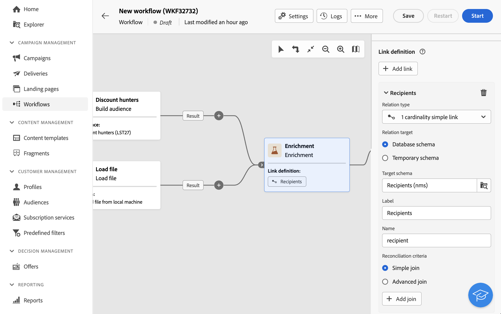
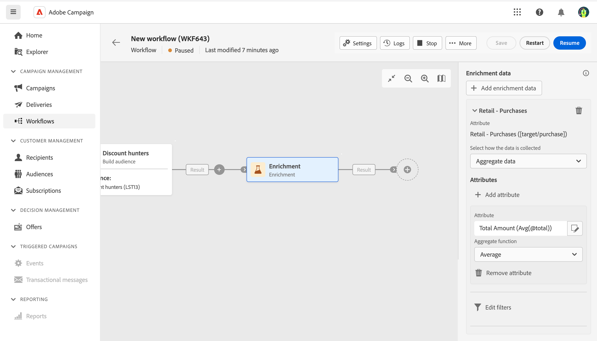
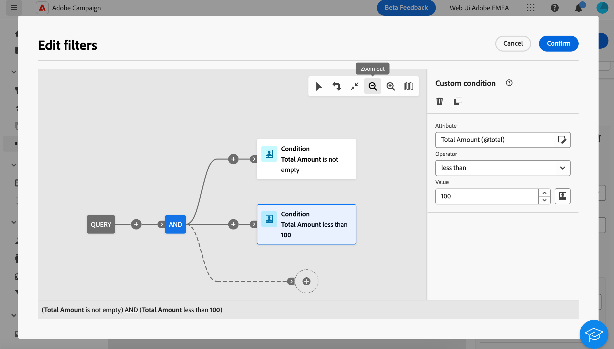
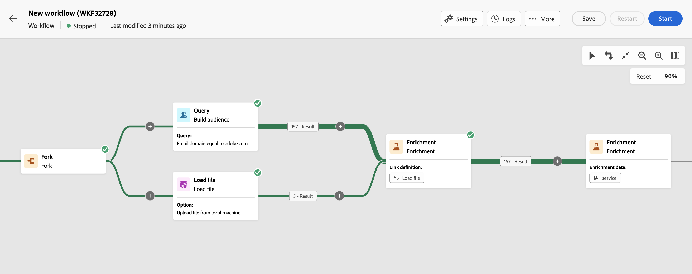

# Enrichment {#enrichment}

>[!CONTEXTUALHELP]
>id="acw_orchestration_enrichment"
>title="Enrichment activity"
>abstract="The **Enrichment** activity allows you to enhance the targeted data with additional information from the database. It is commonly used in a workflow after segmentation activities."

>[!CONTEXTUALHELP]
>id="acw_orchestration_enrichment_data"
>title="Enrichment activity"
>abstract="Once enrichment data has been added to the workflow, it can be used in the activities added after the Enrichment activity to segment customers into distinct groups based on their behaviors, preferences, and needs, or to create personalized marketing messages and campaigns that are more likely to resonate with your target audience."

>[!CONTEXTUALHELP]
>id="acw_orchestration_enrichment_simplejoin"
>title="Link definition"
>abstract="Create a link between the working table data and the Adobe Campaign database. For example, if you load data from a file which contains the account number, country and email of recipients, you have to create a link towards the country table in order to update this information in their profiles.

>[!CONTEXTUALHELP]
>id="acw_orchestration_enrichment_reconciliation"
>title="Enrichment reconciliation"
>abstract="enrichment reconciliation"

>[!CONTEXTUALHELP]
>id="acw_targetdata_personalization_enrichmentdata"
>title="Enrichment data"
>abstract="Select the data to use to enrich your workflow. You can select two types of enrichment data: a single enrichment attribute from the target dimension, or a collection link, which is a link with a 1-N cardinality between tables."

The **Enrichment** activity is a **Targeting** activity. It allows you to enhance the targeted data with additional information from the database. It is commonly used in a workflow after segmentation activities.

Enrichment data can come either:

* **From the same work table** as the one targeted into your workflow:

    *Target a group of customers and add the "Birth date" field to the current work table*.

* **From another work table**:

    *Target a group of customers and add the "Amount" and "Type of product" fields coming from the "Purchase" table*.

Once the enrichment data has been added to the workflow, it can be used in the activities added after the **Enrichment** activity to segment customers into distinct groups based on their behaviors, preferences, and needs, or to create personalized marketing messages and campaigns that are more likely to resonate with your target audience.

For instance, you can add to the workflow working table information related to customers' purchases and use this data to personalize emails with their latest purchase or the amount spent on these purchases.

## Add an Enrichment activity {#enrichment-configuration}

Follow these steps to configure the **Enrichment** activity:

1. Add activities such as **Build audience** and **Combine** activities.
1. Add an **Enrichment** activity.
1. If multiple transitions have been configured in your workflow, you can use the **[!UICONTROL Primary set]** field to define which transition should be used as primary set to enrich with data.

## Add enrichment data {#enrichment-add}

1. Click **Add enrichment data** and select the attribute to use to enrich the data.

    You can select two types of enrichment data: a single enrichment attribute from the target dimension, or a collection link. Each of these types is detailed in the examples below:
    * [Single enrichment attribute](#single-attribute)
    * [Collection lnk](#collection-link)

    >[!NOTE]
    >
    >The **Edit expression button** in the attribute selection screen allows you to build advanced expressions to select the attribute. [Learn how to work with the expression editor](../../query/expression-editor.md)

    

## Create links between tables {#create-links}

>[!CONTEXTUALHELP]
>id="acw_homepage_welcome_rn3"
>title="Links between tables"
>abstract="You can now create a link between the working table data and the Adobe Campaign database in the Enrichment workflow activity."
>additional-url="https://experienceleague.adobe.com/docs/campaign-web/v8/release-notes/release-notes.html" text="See release notes"

The **[!UICONTROL Link definition]** section allows you to create a link between the working table data and the Adobe Campaign database. For example, if you load data from a file which contains the account number, country and email of recipients, you have to create a link towards the country table in order to update this information in their profiles.

There are several types of links available:

* **[!UICONTROL 1 cardinality simple link]**: Each record from the primary set can be associated with one and only one record from the linked data.
* **[!UICONTROL 0 or 1 cardinality simple link]**: Each record from the primary set can be associated with 0 or 1 record from the linked data, but not more than one.
* **[!UICONTROL N cardinality collection link]**: Each record from the primary set can be associated with 0, 1 or more (N) records from the linked data.

To create a link, follow these steps:

1. In the **[!UICONTROL Link definition]** section, click the **[!UICONTROL Add link]** button.

    

1. In the **Relation type** drop-down list, choose the type of link you want to create.

1. Identify the target you want to link the primary set to:

    * To link an existing table in the database, choose **[!UICONTROL Database schema]** and select the desired table from the **[!UICONTROL Target schema]** field.
    * To link with data from the input transition, choose **Temporary schema** and select the transition whose data you want to use.

1. Define the reconciliation criteria to match data from the primary set with the linked schema. There are two types of joins available:

    * **Simple join**: Select a specific attribute to match data from the two schemas. Click **Add join** and select the **Source** and **Destination** attributes to use as reconciliation criteria. 
    * **Advanced join**: Create a join using advanced conditions. Click **Add join** and click the **Create condition** button to open the query modeler.

A workflow example using links is available in the [Examples](#link-example) section.

## Examples {#example}

### Single enrichment attribute {#single-attribute}

Here, we are just adding a single enrichment attribute, for example, the date of birth. Follow these steps:

1. Click inside the **Attribute** field.
1. Select a simple field from the targeting dimension, the date of birth in our example. 
1. Click **Confirm**.

### Collection link {#collection-link}

In this more complex use case, we will select a collection link which is a link with a 1-N cardinality between tables. Let's retrieve the three latest purchases that are less than 100$. For this you need to define:

* an enrichment attribute: the **Total amount** field
* the number of lines to retrieve: 3
* a filter: filter out items that are greater than 100$
* a sorting: descendant sorting on the **Order date** field. 

#### Add the attribute {#add-attribute}

This is where you select the collection link to use as enrichment data.

1. Click inside the **Attribute** field.
1. Click **Display advanced attributes**.
1. Select the **Total amount** field from the **Purchases** table. 

#### Define the collection settings{#collection-settings}

Then, define how the data is collected and the number of records to retrieve.

1. Select **Collect data** in the **Select how the data is collected** drop-down.
1. Type "3" in the **Lines to retrieve (Columns to create)** field. 

If you want, for example, to get the average amount of purchases for a customer, select **Aggregated data** instead, and select **Average** in the **Aggregate function** drop-down.

#### Define the filters{#collection-filters}

Here, we define the maximum value for the enrichment attribute. We filter out items that are greater than 100$. [Learn how to work with the query modeler](../../query/query-modeler-overview.md)

1. Click **Edit filters**.
1. Add the two following filters: **Total amount** exists AND **Total amount** is less than 100. The first one filters NULL values as they would appear as the greatest value.
1. Click **Confirm**.

#### Define the sorting{#collection-sorting}

We now need to apply sorting in order to retrieve the three **latest** purchases.

1. Activate the **Enable sorting** option.
1. Click inside the **Attribute** field.
1. Select the **Order date** field.
1. Click **Confirm**. 
1. Select **Descending** from the **Sort** drop-down.

### Enrichment with linked data {#link-example}

The example below shows a workflow configured to create a link between two transitions. The first transitions targets profile data using a Query activity, while the second transition includes purchase data stored into a file loaded through a Load file activity.

* The first **Enrichment** activity links our primary set (data from the **Query** activity) with the schema from the **Load file** activity. This allows us to match each profile targeted by the query with the corresponding purchase data.
* A second **Enrichment** activity is added in order to enrich data from the workflow table with the purchase data coming from the **Load file** activity. This allows us to use those data in further activities, for example, to personalize messages sent to the customers with information on their purchase.

    

<!--

Add other fields
use it in delivery

cardinality between the tables (1-N)
1. select attribute to use as enrichment data

    display advanced fields option
    i button

    note: attributes from the target dimension

1. Select how the data is collected
1. number of records to retrieve if want to retrieve a collection of multiple records
1. Apply filters and build rule

    select an existing filter
    save the filter for reuse
    view results of the filter visually or in code view

1. sort records using an attribute

leverage enrichment data in campaign

where we can use the enrichment data: personalize email, other use cases?

## Example

-->
