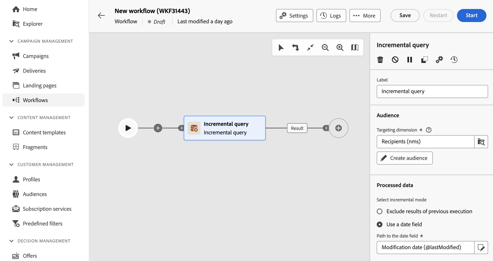
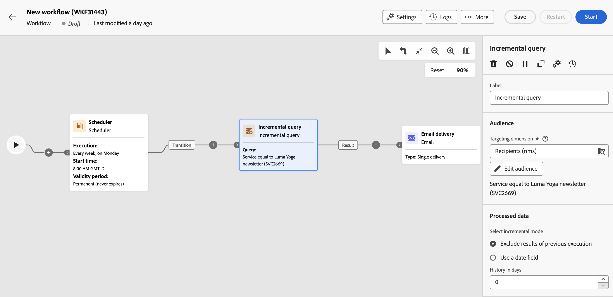

# Incremental query {#incremental-query}

>[!CONTEXTUALHELP]
>id="acw_orchestration_incrementalquery"
>title="Incremental query"
>abstract="The **Incremental query** activity is a **Targeting** activity which allows you to query the database using the Query modeler. Each time this activity is executed, the results from the previous executions are excluded. This allows you to target only new elements."

>[!CONTEXTUALHELP]
>id="acw_orchestration_incrementalquery_history"
>title="Incremental query history"
>abstract="Incremental query history"

>[!CONTEXTUALHELP]
>id="acw_orchestration_incrementalquery_processeddata"
>title="Incremental query Processed data"
>abstract="Incremental query Processed data"

The **Incremental query** activity is a **Targeting** activity that allows you to query the database on a scheduled basis. Each time this activity is executed, the results from the previous executions are excluded. This enables you to target only new elements.

>[!NOTE]
>
>While the Campaign client console integrates the **[!UICONTROL Incremental query]** activity with a built-in scheduler, the Campaign Web User Interface treats this functionality separately. To schedule incremental query executions, add a **[!UICONTROL Scheduler]** activity in the workflow before the **[!UICONTROL Incremental query]** activity. [Learn how to configure a Scheduler activity](scheduler.md)

The **[!UICONTROL Incremental query]** activity can be used for various purposes:

* Segmenting individuals to define the target of a message, audience, or other operations.
* Exporting data. For example, use the activity to regularly export new logs in files. This is useful for external reporting or business intelligence tools.

The population already targeted by previous executions is stored in the workflow. Two workflows started from the same template do not share the same log. However, two tasks based on the same incremental query in the same workflow use the same log.

If the result of an incremental query equals 0 during one of its executions, the workflow pauses until the query's next programmed execution. The transitions and activities that follow the incremental query are not processed before the next execution.

## Configure the Incremental query activity {#incremental-query-configuration}

Follow these steps to configure the **Incremental query** activity:

[Description: Screenshot showing the configuration interface for the Incremental query activity in Adobe Campaign.]  

1. Add an **Incremental query** activity into your workflow.

1. In the **[!UICONTROL Audience]** section, choose the **Targeting dimension**, then click **[!UICONTROL Continue]**.

    The targeting dimension defines the population targeted by the operation, such as recipients, contract beneficiaries, operators, or subscribers. By default, the target is selected from the recipients. [Learn more about targeting dimensions](../../audience/about-recipients.md#targeting-dimensions)

1. Use the query modeler to define your query, similar to how you create an audience when designing a new email. [Learn how to work with the query modeler](../../query/query-modeler-overview.md)

1. In the **[!UICONTROL Processed data]** section, select the incremental mode to use:

    * **[!UICONTROL Exclude results of previous execution]**: Each time the activity is executed, the results of the previous executions are excluded.

        Records already targeted in previous executions can be logged for a maximum number of days from the day they were targeted. Use the **[!UICONTROL History in days]** field to set this value. If this value is zero, the recipients are never purged from the log.

    * **[!UICONTROL Use a date field]**: This option excludes results from previous executions based on a specific date field. Choose the desired date field from the list of attributes available for the selected targeting dimension. On subsequent executions of the workflow, only data modified or created after the last execution date will be retrieved.

        After the first execution of the workflow, the **[!UICONTROL Last execution date]** field becomes available. It specifies the date used for the next execution and is automatically updated every time the workflow is executed. You can manually override this value to fit your needs.

    >[!NOTE]
    >
    >The **[!UICONTROL Use a date field]** mode provides more flexibility depending on the selected date field. For example, if the specified field corresponds to a modification date, the date field mode retrieves data recently updated. The other mode excludes recordings already targeted in a previous execution, even if they have been modified since the last execution of the workflow.

## Example {#incremental-query-example}

The following example shows the configuration of a workflow that filters profiles in the Adobe Campaign database every week. It targets individuals subscribed to the Yoga Newsletter service and sends them a welcome email.

[Description: Screenshot showing an example workflow configuration for filtering profiles subscribed to the Yoga Newsletter service.]  

The workflow includes the following elements:

* A **[!UICONTROL Scheduler]** activity, which executes the workflow every Monday at 6 am.
* An **[!UICONTROL Incremental query]** activity, which targets all current subscribers during the first execution and only new subscribers during subsequent executions.
* An **[!UICONTROL Email delivery]** activity.