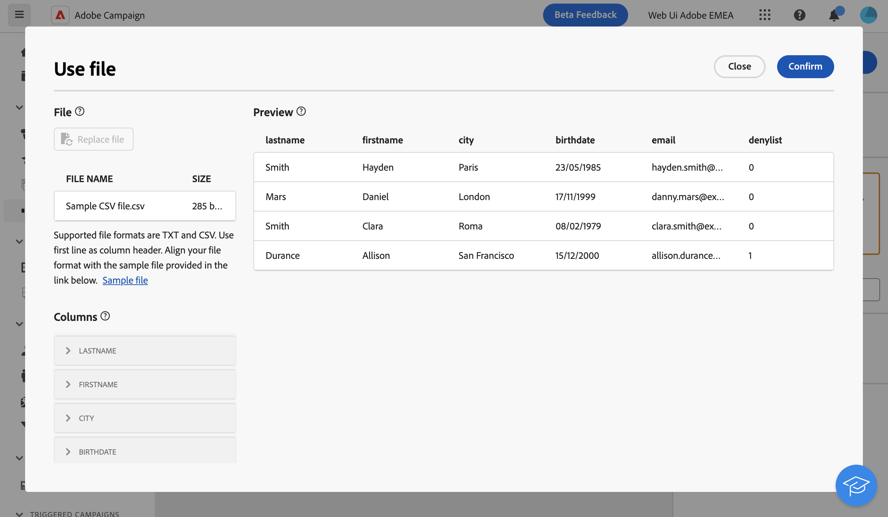

# Load file {#load-file}

>[!CONTEXTUALHELP]
>id="acw_orchestration_loadfile"
>title="Load file activity"
>abstract="The **Load file** activity is a **Data management** activity. Use this activity to work with data stored in an external file."

>[!CONTEXTUALHELP]
>id="acw_orchestration_loadfile_samplefile"
>title="Sample file"
>abstract="Sample file"

>[!CONTEXTUALHELP]
>id="acw_orchestration_loadfile_nameofthefile"
>title="Name of the file"
>abstract="Name of the file"

>[!CONTEXTUALHELP]
>id="acw_orchestration_loadfile_targetdb"
>title="Target database"
>abstract="Target database"

>[!CONTEXTUALHELP]
>id="acw_orchestration_loadfile_rejectmgt"
>title="Reject management for Load file activity"
>abstract="Reject management for Load file activity"

>[!CONTEXTUALHELP]
>id="acw_orchestration_loadfile_outboundtransition"
>title="Reject management outbound transition"
>abstract="Reject management outbound transition"

>[!CONTEXTUALHELP]
>id="acw_orchestration_loadfile_outboundtransition_reject"
>title="Reject management outbound transition for rejects"
>abstract="Reject management outbound transition for rejects"

>[!CONTEXTUALHELP]
>id="acw_orchestration_loadfile_formatting"
>title="Formatting for Load File activity"
>abstract="Formatting for Load File activity"

The **Load file** activity is a **Data management** activity. Use this activity to work with profiles and data stored in an external file. Profiles and data are not added to the database, but all fields in the input file are available for [personalization](../../personalization/gs-personalization.md), or to update profiles, or any other table. 

>[!NOTE]
>Supported file formats are: text (TXT) and comma-separated value (CSV).

This activity can be used with a [Reconciliation](reconciliation.md) activity to link unidentified data to existing resources. For example, the **Load file** activity can be placed before a **Reconciliation** activity if you import non-standard data into the database. 

## Configure the Load file activity {#load-configuration}

Follow these steps to configure the **Load file** activity:

1. Drag and drop a **Load file** activity into your workflow. Click the **Select from file** button.

1. Select the local file to use. The format must be aligned with this [sample file](../../audience/file-audience.md#sample-file).

1. Preview and check how data is mapped in the central section of the screen.

    

1. Use the **Columns** section in the left pane to adjust the data type and width for each column.

1. In the **Formatting** section located under the columns configuration, specify how the external file is formatted to ensure that data is correctly imported.

1. Click **Confirm** once settings are correct.

## Example{#load-example}

A sample of an external file loading used with the **Reconciliation** activity is available in [this section](reconciliation.md#example). 