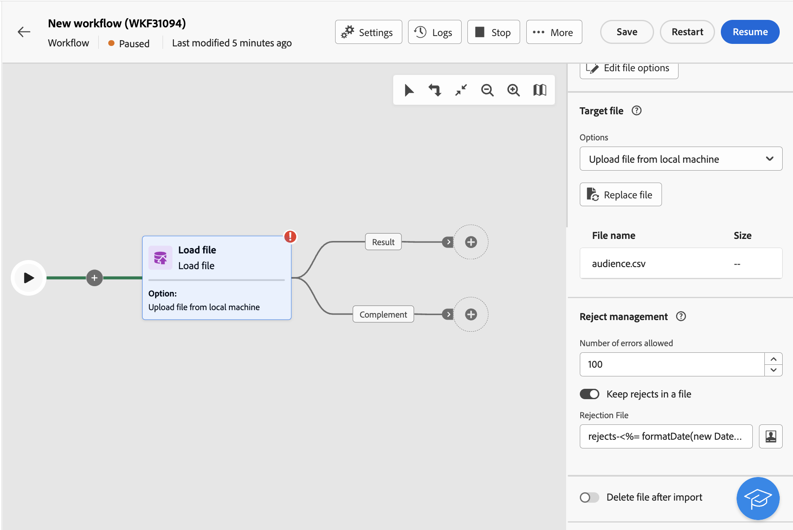

# Load file {#load-file}

>[!CONTEXTUALHELP]
>id="acw_orchestration_loadfile"
>title="Load file activity"
>abstract="The **Load file** activity is a **Data management** activity. Use this activity to work with data stored in an external file."

>[!CONTEXTUALHELP]
>id="acw_orchestration_loadfile_samplefile"
>title="Sample file"
>abstract="Sample file"

>[!CONTEXTUALHELP]
>id="acw_orchestration_loadfile_nameofthefile"
>title="Name of the file"
>abstract="Name of the file"

>[!CONTEXTUALHELP]
>id="acw_orchestration_loadfile_targetdb"
>title="Target database"
>abstract="Target database"

>[!CONTEXTUALHELP]
>id="acw_orchestration_loadfile_rejectmgt"
>title="Reject management for Load file activity"
>abstract="Reject management for Load file activity"

>[!CONTEXTUALHELP]
>id="acw_orchestration_loadfile_outboundtransition"
>title="Reject management outbound transition"
>abstract="Reject management outbound transition"

>[!CONTEXTUALHELP]
>id="acw_orchestration_loadfile_outboundtransition_reject"
>title="Reject management outbound transition for rejects"
>abstract="Reject management outbound transition for rejects"

>[!CONTEXTUALHELP]
>id="acw_orchestration_loadfile_formatting"
>title="Formatting for Load File activity"
>abstract="Formatting for Load File activity"

>[!CONTEXTUALHELP]
>id="acw_orchestration_loadfile_targetfile"
>title="Target file for Load File activity"
>abstract="Target file for Load File activity"

>[!CONTEXTUALHELP]
>id="acw_orchestration_loadfile_valueremapping"
>title="Value remapping for Load File activity"
>abstract="Value remapping for Load File activity"

>[!CONTEXTUALHELP]
>id="acw_orchestration_loadfile_command"
>title="Load File Command"
>abstract="Allowing arbitrary command for pre-processing is a security concern, disable security option XtkSecurity_Disable_Preproc to force the use of a predefined list of commands."

>[!CONTEXTUALHELP]
>id="acw_orchestration_loadfile_delete"
>title="Delete file after import"
>abstract="Toggle the **Delete file after import** to delete the original file from the server after the file is imported."

The **Load file** activity is a **Data management** activity. Use this activity to work with profiles and data stored in an external file. Profiles and data are not added to the database, but all fields in the input file are available for [personalization](../../personalization/gs-personalization.md), or to update profiles, or any other table. 

>[!NOTE]
>Supported file formats are: text (TXT) and comma-separated value (CSV).

This activity can be used with a [Reconciliation](reconciliation.md) activity to link unidentified data to existing resources. For example, the **Load file** activity can be placed before a **Reconciliation** activity if you import non-standard data into the database. 

## Configure the Load file activity {#load-configuration}

The **Load file** activity configuration involves two steps. First, you need to define the expected file structure by uploading a sample file. Once this is done, you can specify the origin of the file whose data will be imported.

Follow these steps to configure the activity:

1. Add a **Load file** activity into your workflow.

    

1. Select the sample file to use to define the expected file structure. To do this, click the **Select file** button in the **[!UICONTROL Sample file]** section and select the local file to use.

    >[!NOTE]
    >
    >The data of the sample file is used for configuring the activity but is not imported. We recommend using a sample file containing little data. The file format must be aligned with this [sample file](../../audience/file-audience.md#sample-file).

1. In the **[!UICONTROL File type]** drop-down list, specify if the file is using delimited columns or fixed width columns.

    

1. For delimited columns file types, use the **Columns** section to configure the properties of each column.

    +++Available options for file columns
    
    * **[!UICONTROL Label]**: Label to display for the column.
    * **[!UICONTROL Data type]**: Type of data contained in the column.
    * **[!UICONTROL Width]** *(string data type)*: Maximum number of characters to display in the column.
    * **[!UICONTROL Data Transformation]** *(string data type)*: Apply transformation to the values contained in the column.
    * **[!UICONTROL White space management]** *(string data type)*: Specify how to manage spaces contained in the column.
    * **[!UICONTROL Separators]** *(date, time, integer and number data types)*: Specify the characters to use as separators.
    * **[!UICONTROL Allow NULLs]**: Specify how to manage empty values in the column. The "Adobe Campaign default" option will throw an error if an empty value is present.
    * **[!UICONTROL Error processing]** *(string data type)*: Specify the behaviour in case of errors in one of the lines.
    * **[!UICONTROL Value remapping]**: This option allows you to map specific values with new ones. For example, if the column contains "True"/"False" values, you can add a mapping to automatically replace those values with "0"/"1" characters.

    +++

1. In the **Formatting** section, specify how the file is formatted to ensure that data is correctly imported.

1. In the **[!UICONTROL Target file]** section, specify how to retrieve the file to upload on the server:

    * **[!UICONTROL Upload file from local machine]**: Select the TXT or CSV file to upload from your machine.
    * **[!UICONTROL Specified in the transition]**: Automatically upload the file specified in the inbound transition upcoming from a previous activity.
    * **[!UICONTROL Pre-process the file]**: Apply a pre-processing command such as **[!UICONTROL Decompression]** or **[!UICONTROL Decrypt]** to a file coming from a previous activity through the inbound transition, 
    * **[!UICONTROL Calculated]**: Upload the file whose name specified in the **[!UICONTROL File name]** field.

    

    >[NOTE]
    >
    >If you are accessing a **[!UICONTROL Load file]** activity that has already been setup in the client console, an additional **[!UICONTROL Target database]** section is available if you have configured the activity to upload the file to an external database.

1. In the **Reject management** section, specify how the activity should behave in case of rejects:

    * Define the maximum number of errors to keep.
    * Toggle the **[!UICONTROL Keep rejects in a file]** option to download on the server a file containing errors that occurred during the import. After activating this option, an additional output transition named "Complement" is added after the activity. Specify the desired name for the file in the **[!UICONTROL Rejection File]**.

1. To delete the uploaded file from the server after the workflow has been executed, toggle the **[!UICONTROL Delete file after import]** option.

1. Click **Confirm** once settings are correct.

## Example {#load-example}

A sample of an external file loading used with the **Reconciliation** activity is available in [this section](reconciliation.md#reconciliation-example).
