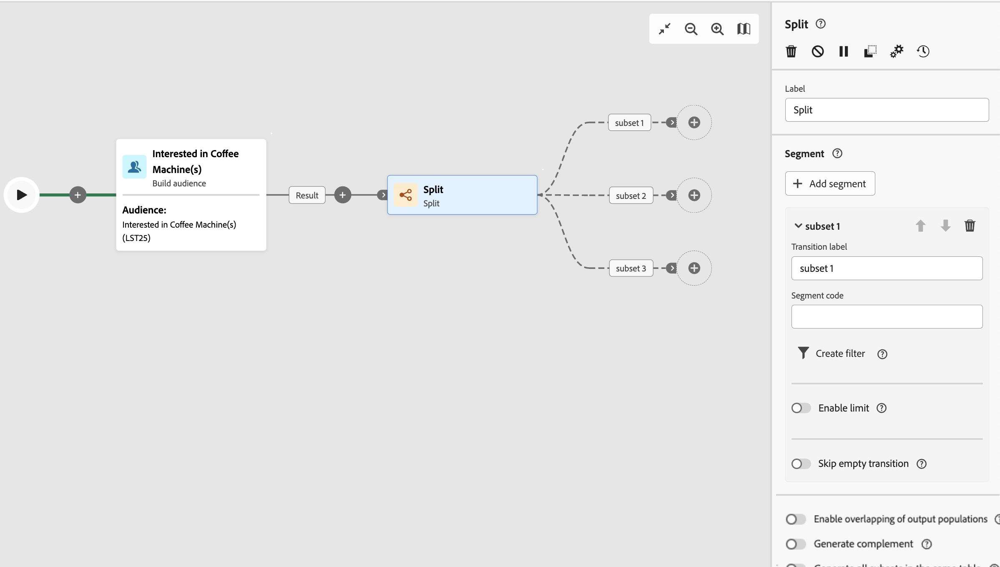

# Split {#split}

>[!CONTEXTUALHELP]
>id="acw_orchestration_split"
>title="Split activity"
>abstract="The **Split** activity is a **Targeting** activity that allows you to segment incoming populations into multiple subsets based on different selection criteria, such as filtering rules or population size."

The **Split** activity is a **Targeting** activity that allows you to segment incoming populations into multiple subsets based on different selection criteria, such as filtering rules or population size.

## Configuration {#general}

>[!CONTEXTUALHELP]
>id="acw_orchestration_split_filter"
>title="Split activity filter"
>abstract="To apply a filtering condition to the subset, click **[!UICONTROL Create filter]** and configure the desired filtering rule. For example, include profiles from the incoming population whose email address exist in the database."

>[!CONTEXTUALHELP]
>id="acw_orchestration_split_limit"
>title="Split activity limit"
>abstract="To limit the number of profiles selected by the subset, toggle on the **[!UICONTROL Enable limit]** option, and specify the number or percentages of the population to include."

>[!CONTEXTUALHELP]
>id="acw_orchestration_split_sorting"
>title="Split activity sorting"
>abstract="When setting a population limit for a subset, you can rank the selected profiles based on a specific profile attribute, in ascending or descending order. To do this, toggle on the **Enable sorting** option. For instance, you can restrict a subset to include only the top 50 profiles with the highest purchase amount."

Follow these steps to configure the **Split** activity:

1. Add a **Split** activity to your workflow.

1. The activity configuration pane opens with a default subset. Click the **Add segment** button to add as many subsets as desired to segment the incoming population.

    

    >[!IMPORTANT]
    >
    >When the Split activity is executed, the population is segmented across the different subsets in the order they are added to the activity. For example, if the first subset recovers 70% of the initial population, the next added subset will apply its selection criteria to the remaining 30% only, and so on.
    >
    > Before configuring your subsets, ensure that you have added them in the correct order, as their position cannot be changed.

1. Once subsets have been added, the activity shows as many output transitions as there are subsets. We strongly recommand changing the label of each subset to identify them easily in the workflow canvas. 

1. Configure how each subset should filter the incoming population. To do this, follow these steps:

    1. Open the subset to display its properties.

    1. To apply a filtering condition to the subset, click **[!UICONTROL Create filter]** and configure the desired filtering rule. For example, include profiles from the incoming population whose email address exist in the database.

    1. To limit the number of profiles selected by the subset, toggle on the **[!UICONTROL Enable limit]** option, and specify the number or percentages of the population to include.

        

    
        >[!NOTE]
        >
        >When setting a population limit for a subset, you can rank the selected profiles based on a specific profile attribute, in ascending or descending order. To do this, toggle on the **[!UICONTROL Enable sorting]** option. For instance, you can restrict a subset to include only the top 50 profiles with the highest purchase amount.

1. Once that you have configured all the subsets, you can select the remaining population that did not match any of the subsets and include them into an additional outbound transition. To do this, toggle on the **[!UICONTROL Generate complement]** option.

    

The activity is now configured. At workflow execution, the population will be segmented into the different subsets, in the order they have been added to the activity. 

## Example

In the following example, the **[!UICONTROL Split]** activity is used to segment an audience into distinct subsets based on the communication channel that we want to use :

* **Subset 1 "push"**: This subset comprises all profiles who have installed our mobile application.
* **Subset 2 "sms"**: Mobile phone users: For the remaining population that did not fall into Subset 1, subset 2 applies a filtering rule to select profiles with mobile phones in the database.
* **Complement transition**: This transition captures all the remaining profiles that did not match Subset 1 or Subset 2. Specifically, it includes profiles who neither installed the mobile application nor have a mobile phone, such as users who haven't installed the mobile app or lack a registered mobile number.

