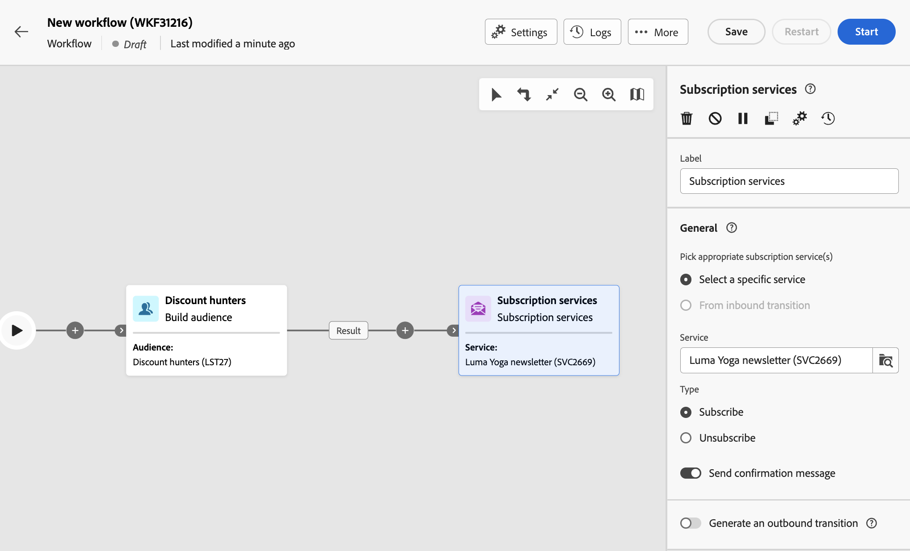

# Subscription services {#subscriptipon-services}

>[!CONTEXTUALHELP]
>id="acw_orchestration_subscription"
>title="Subscription services activity"
>abstract="The Subscription services activity allows multiple profiles to be subscribed to or to be unsubscribed from a service in a single action."

>[!CONTEXTUALHELP]
>id="acw_orchestration_subscription_general"
>title="Subscription service general parameters"
>abstract="Choose the desired service and choose the action to perform (subscription or unsubscription). Toggle on the **Send confirmation message** option on to notify the population that they are subscribed or unsubscribed from the selected service."

>[!CONTEXTUALHELP]
>id="acw_orchestration_subscription_outboundtransition"
>title="Generate an outbound transition"
>abstract="Toggle the **Generate an outbound transition** option to add a transition after the activity."

The **Subscription services** activity is a **Data Management** activity. It allows you to create or delete a subscription to an information service for the population specified in the transition. You can use this activity after targeting profiles or importing a file with identified data.

## Configure the Subscription services activity {#subscription-services-configuration}

Follow these steps to configure the **Subscription services** activity:



1. Add a **Subscription services** activity into your workflow.
1. Select the service for which you would like to manage the subscriptions using one of the following options:

    * **[!UICONTROL Select a specific service]**: Manually select a service using the **[!UICONTROL Service]** field.

    * **[!UICONTROL From inbound transition]**: Use the service specified in the inbound transition. For example, you can import a file which specifies the service to manage for each line. The service on which to perform the operation is then dynamically selected for each profile.

1. Select the action to be executed: Subscription or unsubscription.

1. To notify recipients that they are subscribed to or unsubscribed from the selected service, toggle the **[!UICONTROL Send a confirmation message]** option on. The content of this notification is defined in a delivery template associated to the information service.

1. To add an outbound transition after the activity, toggle the **[!UICONTROL Generate an outbound transition]** option on.

<!--infos en plus de PRD: 

section "Additional information"
- If the inbound data contains a column for the subscription date of profiles, users should be able to select it. Leaving it empty should result in no subscription date set during workflow execution.
- Users can define the origin of the subscription. This field can be set from Inbound data or from the mapping table (target dimension).
A constant value of their choice. Leaving it empty should result in no origin set during workflow execution.-->

<!--## Example {#example}

### Subscribing profiles to a specific service after importing a file {#example1}

This example illustrates how to import a file containing profiles and subscribe them to an existing service. After importing the file, a reconciliation needs to be carried out so that the data imported can be identified as being profiles. To ensure that the file does not contain any duplicates, a deduplication activity is executed on the data.

The workflow is presented as follows:

xxxx

* A **[!UICONTROL Load file]** activity loads the profile file and defines the structure of the imported columns.

  For this example, the file loaded is in the .csv format and contains the following data:

  ```
  lastname,firstname,city,birthdate,email
  Smith,Hayden,Paris,23/05/1985,hayden.smith@example.com
  Mars,Daniel,London,17/11/1999,danny.mars@example.com
  Smith,Clara,Roma,08/02/1979,clara.smith@example.com
  Durance,Allison,San Francisco,15/12/2000,allison.durance@example.com
  ```

* A **[!UICONTROL Reconciliation]** activity identifies the data from the file as belonging to the profile dimension of the Adobe Campaign database. Only the **[!UICONTROL Identification]** tab is configured. It identifies the file data according to the email addresses of the profiles.

* A **[!UICONTROL Deduplication]** based on the **email** field of the temporary resource (resulting from the reconciliation) identifies any duplicates. If the data imported from the file contains any duplicates, the subscription to a service will fail for all data.

* A **[!UICONTROL Subscription Services]** activity lets you select the service to which the profiles must be subscribed, the field corresponding to the subscription date, and the origin of the subscription.


## Example: Updating multiple subscription statuses from a file {#example--updating-multiple-subscription-statuses-from-a-file}

This example illustrates how to import a file containing profiles and update their subscription to several services specified in the file. After importing the file, a reconciliation needs to be carried out so that the data imported can be identified as being profiles with a link to services. To ensure that the file does not contain any duplicates, a deduplication activity will be executed on the data.

The workflow is presented as follows:


* A **[!UICONTROL Load file]** activity loads the profile file and defines the structure of the imported columns.

  For this example, the file loaded is in the .csv format and contains the following data:

  ```
  lastname;firstname;email;birthdate;service;operation
  jackman;megan;megan.jackman@testmail.com;07/08/1975;SVC2;sub
  phillips;edward;phillips@testmail.com;09/03/1986;SVC3;unsub
  weaver;justin;justin_w@testmail.com;11/15/1990;SVC3;sub
  martin;babeth;babeth_martin@testmail.net;11/25/1964;SVC3;unsub
  reese;richard;rreese@testmail.com;02/08/1987;SVC3;sub
  cage;nathalie;cage.nathalie227@testmail.com;07/03/1989;SVC3;sub
  xiuxiu;andrea;andrea.xiuxiu@testmail.com;09/12/1992;SVC4;sub
  grimes;daryl;daryl_890@testmail.com;12/06/1979;SVC3;unsub
  tycoon;tyreese;tyreese_t@testmail.net;10/08/1971;SVC2;sub
  ```

  As you may have noticed, the operation is specified in the file as "sub" or "unsub". The system expects a **Boolean** or **Integer** value to recognize the operation to perform: "0" to unsubscribe and "1" to subscribe. To match this requirement, a remapping of values is performed in the detail of the "operation" column.


  If your file already uses "0" and "1" to identify the operation, you don't need to remap those values. Only make sure that the column is processed as a **Boolean** or **Integer** in the **[!UICONTROL Column definition]** tab.

* A **[!UICONTROL Reconciliation]** activity identifies the data from the file as belonging to the profile dimension of the Adobe Campaign database. Through the **[!UICONTROL Identification]** tab, the **email** field of the file is matched to the **email** field of the profile resource.


  In the **[!UICONTROL Relations]** tab, a link is created with the service resource to allow the **service** field of the file to be recognized. In this example, the values match the **name** field of the service resource.

* A **[!UICONTROL Deduplication]** based on the **email** field of the temporary resource (resulting from the reconciliation) identifies duplicates. It is important to eliminate duplicates since the subscription to a service will fail for all data in case of duplicates.

* A **[!UICONTROL Subscription Services]** identifies the services to update as coming from the transition, through the link created in the **[!UICONTROL Reconciliation]** activity.

  The **[!UICONTROL Operation type]** is identified as coming from the **operation** field of the file. Only Boolean or Integer fields can be selected here. If the column of your file that contains the operation to perform does not appear in the list, make sure that you have correctly set your column format in the **[!UICONTROL Load file]** activity, as explained earlier in this example.


-->
