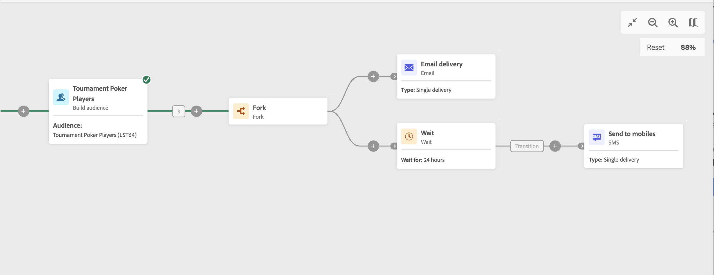

# Wait {#wait}

>[!CONTEXTUALHELP]
>id="acw_orchestration_wait"
>title="Wait activity"
>abstract="The **Wait** activity is used to delay the transition from one activity to another."

The **Wait** activity is a **Flow control** activity. It allows a certain amount of time to pass between the execution of two activities. For example, it can be used to wait several days after an email delivery activity, then analyze the opens and clicks generated during this period before performing follow-up operations, such as sending a reminder email or creating an audience.

## Configuration {#wait-configuration}

Follow these steps to configure the **Wait** activity:

1. Add a **Wait** activity into your workflow.

1. Specify the **Duration** of the wait between the inbound and outbound transitions.

1. Select the time unit in the **Periods** field: seconds, minutes, hours, or days.

## Example {#wait-example}

The following example illustrates the **Wait** activity in a typical use case. An email invitation to an event is sent. After 24 hours, an SMS delivery is sent to the same population.

