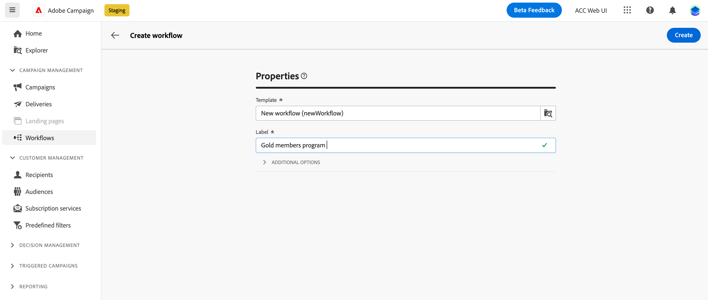
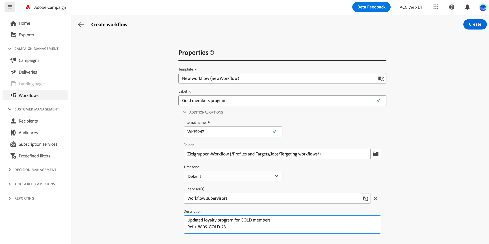
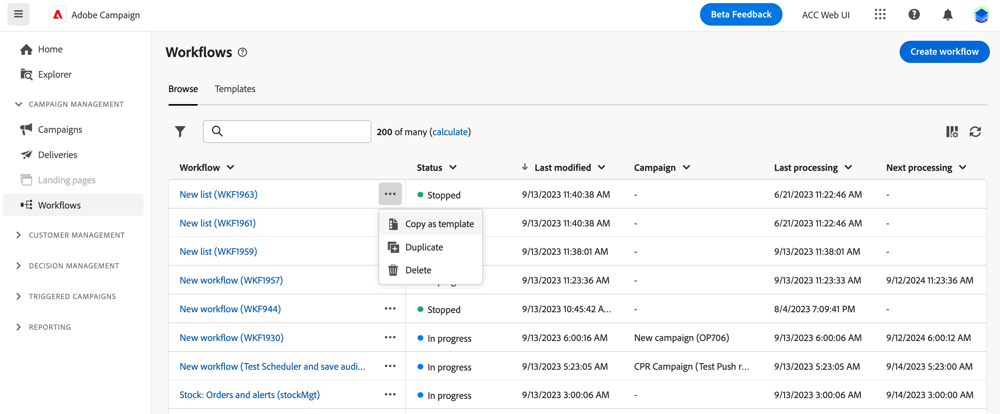

# Create the workflow {#create-first-workflow}

>[!CONTEXTUALHELP]
>id="acw_campaign_creation_workflow"
>title="List of workflows in the campaign"
>abstract="The **Workflows** tab lists all workflows linked to the current campaign. Click the name of a workflow to edit it. Use the **Create workflow** button to add a new workflow for this campaign."

You can create standalone workflows, or workflows within a campaign. The first step is to select a template and define its general properties. You can then configure additional settings as needed.

To do so, follow these steps:

1. To create a **Standalone workflow**, browse to the **Worklows** menu. To create a **Campaign workflow**, browse to the **Campaigns** menu, and open the campaign for which you want to create a new workflow. 

1. Click the **[!UICONTROL Create workflow]** button in the upper-right corner of the screen.

    {zoomable="yes"}

1. In workflow **Properties** dialog, select the template to use to create the workflow (you can also use the default built-in template). [Learn more about workflow templates](#workflow-templates).

1. Enter a label for the workflow. In addition, we strongly recommend you to add a description to your workflow, in the dedicated field of the **[!UICONTROL Additional options]** section of the screen.

1. Expand the **[!UICONTROL Additional options]** section to configure more settings for the workflow. Learn how to configure the worklow properties in [this page](workflow-settings.md#properties)

    {zoomable="yes"}

1. Click the **[!UICONTROL Create workflow]** button to confirm the creation of your workflow.

Your workflow is now created and available in the list of worklows. You can now access its visual canvas and start adding, configuring, and orchestrating the tasks it will perform. [Learn how to orchestrate workflow activities](orchestrate-activities.md).

## Work with workflow templates {#workflow-templates}

>[!CONTEXTUALHELP]
>id="acw_workflow_template_for_campaign"
>title="Workflow templates"
>abstract="Workflow templates contain pre-configured settings and activities which can be reused for creating new workflows."

>[!CONTEXTUALHELP]
>id="acw_workflow_template_creation_properties"
>title="Workflow properties"
>abstract="Workflow templates contain pre-configured settings and activities which can be reused for creating new workflows. In this screen, enter the label of the workflow template and configure its settings such as its internal name, folder and execution folders, timezone, and supervisor group."

Workflow templates contain pre-configured settings and activities which can be reused for creating new workflows. You can select the template of your workflow from the workflow properties, when creating a workflow. An empty template is provided by default.

You can create a template from an existing workflow, or create a new template from scratch. Both methods are detailed below.

>[!BEGINTABS]

>[!TAB Create a template from an existing workflow]

To create a workflow template from an existing workflow, follow these steps:

1. Open to the **Workflows** menu and browse to the workflow to save as a template.
1. Click the three dots on the right of the name of the workflow, and choose **Copy as template**.

    {zoomable="yes"}

1. In the popup window, confirm the template creation.
1. In the workflow template canvas, check, add, and configure the activities as needed.
1. Browse to the settings, from the **Settings** button, to change the name of the workflow template, and enter a description.
1. Select the **folder** and **execution folder** of the template. The folder is the location where the workflow template is saved. The execution folder is the folder where workflows created based on this template are saved.

    {zoomable="yes"}

    The other properties are common with workflows. Learn more in [this page](workflow-settings.md#properties)

1. Save your changes. 

The workflow template is now available in the template list. You can create a workflow based on this template. This workflow will be pre-configured with the settings and activities defined in the template.

>[!TAB Create a template from scratch]

To create a workflow template from scratch, follow these steps:

1. Open to the **Workflows** menu and browse to the **Templates** tab. You can see the list of available workflow templates.
1. Click the **[!UICONTROL Create template]** button in the upper-right corner of the screen.
1. Enter the label and open the additional options to enter a description of your workflow template.
1. Select the folder and execution folder of the template. The folder is the location where the workflow template is saved. The execution folder is the folder where workflows created based on this template are saved.

    {zoomable="yes"}

    The other properties are common with workflows. Learn more in [this page](workflow-settings.md#properties)

1. Click the **Create** button to confirm your settings.
1. In the workflow template canvas, add and configure the activities as needed.

     {zoomable="yes"}

1. Save your changes. 

The workflow template is now available in the template list. You can create a workflow based on this template. This workflow will be pre-configured with the settings and activities defined in the template.

>[!ENDTABS]
