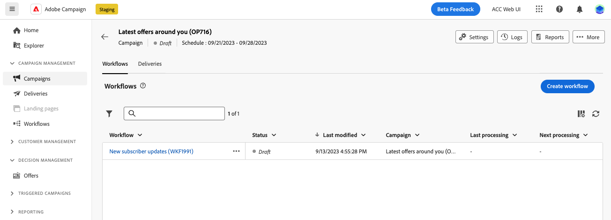

# Key principles of workflow creation {#gs-workflow-creation}

With Adobe Campaign Web, you can build workflows on a visual canvas to design cross-channel processes such as segmentation, campaign execution, and file processing.

## What's inside a workflow? {#gs-workflow-inside}

The workflow diagram represents the planned process. It describes the various tasks to be performed and how they are linked together.

{zoomable="yes"} [Workflow example diagram showing tasks and their connections]

Each workflow contains:

* **Activities**: An activity is a task to be performed. Icons on the diagram represent the various activities. Each activity has specific properties and properties common to all activities.

    In a workflow diagram, a given activity can produce multiple tasks, especially when there is a loop or recurrent actions.

* **Transitions**: Transitions link a source activity to a destination activity and define their sequence.

* **Worktables**: The worktable contains all the information carried by the transition. Each workflow uses several worktables. The data in these tables can be used throughout the workflow's life cycle.

## Key steps to create a workflow {#gs-workflow-steps}

Campaigns offers two ways to create a workflow:

1. Workflows can be created as standalone workflows from the **Workflows** menu.

    {zoomable="yes"} [Screenshot of the interface for creating a standalone workflow]

1. Workflows can be created directly within a campaign from the **Workflow** tab of the campaign. When included in a campaign, the workflow executes along with all the other campaign's workflows, and the reporting metrics are grouped at the campaign level.

    {zoomable="yes"} [Screenshot of the interface for creating a workflow within a campaign]

Key steps to create workflows are as follows:

{zoomable="yes"} [Diagram showing the workflow creation process]

These steps are detailed in the following sections:

1. [Create your workflow and define its properties](create-workflow.md)
1. [Orchestrate and configure activities](orchestrate-activities.md)
1. [Configure your workflow advanced settings](workflow-settings.md)
1. [Start your workflow and monitor its execution](start-monitor-workflows.md)