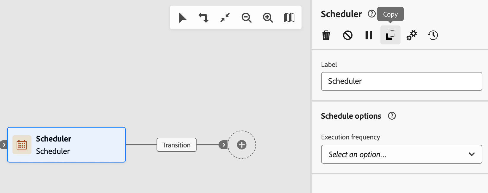

# Orchestrate activities {#orchestrate}

Once you have [created a workflow](create-workflow.md), whether from the workflow menu or within a campaign, you can start orchestrating the different tasks it performs. To do this, a visual canvas is provided, allowing you to construct a workflow diagram. Within this diagram, you can add various activities and connect them in a sequential order.

## Add activities {#add}

At this stage of the configuration, the diagram is displayed with a start icon, representing the beginning of your workflow. To add your first activity, click the **+** button connected to the start icon.

A list of activities that can be added to the diagram appears. The available activities depend on your position within the workflow diagram. For example, when adding your first activity, you can start your workflow by targeting an audience, splitting the workflow path, or setting a **Wait** activity to delay the workflow execution. After a **Build audience** activity, you can refine your target with targeting activities, send a delivery to your audience with channel activities, or organize the workflow process with flow control activities.

{zoomable="yes"} 

Once an activity is added to the diagram, a right pane appears, allowing you to configure the newly added activity with specific settings. Detailed information on how to configure each activity is available in [this section](activities/about-activities.md).

{zoomable="yes"} 

Repeat this process to add as many activities as needed, depending on the tasks your workflow performs. You can also insert a new activity between two activities. To do this, click the **+** button on the transition between the activities, select the desired activity, and configure it in the right pane.

To remove an activity, select it in the canvas and click the **Delete** icon in the activity properties.

>[!TIP]
>
>You can personalize the name of the transitions between each activity. To do this, select the transition and change its label in the right pane.

## The toolbar {#toolbar}

The toolbar, located in the upper-right corner of the canvas, provides options to easily manipulate the activities and navigate in the canvas:

* **Multiple selection mode**: Select multiple activities to delete them all at once or copy and paste them. See [this section](#copy).
* **Rotate**: Switch the canvas vertically.
* **Fit to screen**: Adapt the canvas zoom level to your screen.
* **Zoom out** / **Zoom in**: Zoom out or in the canvas.
* **Display map**: Open a snapshot of the canvas showing your location.

{zoomable="yes"}{width="50%"} 

## Manage activities {#manage}

When adding activities, action buttons are available in the properties pane, allowing you to perform multiple operations.

{zoomable="yes"} 

You can:

* **Delete** the activity from the canvas.
* **Disable/Enable** the activity. When the workflow executes, disabled activities and the following activities on the same path are not executed, and the workflow stops.
* **Pause/Resume** the activity. When the workflow executes, it pauses at the paused activity. The corresponding task, as well as all those that follow it in the same path, are not executed.
* **Copy** the activity. See [this section](#copy).
* **Move** an activity and all its child nodes to another transition. See [this section](#move).
* Access the activity's **Execution options**.
* Access the activity's **Logs and tasks**.

Several **Targeting** activities, such as **Combine** or **Deduplication**, allow you to process the remaining population and include it in an additional outbound transition. For example, if you're using a **Split** activity, the complement consists of the population that did not match any of the previously defined subsets. To use this capability, activate the **Generate complement** option.

 

## Move or copy activities {#move-copy}

### Copy-paste activities {#copy}

You can copy workflow activities and paste them into any workflow. The destination workflow can be in a different browser tab.

To copy activities, you have two choices:

* Copy one activity using the action button.

    {zoomable="yes"}{width="70%"} 

* Copy multiple activities using the toolbar button.

    {zoomable="yes"}{width="70%"} 

To paste the copied activities, click the **+** button on a transition and select "Paste X activity."

{zoomable="yes"}{width="50%"} 

### Move activities and their child nodes {#move}

Journey Optimizer allows you to move an activity, along with the entire content of its child nodes (including all transitions and activities within it), to the end of another transition within the same workflow.

This process disconnects the activity and everything in its outbound transition from the initial location, moving it to the new target transition.

To move an activity:

1. Select the activity you want to move.
1. In the activity's properties pane, click the **Move** button.
1. Select the transition where you want to place the activity and its outbound transition, then confirm.

 

## Execution options {#execution}

All activities allow you to manage their execution options. Select an activity and click the **Execution options** button. This lets you define the activity's execution mode and behavior in case of errors.

{zoomable="yes"}{width="70%"}

### Properties {#properties}

>[!CONTEXTUALHELP]
>id="acw_workflow_activity_execution_options_properties"
>title="Activity properties"
>abstract="This section lets you define how and where an activity runs. You can set the execution action, limit run duration, choose a time zone, assign machine affinity, manage asynchronous behavior, and specify what happens in case of an error."

The **Execution** field allows you to define the action to carry out when the task starts. 

The **Maximum execution duration** field allows you to specify a duration such as "30s" or "1h." If the activity is not finished after the specified duration, an alert is triggered. This has no impact on how the workflow functions.

The **Time zone** field allows you to select the time zone of the activity. Adobe Campaign manages time differences between multiple countries on the same instance. The setting applied is configured when the instance is created.

The **Affinity** field allows you to force a workflow or a workflow activity to execute on a particular machine. To do this, specify one or several affinities for the workflow or activity in question.

The **Behavior** field allows you to define the procedure to follow if asynchronous tasks are used.

### Error management {#execution-options}

>[!CONTEXTUALHELP]
>id="acw_workflow_activity_execution_options_error"
>title="Initialization script"
>abstract="This section lets you define what happens if an activity fails. You can choose actions such as stopping the workflow, moving to the next activity, or triggering a custom error-handling process."

The **In case of error** field allows you to specify the action to carry out if the activity encounters an error. See this [section](workflow-settings.md#error-settings).

### Initialization script {#initialization-options}

>[!CONTEXTUALHELP]
>id="acw_workflow_activity_execution_options_initialization"
>title="Initialization script"
>abstract="This section lets you add JavaScript that runs when the activity starts. Use it to initialize variables, set parameters, or prepare data specific to that activity’s execution."

The **Initialization script** lets you initialize variables or modify activity properties. Click the **Edit code** button and type the snippet of code to execute. The script is called when the activity executes. Refer to the section related to [event variables](../workflows/event-variables.md).

## Example {#example}

Here is a workflow example designed to send an email to all customers (other than VIP customers) with an email who are interested in coffee machines.

{zoomable="yes"} 

To achieve this, the following activities have been added:

* A **[!UICONTROL Fork]** activity that divides the workflow into three paths (one for each set of customers),
* **[!UICONTROL Build audience]** activities to target the three sets of customers:
    * Customers with an email,
    * Customers belonging to the pre-existing "Interested in Coffee Machine(s)" audience,
    * Customers belonging to the pre-existing "VIP to reward" audience.
* A **[!UICONTROL Combine]** activity that groups together customers with an email and those interested in coffee machines,
* A **[!UICONTROL Combine]** activity that excludes VIP customers,
* An **[!UICONTROL Email delivery]** activity that sends an email to the resulting customers.

Once you complete the workflow, add an **[!UICONTROL End]** activity at the end of the diagram. This activity visually marks the end of a workflow and has no functional impact.

After successfully designing the workflow diagram, execute the workflow and track the progress of its various tasks. [Learn how to start a workflow and monitor its execution](start-monitor-workflows.md).