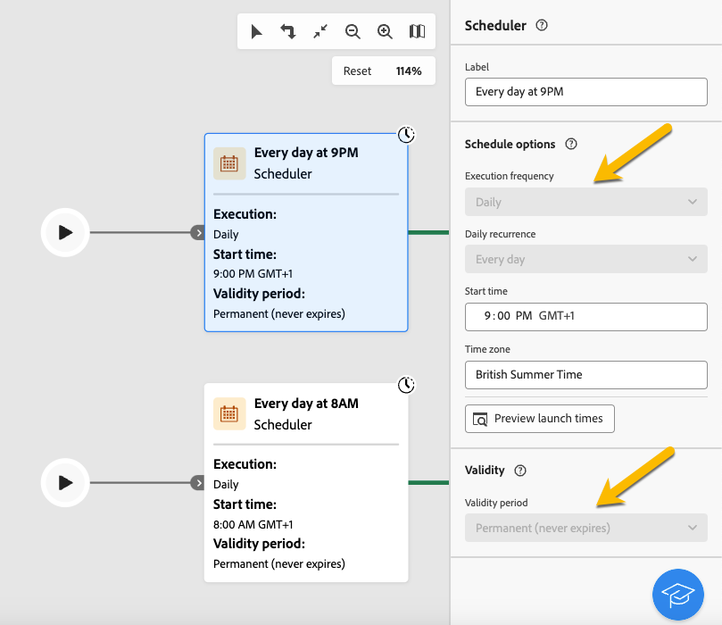

# About read-only workflows {#readonly-workflows}

>[!CONTEXTUALHELP]
>id="acw_wf_read_only_canvas"
>title="This workflow is read only"
>abstract="You cannot edit this workflow due to your rights or the type of the workflow."

Some workflows may be in read-only mode. You can see it with :

- The mention **[!UICONTROL Read-only]**  near the **[!UICONTROL Settings]** button
- The action buttons not accessible

{zoomable="yes"}

You cannot edit anything in a read-only workflow. You are not allowed to change the settings of the activities.

{zoomable="yes"}

You do not have the rights to delete the workflow also.

{zoomable="yes"}

## Why read-only workflows 

Read-only mode is for users who do not have permission and access rights to edit those workflows. [Learn more here](../get-started/permissions.md)

A campaign user may have restrictions in the data he can access in Adobe Campaign. The administrator can give him the possibility to view some features but not to work on them.

## Types of read-only workflows

According to the type of the workflow, the read-only mode may be different.

### Campaign workflows

In the case of a read-only campaign workflow, the user cannot access the monitoring button. 

{zoomable="yes"}

### Technical workflows

Technical workflows are in read-only mode for campaign users.
Built-in technical workflows are in read-only mode for all, even for the administator users. But the user can **pause** or **stop** them if needed. Those are the only actions allowed. [Learn more here](https://experienceleague.adobe.com/en/docs/campaign/automation/workflows/introduction/wf-type/technical-workflows)

{zoomable="yes"}
